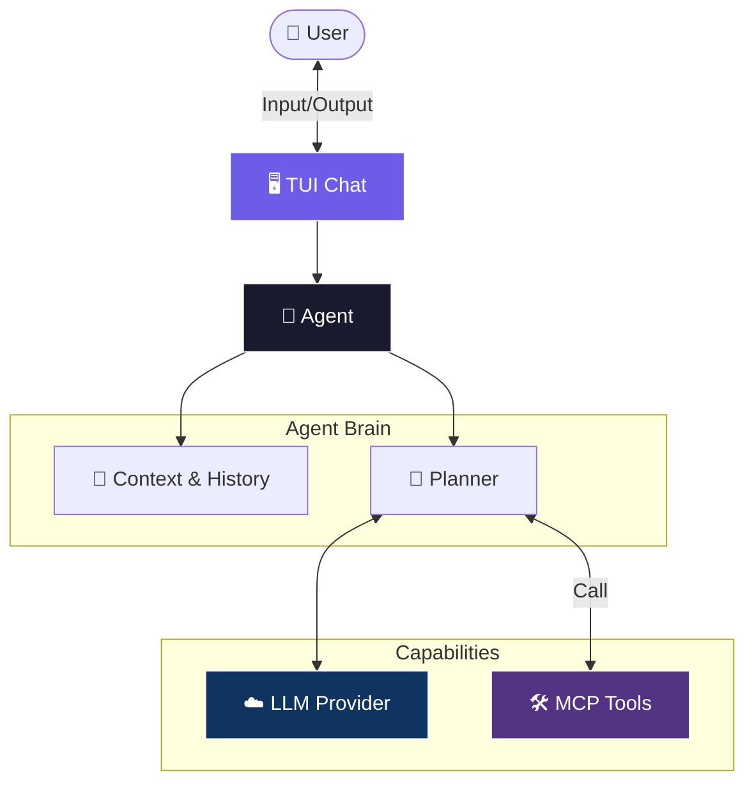

# 🤖 AGENTS.md - AI Coding Agent Guide

> **Purpose**: Quick reference for AI coding agents to understand this codebase.

---

## 📍 Repository Overview

**What is this?** A Rust-based MCP (Model Context Protocol) client with:
- Full TUI interface (Ratatui)
- Multi-provider LLM support (Gemini, OpenAI, Ollama, Anthropic)
- Agent mode with tool calling
- REST API server

**Tech Stack**: Rust 1.75+, Tokio (async), Ratatui (TUI), Axum (HTTP), Serde (JSON)

---

## 🗂️ File Map

```
src/
├── bin/                    # Entry points
│   ├── menu.rs            # Main TUI entry (cargo run)
│   ├── rest.rs            # REST-only mode (uses config bind)
│   └── stdio.rs           # STDIO-only mode
│
└── lib/                    # Main library
    ├── mod.rs             # Top-level orchestration, run() function
    │
    ├── application/       # Business logic layer
    │   ├── agent/         # Agent with tool-calling loop
    │   │   ├── runner.rs  # Core ReAct loop (thought → action → observe)
    │   │   ├── parser.rs  # JSON response parsing
    │   │   └── prompt.rs  # System prompt composition
    │   ├── client.rs      # McpClient - main client facade
    │   ├── stdio.rs       # Legacy text-based STDIO (deprecated)
    │   └── tooling.rs     # Tool execution runtime
    │
    ├── cli/               # CLI argument parsing (clap)
    │
    ├── config/            # Configuration loading & wizard
    │   ├── app.rs         # AppConfig, RestServerConfig structs
    │   ├── loader.rs      # Loads BOTH client.toml + model.toml
    │   ├── wizard/        # Interactive setup wizard
    │   │   ├── mod.rs     # Wizard orchestration
    │   │   └── generators/    # ⭐ SPLIT GENERATORS
    │   │       ├── mod.rs
    │   │       ├── client.rs  # Writes to client.toml
    │   │       └── model.rs   # Writes to model.toml
    │   └── generator.rs   # Legacy (kept for compatibility)
    │
    ├── constants.rs       # CONFIG_PATH, MODEL_CONFIG_PATH, etc.
    │
    ├── domain/            # Domain types (tool definitions, etc.)
    │
    ├── infrastructure/    # External integrations
    │   ├── model/         # LLM provider implementations
    │   │   ├── gemini.rs
    │   │   ├── openai.rs
    │   │   ├── ollama.rs
    │   │   └── anthropic.rs
    │   ├── server/        # REST API server (Axum)
    │   └── rpc/           # JSON-RPC for MCP communication
    │
    └── tui/               # TUI layer (Ratatui)
        ├── terminal.rs    # Terminal init/restore, NavAction enum
        ├── widgets/       # Reusable widgets (Menu, TableMenu)
        └── screens/       # Screen modules
            ├── mode_selector.rs   # Mode selection menu
            ├── setup_menu/        # Configuration management
            │   ├── mod.rs         # Main setup menu
            │   ├── providers.rs   # Manage LLM providers
            │   ├── models.rs      # Manage models
            │   ├── servers.rs     # Manage MCP servers
            │   ├── sync.rs        # Sync tools from servers
            │   └── prompt.rs      # Manage Prompt Template
            └── chat/              # Interactive chat (SOLID)
                ├── state.rs       # ChatState, ChatMessage
                ├── ui.rs          # Rendering (status, messages, input)
                ├── input.rs       # Keyboard handling
                └── runner.rs      # Async event loop

config/                         # ⭐ SPLIT CONFIGURATION
├── client.toml                # Infrastructure: providers, servers, REST
├── model.toml                 # Model: default_provider, model, prompt, tools
└── .env                       # API keys (gitignored)
```

---

## 🔑 Key Patterns

### 1. Terminal Reference Passing
TUI screens accept `&mut Tui` parameter to avoid reinitializing terminal:
```rust
pub fn run_manage_providers_with_terminal(terminal: &mut Tui) -> Result<()>
```

### 2. NavAction Enum
Single enum for all navigation actions in `tui/terminal.rs`:
```rust
pub enum NavAction {
    Up, Down, Select, Back, ForceQuit, None
}
```
- `q` key → `ForceQuit` (exits entire app)
- `ESC` → `Back` (go back one screen)

### 3. Async Channel Pattern (Chat)
Chat uses `mpsc::channel` for async LLM responses:
```rust
let (response_tx, mut response_rx) = mpsc::channel::<ResponseEvent>(10);
tokio::spawn(async move { send_message(..., tx).await; });
// In loop: response_rx.try_recv()
```

### 4. Split Configuration Loading
```rust
// Loader reads from BOTH files
let config = AppConfig::load(Some(Path::new("config/client.toml")))?;
// Internally derives model.toml from same directory
```

**Config files:**
- `config/client.toml` → providers, servers, `[server]` (bind, cors)
- `config/model.toml` → default_provider, model, prompt_template, tools
- `config/.env` → API key values

### 5. Split Generators
```rust
// For model.toml (default_provider, model, prompt_template, tools)
use crate::config::wizard::generators::model;
model::update_default_provider("gemini")?;
model::sync_tools_from_server("time", tools)?;

// For client.toml (providers, servers, REST settings)
use crate::config::wizard::generators::client;
client::add_provider("ollama", "ollama", "http://localhost:11434", None)?;
client::add_server("time", "/path/to/server", &[])?;
```

### 6. Agent ReAct Loop
Agent expects JSON responses from LLM:
```json
{"action": "call_tool", "tool": "tool_name", "arguments": {...}}
{"action": "final", "response": "Final answer text"}
```

---

## 🧭 Common Tasks

### Add a new TUI screen
1. Create `src/lib/tui/screens/your_screen.rs`
2. Function signature: `pub fn run_your_screen(terminal: &mut Tui) -> Result<()>`
3. Export in `screens/mod.rs`

### Add a new LLM provider
1. Implement `ModelProvider` trait in `infrastructure/model/`
2. Add to `DynamicModelProvider::from_configs()`

### Add a new command in chat
1. Add variant to `CommandResult` in `chat/input.rs`
2. Add to `parse_command()` match
3. Handle in `handle_command()` in `chat/runner.rs`

### Modify config structure
1. Update structs in `config/app.rs` (RestServerConfig, AppConfig)
2. Update loader in `config/loader.rs`
3. Update generators:
   - `config/wizard/generators/client.rs` for client.toml changes
   - `config/wizard/generators/model.rs` for model.toml changes
4. Update `config.example/client.toml` and `config.example/model.toml`

### Add REST server configuration
1. Add field to `RestServerConfig` in `config/app.rs`
2. Update CLI args in `cli/mod.rs` and `bin/rest.rs`
3. Update `lib/mod.rs` to use config as default

---

## ⚠️ Gotchas

1. **PowerShell exit codes**: `cargo build` may show exit code 1 due to PowerShell parsing, check for "Finished" text instead.

2. **Terminal state**: Always restore terminal on error paths to prevent broken terminal state.

3. **Unused code warnings**: Legacy functions may exist for backwards compatibility, check `#[allow(dead_code)]`.

4. **Async in TUI**: Use `tokio::task::block_in_place` or channels to bridge sync TUI with async operations.

5. **Windows line endings**: Files may have CRLF endings.

6. **Split config files**: `client.toml` and `model.toml` must both exist. Loader derives `model.toml` path from `client.toml`'s parent directory.

7. **REST bind address**: Configured in `[server].bind` in `client.toml`. CLI `--addr` flag overrides it.

8. **Generator separation**: Use `generators::model` for model.toml updates, `generators::client` for client.toml updates.

---

## 🔧 Quick Commands

```bash
cargo run                    # TUI mode selector
cargo run --bin stdio        # Direct STDIO mode
cargo run --bin mcp-rest     # Direct REST mode (uses config bind)
cargo run --bin mcp-rest -- --addr 0.0.0.0:3000  # Override bind
cargo run -- --mode rest     # REST via main binary
cargo run -- --mode all      # STDIO + REST together
cargo build                  # Build debug
cargo build --release        # Build production
cargo clippy                 # Lint
cargo fmt                    # Format
```

---

## 📊 Agent Architecture



---

## 📝 Code Style

- **Error handling**: Use `Box<dyn Error>` for flexibility, `thiserror` for custom errors
- **Logging**: Use `tracing` crate (`info!`, `debug!`, `error!`)
- **Async**: Tokio runtime, avoid blocking in async contexts
- **TUI**: Ratatui with crossterm backend
- **Config**: TOML format with serde

---

## 🔗 Key Dependencies

| Crate | Purpose |
|:------|:--------|
| `ratatui` | TUI framework |
| `crossterm` | Terminal manipulation |
| `tokio` | Async runtime |
| `axum` | HTTP server |
| `serde` | Serialization |
| `clap` | CLI parsing |
| `tracing` | Logging |
