# 🤖 Agent Architecture

Dokumen ini menjelaskan arsitektur, peran, dan alur kerja Agent dalam sistem MCP Client.

---

## 📋 Overview

Agent adalah komponen inti yang bertindak sebagai orkestrator antara pengguna (User), Model Bahasa (LLM), dan MCP Tools. Agent bertanggung jawab untuk memahami maksud pengguna, memilih tool yang tepat, mengeksekusinya, dan merangkum hasil akhir.

```mermaid
graph TD
    User([👤 User]) <-->|Input/Output| Agent[🤖 Agent]
    
    subgraph "Agent Brain"
        Context[📝 Context & History]
        Planner[🧠 Planner]
    end
    
    subgraph "Capabilities"
        LLM[☁️ Gemini / Ollama]
        Tools[🛠️ MCP Tools]
    end
    
    Agent --> Context
    Agent --> Planner
    Planner <--> LLM
    Planner <-->|Call| Tools
    
    style Agent fill:#1a1a2e,stroke:#fff,color:#fff
    style LLM fill:#0f3460,stroke:#fff,color:#fff
    style Tools fill:#533483,stroke:#fff,color:#fff
```

---

## ⚙️ Core Workflow

Alur kerja utama Agent (`Agent::run`) mengikuti siklus **Thought-Act-Observe** (ReAct pattern) dengan format komunikasi JSON yang ketat.

### 1. Inisialisasi
- Memuat **System Prompt** dari `config/client.toml`.
- Menyuntikkan **Tool Context** (daftar tool tersedia).
- Menyuntikkan **Server Instructions** (SOP spesifik dari MCP server).

### 2. Siklus Eksekusi
Model wajib merespons dalam format JSON:
- **Call Tool**: `{"action":"call_tool", "tool":"nama_tool", "arguments":{...}}`
- **Final Answer**: `{"action":"final", "response":"Jawaban akhir..."}`

### 3. Tool Execution
- Agent memanggil `ToolRuntime`.
- Runtime meneruskan request ke MCP Server yang sesuai via JSON-RPC.
- Hasil (output/error) dikembalikan ke Agent dan ditambahkan ke memori percakapan.

---

## 🛠️ Tool Integration

Agent tidak memiliki tool "hardcoded". Semua tool berasal dari konfigurasi dinamis.

### Built-in Tools
- **`list_tools`**: Kemampuan introspeksi agar agent bisa melihat daftar tool yang tersedia saat runtime.

### External Tools (via MCP)
- **Time Server**: Menyediakan waktu akurat, zona waktu.
- **Certificate Server**: Generasi dokumen PDF, validasi data.

---

## 🧠 Configuration & Personality

Perilaku agent sepenuhnya dikendalikan oleh konfigurasi, membuatnya mudah diadaptasi untuk berbagai domain (Pelayanan Publik, Coding Assistant, Data Analyst, dll).

| Komponen | Lokasi Config | Deskripsi |
|:---------|:--------------|:----------|
| **Persona** | `prompt_template` | Instruksi dasar tentang siapa agent ini |
| **Model** | `default_provider` | Otak di balik agent (Gemini, Ollama) |
| **Tools** | `[[tools]]` | Kemampuan yang bisa dilakukan agent |
| **Servers** | `[[servers]]` | Backend yang menjalankan tools |

### Contoh Persona (Pelayanan Publik)
> "Anda adalah asisten pelayanan publik yang ramah dan efisien. Jangan pernah menebak informasi waktu atau prosedur, selalu gunakan tool yang tersedia."

---

## 🛡️ Error Handling & Limits

1. **Max Steps**: Dibatasi 8 langkah untuk mencegah infinite loop.
2. **Invalid JSON**: Agent akan meminta model memperbaiki format output.
3. **Tool Error**: Kesalahan tool akan dikembalikan ke model agar bisa dicoba ulang (self-correction).
4. **Language**: Otomatis mendeteksi dan merespons dalam bahasa pengguna.

---

## 🧪 Observability

Dalam mode STDIO, developer bisa memantau "pikiran" agent:

- **`/log`**: Melihat raw conversation history antara Agent dan LLM.
- **`/steps`**: Melihat urutan pemanggilan tool (Thought -> Action -> Observation).
- **`/config`**: Memeriksa konfigurasi yang aktif saat ini.

---

## 📝 Developer Guidelines

1. **Separation of Concerns**: Logika agent (`application::agent`) terpisah dari implementasi tool (`tooling`).
2. **Stateless Tooling**: Agent menganggap tool stateless; context disimpan di percakapan.
3. **Async/Await**: Semua I/O (LLM, MCP) bersifat non-blocking untuk performa tinggi.
