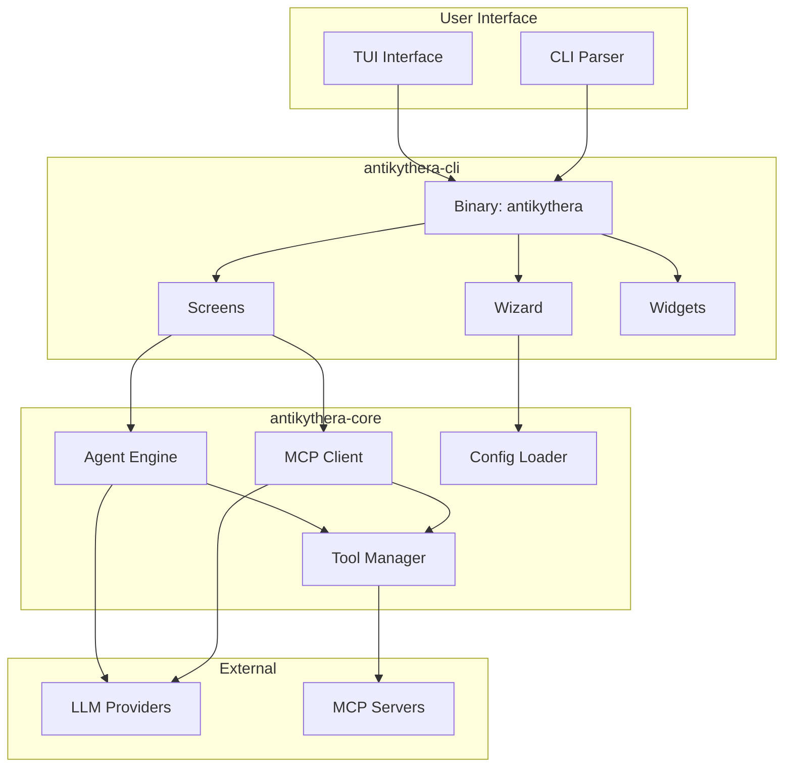
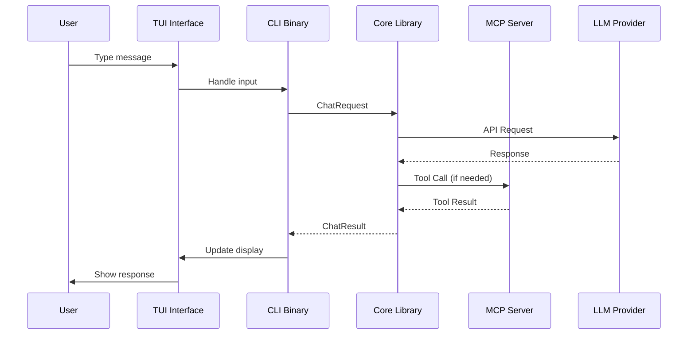
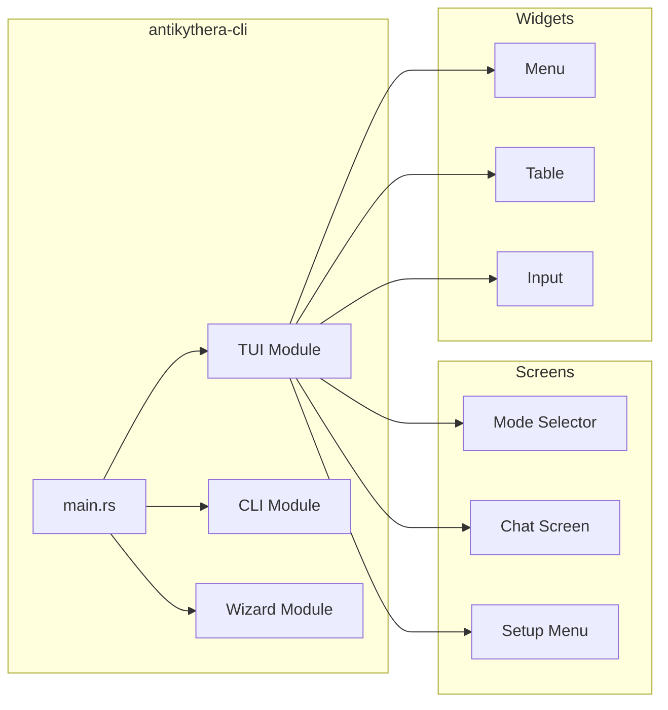
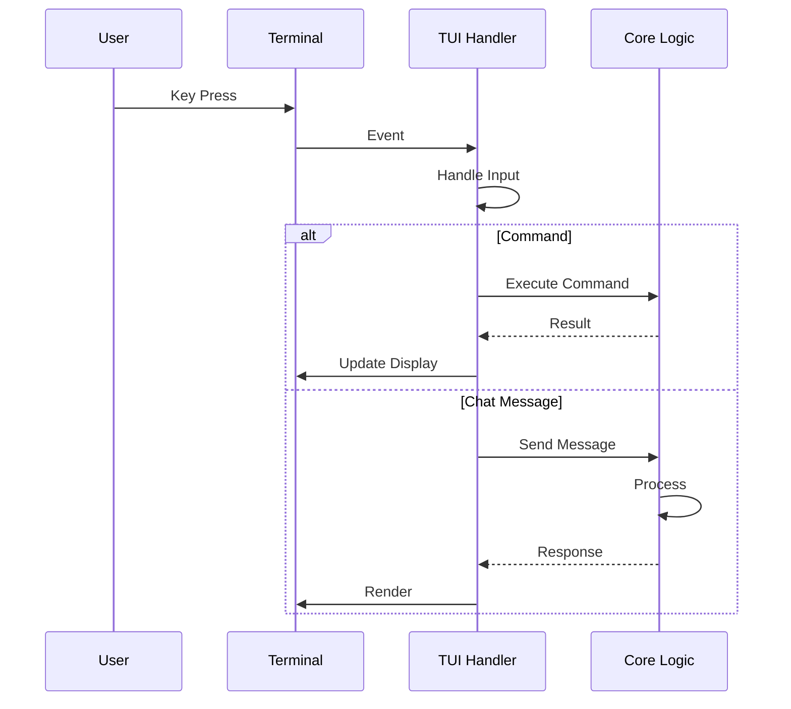

# 🖥️ Antikythera CLI Documentation

> **Command Line Interface** - Interactive TUI and command-line tools for MCP client

---

## 📋 Table of Contents

- [Overview](#-overview)
- [Architecture](#-architecture)
- [Installation](#-installation)
- [Quick Start](#-quick-start)
- [Usage Modes](#-usage-modes)
  - [CLI Mode](#cli-mode)
  - [WASM Mode](#wasm-mode)
- [Commands](#-commands)
  - [Built-in Commands](#built-in-commands)
  - [Agent Commands](#agent-commands)
  - [System Commands](#system-commands)
- [Configuration](#-configuration)
  - [Config Files](#config-files)
  - [Environment Variables](#environment-variables)
  - [CLI Flags](#cli-flags)
- [TUI Interface](#-tui-interface)
  - [Mode Selector](#mode-selector)
  - [Chat Interface](#chat-interface)
  - [Setup Wizard](#setup-wizard)
- [Keyboard Shortcuts](#-keyboard-shortcuts)
- [Examples](#-examples)
- [Troubleshooting](#-troubleshooting)

---

## 🎯 Overview

Antikythera CLI provides a **rich terminal user interface (TUI)** for interacting with AI models through the Model Context Protocol (MCP).

### Features

| Feature | Description |
|:--------|:------------|
| 🖥️ **Interactive TUI** | Full-screen interface with Ratatui |
| 🤖 **Multi-Provider** | Support for Gemini, Ollama, OpenAI, Anthropic |
| 🔧 **MCP Tools** | Tool execution via MCP servers |
| 💬 **Agent Mode** | Autonomous tool-using agent |
| ⚙️ **Setup Wizard** | Interactive configuration |
| 🎨 **Themes** | Customizable UI themes |

### Supported Platforms

| Platform | Status | Binary |
|:---------|:------:|:-------|
| **Linux** | ✅ Stable | `antikythera` |
| **Windows** | ✅ Stable | `antikythera.exe` |
| **macOS** | ✅ Stable | `antikythera` |
| **WASM** | 🧪 Beta | `antikythera_sdk.wasm` |

---

## 🏗️ Architecture



### Component Flow



---

## 📦 Installation

### 1. From Source (Recommended)

```bash
# Clone repository
git clone https://github.com/antikythera/mcp-framework.git
cd mcp-framework

# Build release binary
cargo build --release

# Binary location:
# Linux/macOS: target/release/antikythera
# Windows: target/release/antikythera.exe
```

### 2. Add to PATH

**Linux/macOS:**
```bash
# Add to PATH
cp target/release/antikythera /usr/local/bin/

# Or add to ~/.bashrc or ~/.zshrc
export PATH="$PATH:/path/to/mcp-framework/target/release"
```

**Windows:**
```powershell
# Add to PATH (PowerShell)
$env:Path += ";C:\path\to\mcp-framework\target\release"

# Or use System Properties > Environment Variables
```

### 3. Verify Installation

```bash
antikythera --version
# Output: antikythera 0.8.0
```

---

## 🚀 Quick Start

### First Run

```bash
# Run the CLI
antikythera

# Or with cargo
cargo run --bin antikythera
```

**First Run Flow:**
```
┌─────────────────────────────────────────┐
│  🚀 Antikythera MCP v0.8.0             │
│  📦 https://github.com/antikythera/... │
├─────────────────────────────────────────┤
│  ↑↓ Navigate  Enter Select  q Quit     │
├─────────────────────────────────────────┤
│  ▶ CLI   - Debug & Native mode         │
│    WASM  - WebAssembly build target    │
└─────────────────────────────────────────┘
```

1. **Select Mode**: Use `↑↓` arrows, press `Enter`
2. **No Config?**: Wizard will guide you
3. **Start Chatting**: Type your message!

---

## 🎮 Usage Modes

### CLI Mode

Default mode for interactive TUI chat.

```bash
# Run in CLI mode (default)
antikythera

# Or explicitly
antikythera --mode cli
```

**Features:**
- ✅ Full TUI interface
- ✅ Agent mode with tools
- ✅ Configuration wizard
- ✅ Chat history

---

### WASM Mode

Build target for web deployment (not runnable directly).

```bash
# Build for WASM
cargo build -p antikythera-sdk \
  --target wasm32-unknown-unknown \
  --release

# Output: target/wasm32-unknown-unknown/release/antikythera_sdk.wasm
```

**Usage in Web App:**
```javascript
import init, { WasmClient } from './pkg/antikythera_sdk.js';

await init();
const client = new WasmClient(config_json);
const response = await client.chat("Hello");
```

---

## 📖 Commands

### Built-in Commands

Type `/command` in chat to use:

| Command | Aliases | Description |
|:--------|:--------|:------------|
| `/help` | `/?` | Show help message |
| `/agent` | - | Toggle agent mode |
| `/agent on` | - | Enable agent mode |
| `/agent off` | - | Disable agent mode |
| `/reset` | `/clear`, `/new` | Reset session |
| `/logs` | - | Show last interaction logs |
| `/steps` | `/tools` | Show tool execution steps |
| `/setup` | `/config`, `/wizard` | Open configuration wizard |
| `/exit` | `/quit`, `/bye` | Exit chat |

---

### Agent Commands

**Toggle Agent Mode:**
```
/agent
# Agent mode: ON
```

**Enable Agent Mode:**
```
/agent on
# Agent mode: ON
```

**Disable Agent Mode:**
```
/agent off
# Agent mode: OFF
```

---

### System Commands

**Show Help:**
```
/help

Available commands:
  /help          - Show this help
  /agent [on|off] - Toggle or set agent mode
  /reset         - Reset session and start new
  /logs          - Show last interaction logs
  /steps         - Show tool execution steps
  /setup         - Open configuration wizard
  /exit          - Exit chat
```

**Reset Session:**
```
/reset
# Session reset. Starting fresh.
```

**Show Logs:**
```
/logs
# Last logs:
# [INFO] Agent run started
# [INFO] Tool 'read_file' executed (success: true)
```

**Show Tool Steps:**
```
/steps
# Last tool steps:
# • read_file: ✓
# • write_file: ✓
```

**Open Setup Wizard:**
```
/setup
# Opening configuration wizard...
```

---

## ⚙️ Configuration

### Config Files

Antikythera uses **two configuration files**:

| File | Purpose | Location |
|:-----|:--------|:---------|
| `config/client.toml` | Providers, servers, REST config | `~/.config/antikythera/` or `./config/` |
| `config/model.toml` | Default model, prompts, tools | Same as above |

---

#### client.toml Example

```toml
# MCP Client Configuration

# =============================================================================
# PROVIDERS - Configure your LLM backends
# =============================================================================

# Google Gemini
[[providers]]
id = "gemini"
type = "gemini"
endpoint = "https://generativelanguage.googleapis.com"
api_key = "GEMINI_API_KEY"
models = [
    { name = "gemini-2.0-flash", display_name = "Gemini 2.0 Flash" },
    { name = "gemini-2.5-pro", display_name = "Gemini 2.5 Pro" },
]

# Ollama Local
[[providers]]
id = "ollama"
type = "ollama"
endpoint = "http://127.0.0.1:11434"
models = [
    { name = "llama3", display_name = "Llama 3" },
]

# =============================================================================
# REST SERVER - CORS and API documentation
# =============================================================================

[server]
bind = "127.0.0.1:8080"
cors_origins = ["http://localhost:3000"]

[[server.docs]]
url = "http://localhost:8080"
description = "Local development"

# =============================================================================
# MCP SERVERS - Define your tool servers
# =============================================================================

[[servers]]
name = "filesystem"
command = "/path/to/mcp-filesystem-server"
args = ["--root", "/home/user"]
```

---

#### model.toml Example

```toml
# Model Configuration

# Default provider and model
default_provider = "ollama"
model = "llama3"

# System prompt template
prompt_template = """
You are a helpful AI assistant.

{{custom_instruction}}

{{language_guidance}}

{{tool_guidance}}
"""

# Prompts customization
[prompts]
tool_guidance = "You have access to the following tools..."
fallback_guidance = "If the request is outside tool scope..."
json_retry_message = "System Error: Invalid JSON format..."
tool_result_instruction = "Provide a valid JSON response..."

# Tools (synced from MCP servers)
[[tools]]
name = "read_file"
description = "Read contents of a file"
server = "filesystem"

[[tools]]
name = "write_file"
description = "Write contents to a file"
server = "filesystem"
```

---

### Environment Variables

| Variable | Description | Example |
|:---------|:------------|:--------|
| `GEMINI_API_KEY` | Google Gemini API key | `AIzaSy...` |
| `OPENAI_API_KEY` | OpenAI API key | `sk-...` |
| `ANTHROPIC_API_KEY` | Anthropic API key | `sk-ant-...` |
| `ANTIKYTHERA_CONFIG` | Custom config path | `/etc/antikythera/client.toml` |

**.env File:**
```bash
# config/.env
GEMINI_API_KEY=your_api_key_here
OPENAI_API_KEY=your_api_key_here
```

---

### CLI Flags

| Flag | Short | Description | Default |
|:-----|:-----:|:------------|:--------|
| `--config` | `-c` | Path to config file | `./config/client.toml` |
| `--system` | `-s` | Override system prompt | `None` |
| `--mode` | `-m` | Run mode (`cli`, `wasm`) | Interactive |
| `--help` | `-h` | Show help message | - |
| `--version` | `-V` | Show version | - |

**Examples:**

```bash
# Use custom config
antikythera --config /etc/my-config.toml

# Override system prompt
antikythera --system "You are a coding assistant"

# Run in CLI mode directly
antikythera --mode cli

# Combine flags
antikythera -c ./custom.toml -m cli -s "You are helpful"
```

---

## 🖥️ TUI Interface

### Mode Selector

First screen when running `antikythera`:

```
┌────────────────────────────────────────────────────┐
│           🚀 Antikythera MCP v0.8.0               │
│  📦 https://github.com/antikythera/mcp-framework  │
├────────────────────────────────────────────────────┤
│                                                    │
│   ▶ CLI   - Debug & Native mode                   │
│     WASM  - WebAssembly build target              │
│                                                    │
├────────────────────────────────────────────────────┤
│  ↑↓ Navigate  Enter Select  q Quit                │
└────────────────────────────────────────────────────┘
```

**Navigation:**
- `↑` `↓` - Move selection
- `Enter` - Select mode
- `q` - Quit program
- `Esc` - Back

---

### Chat Interface

Main chat screen:

```
┌────────────────────────────────────────────────────┐
│  🤖 Antikythera MCP - Ollama: llama3              │
├────────────────────────────────────────────────────┤
│                                                    │
│  [System] Welcome to MCP Chat!                     │
│                                                    │
│  👤 User: Hello, how are you?                      │
│                                                    │
│  🤖 Assistant: I'm doing well! How can I help?    │
│                                                    │
│                                                    │
├────────────────────────────────────────────────────┤
│  👤 > Hello, can you help me?_                    │
├────────────────────────────────────────────────────┤
│  Agent: ON  |  ↑↓ Scroll  Ctrl+C Clear  Ctrl+Q Exit│
└────────────────────────────────────────────────────┘
```

**Components:**
1. **Header** - Current provider and model
2. **Message Area** - Chat history
3. **Input Line** - Your message input
4. **Footer** - Status and shortcuts

---

### Setup Wizard

Interactive configuration:

```
┌────────────────────────────────────────────────────┐
│  ⚙️  Configuration Wizard                          │
├────────────────────────────────────────────────────┤
│                                                    │
│  Welcome! No configuration found.                  │
│  Let's set up your MCP client.                     │
│                                                    │
│  Provider Type:                                    │
│  ▶ gemini                                          │
│    ollama                                          │
│    openai                                          │
│    anthropic                                       │
│                                                    │
│  Enter API Key: ***************                    │
│                                                    │
├────────────────────────────────────────────────────┤
│  Enter: Confirm  Esc: Back                         │
└────────────────────────────────────────────────────┘
```

---

## ⌨️ Keyboard Shortcuts

### Global Shortcuts

| Key | Action |
|:----|:-------|
| `Ctrl+Q` | Exit chat |
| `Ctrl+C` | Clear input / Cancel loading |
| `Ctrl+L` | Toggle agent mode |
| `↑` `↓` | Scroll messages |
| `Page Up` | Scroll to top |
| `Page Down` | Scroll to bottom |

---

### Input Mode

| Key | Action |
|:----|:-------|
| `Enter` | Send message |
| `Shift+Enter` | New line |
| `Ctrl+A` | Move to beginning |
| `Ctrl+E` | Move to end |
| `Ctrl+K` | Delete to end |
| `Ctrl+U` | Delete to beginning |
| `Ctrl+W` | Delete word |
| `Backspace` | Delete character |

---

### Loading State

| Key | Action |
|:----|:-------|
| `Ctrl+C` | Cancel current request |
| `Ctrl+Q` | Force quit |
| `q` | Cancel (when input empty) |

---

## 💡 Examples

### Basic Chat

```bash
# Start chat
antikythera

# Type message
Hello! Can you help me write a Python script?

# Assistant responds
```

---

### Agent Mode with Tools

```bash
# Enable agent mode
/agent on

# Ask agent to use tools
Please list all .txt files in my documents folder

# Agent will:
# 1. Call tool: list_files(path="/home/user/documents", pattern="*.txt")
# 2. Return results
```

---

### Custom Configuration

```bash
# Use custom config file
antikythera --config /etc/my-config.toml

# Override system prompt
antikythera --system "You are an expert Python developer"

# Combine
antikythera -c ./prod-config.toml -s "You are helpful and concise"
```

---

### Session Management

```bash
# Reset session
/reset
# Session reset. Starting fresh.

# View logs
/logs
# Last logs:
# [INFO] Agent run started
# [INFO] Tool 'read_file' executed

# View tool steps
/steps
# Last tool steps:
# • read_file: ✓
# • write_file: ✓
```

---

### Open Setup Wizard

```bash
# From chat
/setup

# Or from command line
antikythera --mode setup
```

---

## 🔧 Troubleshooting

### Common Issues

#### 1. "No configuration found"

**Problem:** Config file missing

**Solution:**
```bash
# Run wizard
antikythera

# Or create config manually
mkdir -p ~/.config/antikythera
cp config.example/client.toml ~/.config/antikythera/client.toml
```

---

#### 2. "Failed to connect to Ollama"

**Problem:** Ollama not running

**Solution:**
```bash
# Start Ollama
ollama serve

# Or update endpoint in config
# client.toml: endpoint = "http://127.0.0.1:11434"
```

---

#### 3. "Tool execution failed"

**Problem:** MCP server not configured

**Solution:**
```toml
# client.toml: Add server
[[servers]]
name = "filesystem"
command = "/path/to/mcp-filesystem-server"
```

---

#### 4. TUI not rendering correctly

**Problem:** Terminal not supported

**Solution:**
```bash
# Try different terminal
# Recommended: alacritty, kitty, wezterm, iTerm2

# Check TERM variable
echo $TERM
# Should be: xterm-256color or similar
```

---

#### 5. "API Key missing"

**Problem:** API key not set

**Solution:**
```bash
# Set environment variable
export GEMINI_API_KEY="your_key_here"

# Or add to config/.env
GEMINI_API_KEY=your_key_here
```

---

### Debug Mode

```bash
# Enable debug logging
RUST_LOG=debug antikythera

# Output:
# [DEBUG] antikythera_core::agent: Agent run started
# [DEBUG] antikythera_core::client: Sending request to LLM
# [INFO] antikythera_core::agent: Tool 'read_file' requested
```

---

### Performance Tips

| Tip | Impact |
|:----|:------:|
| Use local models (Ollama) | ⚡ Faster |
| Reduce max_steps in agent | ⚡ Faster |
| Disable agent mode when not needed | ⚡ Faster |
| Use release build | ⚡ 2x Faster |

```bash
# Build release (recommended)
cargo build --release

# Run release
./target/release/antikythera
```

---

## 📊 Architecture Details

### CLI Binary Structure



### Event Flow



---

## 🤝 Contributing

Contributions are welcome! See our [Contributing Guide](CONTRIBUTING.md).

### Development

```bash
# Clone repository
git clone https://github.com/antikythera/mcp-framework.git

# Run in development mode
cargo run --bin antikythera

# Run tests
cargo test -p antikythera-cli

# Format code
cargo fmt

# Lint
cargo clippy
```

---

## 📝 License

Antikythera CLI is licensed under the MIT License.

---

*Last Updated: 2026-04-01*  
*Version: 0.8.0*  
*Binary: antikythera*
