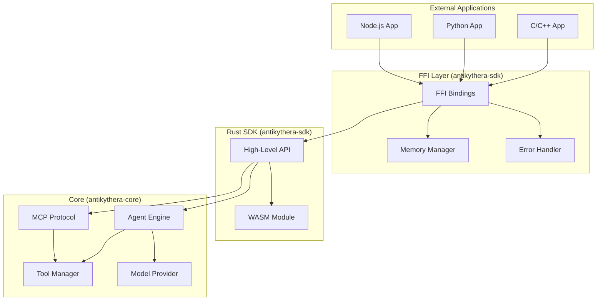
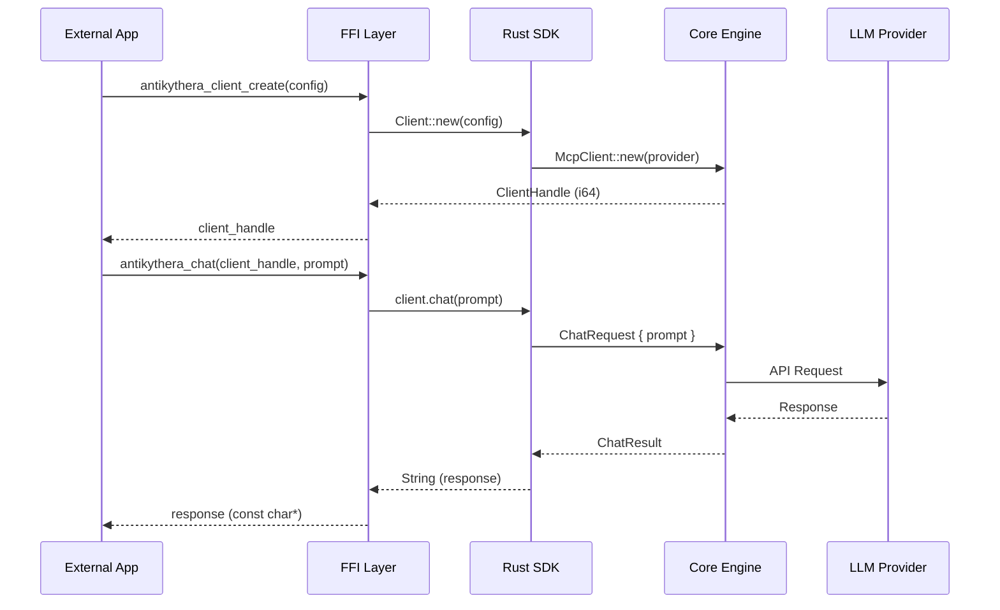
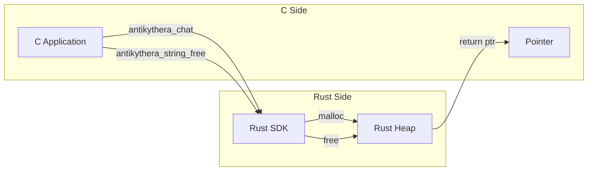

# 🔌 Antikythera FFI Documentation

> **Foreign Function Interface** - C/C++ bindings for integrating Antikythera MCP client with other languages

---

## 📋 Table of Contents

- [Overview](#-overview)
- [Architecture](#-architecture)
- [Installation](#-installation)
- [API Reference](#-api-reference)
  - [Core Functions](#core-functions)
  - [Client Management](#client-management)
  - [Chat & Agent](#chat--agent)
  - [Utility Functions](#utility-functions)
- [Usage Examples](#-usage-examples)
  - [C Example](#c-example)
  - [C++ Example](#c-example-1)
  - [Python Example](#python-example)
- [Data Structures](#-data-structures)
- [Error Handling](#-error-handling)
- [Memory Management](#-memory-management)
- [Thread Safety](#-thread-safety)
- [Build Instructions](#-build-instructions)

---

## 🎯 Overview

The Antikythera FFI provides a **C-compatible interface** to the Rust SDK, enabling integration with:

| Language | Support Level | Example |
|:---------|:-------------:|:--------|
| **C** | ✅ Full | See [C Example](#c-example) |
| **C++** | ✅ Full | See [C++ Example](#c-example-1) |
| **Python** | ✅ via ctypes | See [Python Example](#python-example) |
| **Node.js** | ✅ via FFI-n | See [Node.js Example](#nodejs-example) |
| **Go** | ✅ via cgo | Coming soon |
| **Java** | ✅ via JNA | Coming soon |

### Key Features

- ✅ **Zero-copy string handling** where possible
- ✅ **Thread-safe** client instances
- ✅ **Async support** via callback pattern
- ✅ **Memory-safe** with explicit ownership
- ✅ **Error propagation** with detailed messages

---

## 🏗️ Architecture



### Data Flow



---

## 📦 Installation

### 1. Build the FFI Library

```bash
# Build FFI library (shared library)
cargo build -p antikythera-sdk --release --features ffi

# Output locations:
# Linux:   target/release/libantikythera_sdk.so
# Windows: target/release/antikythera_sdk.dll
# macOS:   target/release/libantikythera_sdk.dylib
```

### 2. Header File

Copy the generated header or use the provided one:

```c
// include/antikythera.h
#ifndef ANTIKYTHERA_FFI_H
#define ANTIKYTHERA_FFI_H

#include <stdint.h>
#include <stdbool.h>

#ifdef __cplusplus
extern "C" {
#endif

// ... function declarations ...

#ifdef __cplusplus
}
#endif

#endif // ANTIKYTHERA_FFI_H
```

### 3. Link to Your Project

**CMake:**
```cmake
find_library(ANTIKYTHERA_LIB antikythera_sdk PATHS /path/to/target/release)
include_directories(/path/to/include)
target_link_libraries(your_app ${ANTIKYTHERA_LIB})
```

**Makefile:**
```makefile
CFLAGS += -I/path/to/include
LDFLAGS += -L/path/to/target/release -lantikythera_sdk
```

---

## 📖 API Reference

### Core Functions

#### `antikythera_init`

Initialize the SDK (call once at startup).

```c
void antikythera_init(void);
```

**Example:**
```c
antikythera_init();
```

---

#### `antikythera_version`

Get the SDK version string.

```c
const char* antikythera_version(void);
```

**Returns:** Version string (e.g., `"0.8.0"`)

**Example:**
```c
printf("Antikythera SDK version: %s\n", antikythera_version());
```

---

### Client Management

#### `antikythera_client_create`

Create a new client instance from JSON configuration.

```c
int64_t antikythera_client_create(const char* config_json);
```

**Parameters:**
| Name | Type | Description |
|:-----|:-----|:------------|
| `config_json` | `const char*` | JSON configuration string |

**Returns:**
- `>0` - Client handle (use in subsequent calls)
- `-1` - Error (check `antikythera_last_error()`)

**Example:**
```c
const char* config = R"({
    "providers": [
        {
            "id": "ollama",
            "type": "ollama",
            "endpoint": "http://127.0.0.1:11434"
        }
    ],
    "default_provider": "ollama",
    "model": "llama3"
})";

int64_t client = antikythera_client_create(config);
if (client < 0) {
    fprintf(stderr, "Error: %s\n", antikythera_last_error());
    return -1;
}
```

---

#### `antikythera_client_destroy`

Destroy a client instance and free resources.

```c
void antikythera_client_destroy(int64_t client_handle);
```

**Parameters:**
| Name | Type | Description |
|:-----|:-----|:------------|
| `client_handle` | `int64_t` | Client handle from `antikythera_client_create` |

**Example:**
```c
antikythera_client_destroy(client);
```

---

### Chat & Agent

#### `antikythera_chat`

Send a chat message and get response (blocking).

```c
char* antikythera_chat(int64_t client_handle, const char* prompt);
```

**Parameters:**
| Name | Type | Description |
|:-----|:-----|:------------|
| `client_handle` | `int64_t` | Client handle |
| `prompt` | `const char*` | User message |

**Returns:**
- `char*` - Response string (must be freed with `antikythera_string_free`)
- `NULL` - Error (check `antikythera_last_error()`)

**Example:**
```c
char* response = antikythera_chat(client, "Hello, how are you?");
if (response) {
    printf("Assistant: %s\n", response);
    antikythera_string_free(response);
} else {
    fprintf(stderr, "Error: %s\n", antikythera_last_error());
}
```

---

#### `antikythera_run_agent`

Run autonomous agent with tool execution (blocking).

```c
char* antikythera_run_agent(
    int64_t client_handle, 
    const char* prompt,
    const char* options_json
);
```

**Parameters:**
| Name | Type | Description |
|:-----|:-----|:------------|
| `client_handle` | `int64_t` | Client handle |
| `prompt` | `const char*` | Task description |
| `options_json` | `const char*` | Agent options (JSON) |

**Agent Options JSON:**
```json
{
    "session_id": "optional-session-id",
    "max_steps": 8,
    "system_prompt": "Optional custom system prompt"
}
```

**Returns:**
- `char*` - JSON response with format:
```json
{
    "response": "Final answer",
    "logs": ["Log message 1", "Log message 2"],
    "session_id": "session-id",
    "steps": [
        {
            "tool": "tool_name",
            "success": true,
            "message": "Tool result"
        }
    ]
}
```

**Example:**
```c
const char* options = R"({
    "max_steps": 10,
    "system_prompt": "You are a helpful assistant with tool access."
})";

char* result = antikythera_run_agent(client, "List files in current directory", options);
if (result) {
    printf("Agent result: %s\n", result);
    antikythera_string_free(result);
}
```

---

#### `antikythera_list_tools`

List available tools for the client.

```c
char* antikythera_list_tools(int64_t client_handle);
```

**Returns:** JSON array of tools:
```json
{
    "tools": [
        {
            "name": "read_file",
            "description": "Read contents of a file"
        },
        {
            "name": "write_file",
            "description": "Write contents to a file"
        }
    ]
}
```

---

### Utility Functions

#### `antikythera_string_free`

Free a string returned by the SDK.

```c
void antikythera_string_free(char* str);
```

**⚠️ Important:** All strings returned by FFI functions **must** be freed with this function.

**Example:**
```c
char* response = antikythera_chat(client, "Hello");
// ... use response ...
antikythera_string_free(response);  // MUST free
```

---

#### `antikythera_last_error`

Get the last error message.

```c
const char* antikythera_last_error(void);
```

**Returns:** Error message string (do not free)

**Example:**
```c
int64_t client = antikythera_client_create(invalid_json);
if (client < 0) {
    fprintf(stderr, "Error: %s\n", antikythera_last_error());
}
```

---

#### `antikythera_set_log_callback`

Set a callback for log messages.

```c
typedef void (*antikythera_log_callback)(const char* level, const char* message);

void antikythera_set_log_callback(antikythera_log_callback callback);
```

**Example:**
```c
void my_log_callback(const char* level, const char* message) {
    printf("[%s] %s\n", level, message);
}

antikythera_set_log_callback(my_log_callback);
```

---

## 💻 Usage Examples

### C Example

```c
#include <stdio.h>
#include <stdlib.h>
#include "antikythera.h"

int main() {
    // Initialize SDK
    antikythera_init();
    printf("Antikythera SDK v%s\n", antikythera_version());
    
    // Configuration
    const char* config = R"({
        "providers": [
            {
                "id": "ollama",
                "type": "ollama",
                "endpoint": "http://127.0.0.1:11434"
            }
        ],
        "default_provider": "ollama",
        "model": "llama3"
    })";
    
    // Create client
    int64_t client = antikythera_client_create(config);
    if (client < 0) {
        fprintf(stderr, "Failed to create client: %s\n", antikythera_last_error());
        return 1;
    }
    
    // Simple chat
    char* response = antikythera_chat(client, "What is the capital of France?");
    if (response) {
        printf("Answer: %s\n", response);
        antikythera_string_free(response);
    }
    
    // Run agent with tools
    const char* options = R"({ "max_steps": 5 })";
    char* agent_result = antikythera_run_agent(
        client, 
        "List all .txt files in the current directory", 
        options
    );
    if (agent_result) {
        printf("Agent result: %s\n", agent_result);
        antikythera_string_free(agent_result);
    }
    
    // Cleanup
    antikythera_client_destroy(client);
    printf("Done!\n");
    
    return 0;
}
```

**Compile:**
```bash
gcc -o my_app my_app.c -I/path/to/include -L/path/to/target/release -lantikythera_sdk
```

---

### C++ Example

```cpp
#include <iostream>
#include <string>
#include <memory>
#include "antikythera.h"

// RAII wrapper for client
class AntikytheraClient {
public:
    explicit AntikytheraClient(const std::string& config_json) {
        handle_ = antikythera_client_create(config_json.c_str());
        if (handle_ < 0) {
            throw std::runtime_error(antikythera_last_error());
        }
    }
    
    ~AntikytheraClient() {
        if (handle_ >= 0) {
            antikythera_client_destroy(handle_);
        }
    }
    
    // Non-copyable
    AntikytheraClient(const AntikytheraClient&) = delete;
    AntikytheraClient& operator=(const AntikytheraClient&) = delete;
    
    std::string chat(const std::string& prompt) {
        char* response = antikythera_chat(handle_, prompt.c_str());
        if (!response) {
            throw std::runtime_error(antikythera_last_error());
        }
        std::string result(response);
        antikythera_string_free(response);
        return result;
    }
    
private:
    int64_t handle_;
};

int main() {
    antikythera_init();
    
    try {
        std::string config = R"({
            "providers": [{"id": "ollama", "type": "ollama", "endpoint": "http://127.0.0.1:11434"}],
            "default_provider": "ollama",
            "model": "llama3"
        })";
        
        AntikytheraClient client(config);
        
        std::string answer = client.chat("Explain quantum computing in simple terms");
        std::cout << "Answer: " << answer << std::endl;
        
    } catch (const std::exception& e) {
        std::cerr << "Error: " << e.what() << std::endl;
        return 1;
    }
    
    return 0;
}
```

**Compile:**
```bash
g++ -std=c++17 -o my_app my_app.cpp -I/path/to/include -L/path/to/target/release -lantikythera_sdk
```

---

### Python Example

```python
import ctypes
import json
from typing import Optional

# Load library
lib = ctypes.CDLL("./target/release/libantikythera_sdk.so")  # or .dll/.dylib

# Define types
lib.antikythera_init.argtypes = []
lib.antikythera_init.restype = None

lib.antikythera_version.argtypes = []
lib.antikythera_version.restype = ctypes.c_char_p

lib.antikythera_client_create.argtypes = [ctypes.c_char_p]
lib.antikythera_client_create.restype = ctypes.c_int64

lib.antikythera_client_destroy.argtypes = [ctypes.c_int64]
lib.antikythera_client_destroy.restype = None

lib.antikythera_chat.argtypes = [ctypes.c_int64, ctypes.c_char_p]
lib.antikythera_chat.restype = ctypes.c_char_p

lib.antikythera_string_free.argtypes = [ctypes.c_char_p]
lib.antikythera_string_free.restype = None

lib.antikythera_last_error.argtypes = []
lib.antikythera_last_error.restype = ctypes.c_char_p

# Initialize
lib.antikythera_init()
print(f"Antikythera SDK v{lib.antikythera_version().decode()}")

# Create client
config = json.dumps({
    "providers": [
        {"id": "ollama", "type": "ollama", "endpoint": "http://127.0.0.1:11434"}
    ],
    "default_provider": "ollama",
    "model": "llama3"
}).encode()

client = lib.antikythera_client_create(config)
if client < 0:
    raise RuntimeError(lib.antikythera_last_error().decode())

try:
    # Chat
    response = lib.antikythera_chat(client, b"What is machine learning?")
    if response:
        print(f"Answer: {response.decode()}")
        lib.antikythera_string_free(response)
    else:
        raise RuntimeError(lib.antikythera_last_error().decode())

finally:
    lib.antikythera_client_destroy(client)
```

---

### Node.js Example

```javascript
const ffi = require('ffi-napi');
const ref = require('ref-napi');

// Load library
const lib = ffi.Library('./target/release/libantikythera_sdk', {
    'antikythera_init': ['void', []],
    'antikythera_version': ['string', []],
    'antikythera_client_create': ['int64', ['string']],
    'antikythera_client_destroy': ['void', ['int64']],
    'antikythera_chat': ['string', ['int64', 'string']],
    'antikythera_string_free': ['void', ['string']],
    'antikythera_last_error': ['string', []]
});

// Initialize
lib.antikythera_init();
console.log(`Antikythera SDK v${lib.antikythera_version()}`);

// Create client
const config = JSON.stringify({
    providers: [{id: "ollama", type: "ollama", endpoint: "http://127.0.0.1:11434"}],
    default_provider: "ollama",
    model: "llama3"
});

const client = lib.antikythera_client_create(config);
if (client < 0) {
    throw new Error(lib.antikythera_last_error());
}

try {
    // Chat
    const response = lib.antikythera_chat(client, "What is Node.js?");
    console.log(`Answer: ${response}`);
} finally {
    lib.antikythera_client_destroy(client);
}
```

---

## 📊 Data Structures

### Client Handle

```c
typedef int64_t ClientHandle;
```

Opaque handle to a client instance. Created by `antikythera_client_create`, destroyed by `antikythera_client_destroy`.

---

### Log Callback

```c
typedef void (*antikythera_log_callback)(
    const char* level,   // "INFO", "WARN", "ERROR", "DEBUG"
    const char* message  // Log message
);
```

---

### Agent Options (JSON)

```json
{
    "session_id": "string (optional)",
    "max_steps": "integer (default: 8)",
    "system_prompt": "string (optional)"
}
```

---

### Agent Result (JSON)

```json
{
    "response": "string - Final answer",
    "logs": ["string - Log messages"],
    "session_id": "string - Session identifier",
    "steps": [
        {
            "tool": "string - Tool name",
            "success": "boolean",
            "message": "string - Tool result message"
        }
    ]
}
```

---

## ⚠️ Error Handling

### Error Codes

| Return Value | Meaning |
|:-------------|:--------|
| `>= 0` | Success (handle or valid result) |
| `-1` | General error (check `antikythera_last_error()`) |
| `NULL` | Null pointer (error occurred) |

### Error Handling Pattern

```c
// Function that returns handle
int64_t handle = antikythera_client_create(config);
if (handle < 0) {
    fprintf(stderr, "Error: %s\n", antikythera_last_error());
    return -1;
}

// Function that returns string
char* result = antikythera_chat(client, prompt);
if (!result) {
    fprintf(stderr, "Error: %s\n", antikythera_last_error());
    return -1;
}
// Use result...
antikythera_string_free(result);
```

---

## 🧠 Memory Management

### Ownership Rules

1. **Strings returned by FFI** → Caller must free with `antikythera_string_free()`
2. **Client handles** → Must destroy with `antikythera_client_destroy()`
3. **Strings passed to FFI** → Caller retains ownership (do not free until after call)

### Memory Diagram



### Example: Proper Memory Management

```c
// ✅ CORRECT
char* response = antikythera_chat(client, "Hello");
if (response) {
    printf("%s\n", response);
    antikythera_string_free(response);  // Free after use
}

// ❌ WRONG - Memory leak
char* response = antikythera_chat(client, "Hello");
printf("%s\n", response);
// Forgot to free!

// ❌ WRONG - Double free
char* response = antikythera_chat(client, "Hello");
antikythera_string_free(response);
antikythera_string_free(response);  // Double free!
```

---

## 🔒 Thread Safety

### Thread Safety Matrix

| Function | Thread Safe? | Notes |
|:---------|:------------:|:------|
| `antikythera_init()` | ✅ Yes | Call once at startup |
| `antikythera_version()` | ✅ Yes | Read-only |
| `antikythera_client_create()` | ✅ Yes | Creates new instance |
| `antikythera_client_destroy()` | ⚠️ No | Don't call while client in use |
| `antikythera_chat()` | ⚠️ Per-client | Same client = sequential only |
| `antikythera_run_agent()` | ⚠️ Per-client | Same client = sequential only |
| `antikythera_last_error()` | ⚠️ TLS | Thread-local storage |

### Multi-threading Example

```c
// ✅ CORRECT - Multiple clients in different threads
void thread_func(void* config) {
    int64_t client = antikythera_client_create(config);
    // ... use client ...
    antikythera_client_destroy(client);
}

// Create multiple threads with separate clients
pthread_create(&t1, NULL, thread_func, config1);
pthread_create(&t2, NULL, thread_func, config2);

// ❌ WRONG - Same client in multiple threads
int64_t client = antikythera_client_create(config);
pthread_create(&t1, NULL, chat_thread, client);  // Race condition!
pthread_create(&t2, NULL, chat_thread, client);  // Race condition!
```

---

## 🛠️ Build Instructions

### Prerequisites

- Rust 1.75+
- C compiler (gcc, clang, MSVC)
- CMake (optional)

### Build Steps

```bash
# 1. Clone repository
git clone https://github.com/antikythera/mcp-framework.git
cd mcp-framework

# 2. Build FFI library
cargo build -p antikythera-sdk --release --features ffi

# 3. Verify build artifacts
ls -la target/release/
# Linux:   libantikythera_sdk.so
# Windows: antikythera_sdk.dll
# macOS:   libantikythera_sdk.dylib
```

### Cross-Platform Build

```bash
# Install cross-compilation targets
rustup target add x86_64-unknown-linux-gnu
rustup target add x86_64-pc-windows-gnu
rustup target add x86_64-apple-darwin

# Build for specific target
cargo build -p antikythera-sdk --release --features ffi --target x86_64-unknown-linux-gnu
```

---

## 📝 License

Antikythera FFI is licensed under the MIT License.

---

*Last Updated: 2026-04-01*  
*Version: 0.8.0*  
*SDK: antikythera-sdk*
