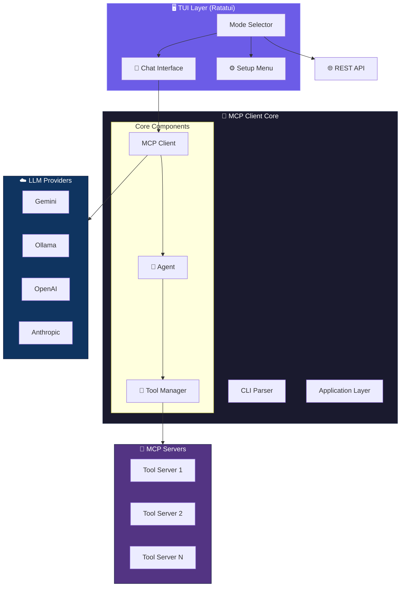
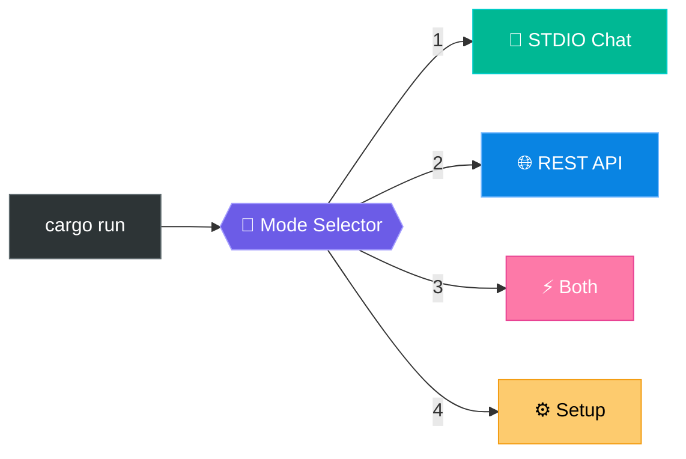
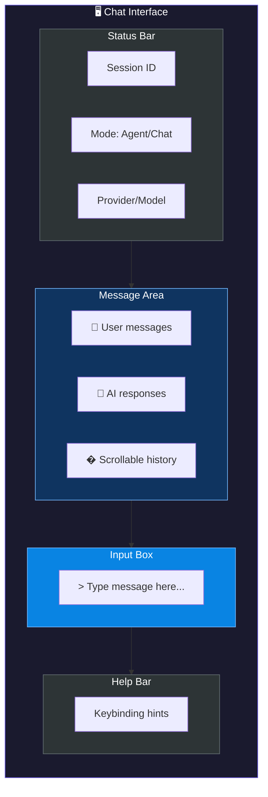
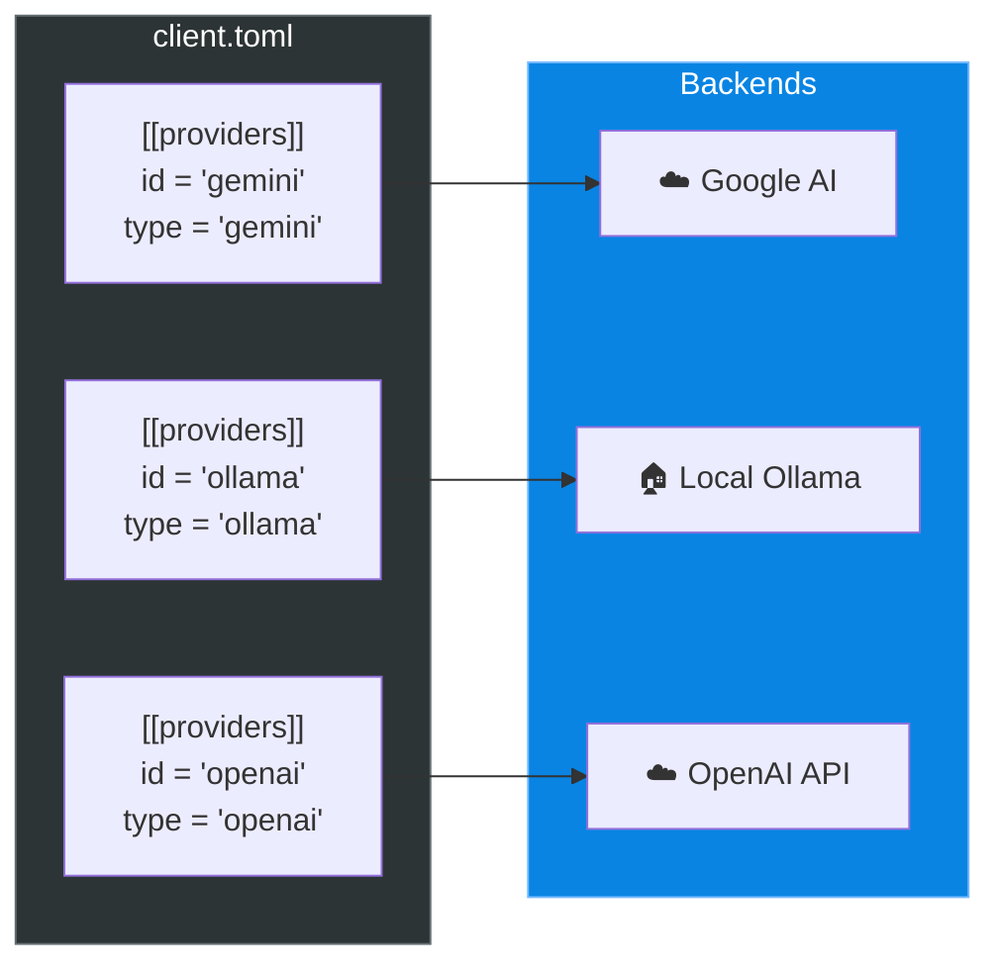
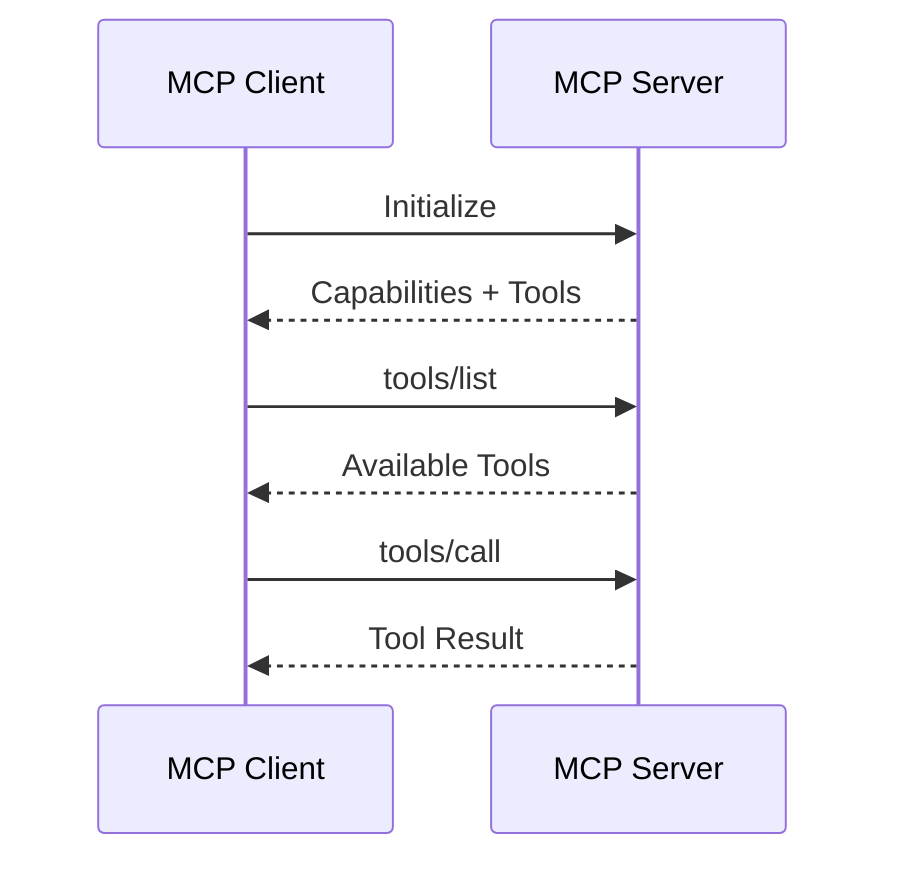
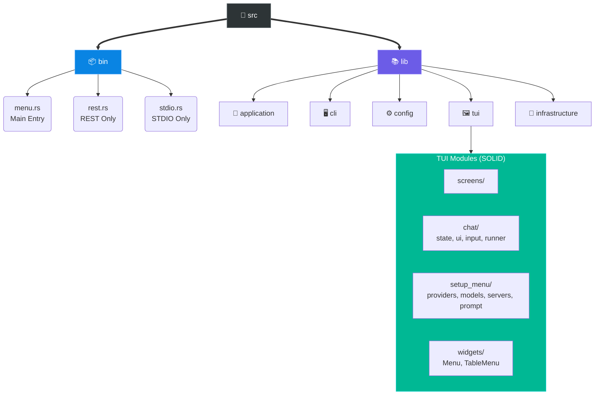
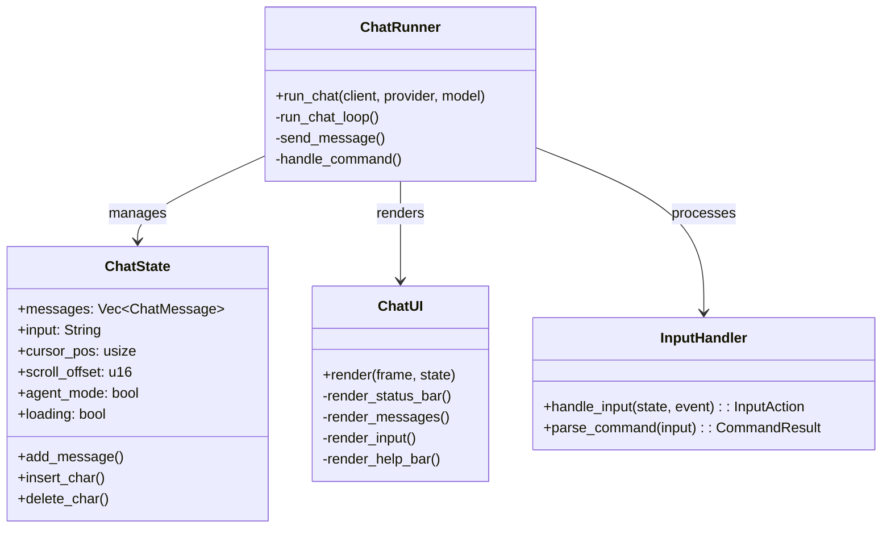

<div align="center">

# 🚀 MCP Client

**A flexible Model Context Protocol client with modern TUI interface**

[](https://www.rust-lang.org/)
[](LICENSE)
[](http://makeapullrequest.com)

[Features](#-features) •
[Quick Start](#-quick-start) •
[TUI Interface](#-tui-interface) •
[Configuration](#%EF%B8%8F-configuration) •
[API](#-api-reference) •
[Development](#-development)

</div>

---

## ✨ Features

| Feature | Description |
|:--------|:------------|
| 🖥️ **Modern TUI** | Full Ratatui-based interface with responsive layout |
| 🤖 **Multi-Provider** | Gemini, Ollama, OpenAI, Anthropic, and more |
| 🔧 **MCP Tools** | Connect any MCP-compatible tool server |
| 💬 **Interactive Chat** | Real-time chat with Agent/Chat mode toggle |
| 🌐 **REST API** | HTTP API with Swagger UI |
| ⚡ **Dual Mode** | Run STDIO + REST simultaneously |
| 🔄 **Hot Reload** | Reload config without restart |
| 📝 **Setup Wizard** | TUI-based configuration management |

---

## 🏗️ Architecture



---

## 🚀 Quick Start

### Prerequisites

| Requirement | Version | Note |
|:------------|:--------|:-----|
| Rust | 1.75+ | Edition 2024 |
| Ollama | Latest | Optional, for local models |
| API Key | - | For cloud providers |

### Installation

```bash
# Clone repository
git clone https://github.com/your-username/antikhitera-mcp-client.git
cd antikhitera-mcp-client

# Build
cargo build --release

# Run (shows TUI mode selector)
cargo run
```

---

## 🖥️ TUI Interface

### Mode Selection



### Chat Interface Layout



#### Layout Components

| Component | Description |
|:----------|:------------|
| **Status Bar** | Session ID, Agent/Chat mode toggle, Provider & Model info |
| **Message Area** | Scrollable chat history with user and AI messages |
| **Input Box** | Text input with cursor, shows "Command" when typing `/` |
| **Help Bar** | Context-sensitive keybinding hints |


### Chat Keybindings

| Key | Action |
|:----|:-------|
| `Enter` | Send message |
| `q` | Exit (when input empty) |
| `Ctrl+C` | Clear input |
| `PageUp/Down` | Scroll messages |
| `/help` | Show commands |
| `/agent on\|off` | Toggle agent mode |
| `/reset` | Reset session |
| `/logs` | Show last logs |
| `/steps` | Show tool steps |

### Setup Menu


---

## ⚙️ Configuration

### Directory Structure

```
config/
├── client.toml    # Main configuration
└── .env           # API keys (gitignored)
```

### Provider Configuration



### Full Configuration Example

See [config.example/client.toml](config.example/client.toml) for the complete configuration reference.

---

## 🌐 API Reference

### REST Endpoints

| Method | Endpoint | Description |
|:------:|:---------|:------------|
| `POST` | `/chat` | 💬 Send chat message |
| `GET` | `/config` | ⚙️ Get configuration |
| `PUT` | `/config` | ✏️ Update configuration |
| `POST` | `/reload` | 🔄 Reload from file |
| `GET` | `/tools` | 🔧 List tools |
| `POST` | `/tools/{name}` | ▶️ Invoke tool |

> 📚 **Swagger UI**: `http://127.0.0.1:8080/swagger-ui/`

### STDIO/TUI Commands

| Command | Description |
|:--------|:------------|
| `/help` | 📖 Show commands |
| `/agent [on\|off]` | 🤖 Toggle agent mode |
| `/reset` | 🗑️ Clear session |
| `/logs` | 📋 Show interaction logs |
| `/steps` | 🔧 Show tool steps |
| `/exit` | 🚪 Exit app |

---

## 🔌 Adding MCP Servers



### Steps

1️⃣ **Add server via Setup Menu or config**

```toml
[[servers]]
name = "my-server"
command = "/path/to/server-binary"
```

2️⃣ **Sync tools in Setup → Manage MCP Servers → Sync All**

3️⃣ **Tools auto-bind to the configured server**

---

## 🧪 Development

### Project Structure



### Chat Module Architecture (SOLID)



### 🛠️ Developer Commands

#### Build & Run

| Command | Description |
|:--------|:------------|
| `cargo build` | 🔨 Build in debug mode |
| `cargo build --release` | 🚀 Build for production |
| `cargo run` | 🎮 Run TUI mode selector |
| `cargo run --bin stdio` | 💬 Run directly in STDIO mode |
| `cargo run --bin rest` | 🌐 Run directly in REST mode |

#### Testing

| Command | Description |
|:--------|:------------|
| `cargo test` | 🧪 Run all tests |
| `cargo test --test config_loading_tests` | 📄 Run specific integration test |
| `cargo clippy` | 🔍 Lint code |
| `cargo fmt` | 🎨 Format code |

---

## 📄 License

MIT License - See [LICENSE](LICENSE) for details.

---

<p align="center">
  Made with ❤️ using Rust + Ratatui
</p>
