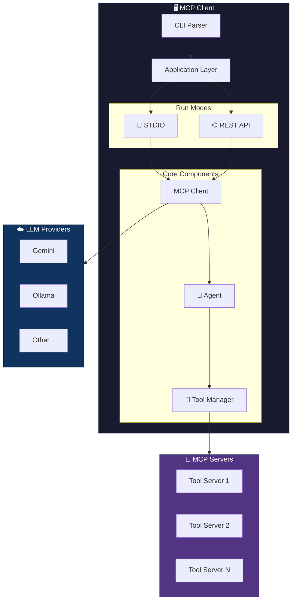
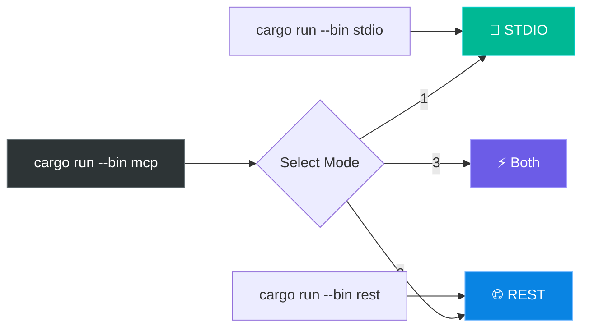
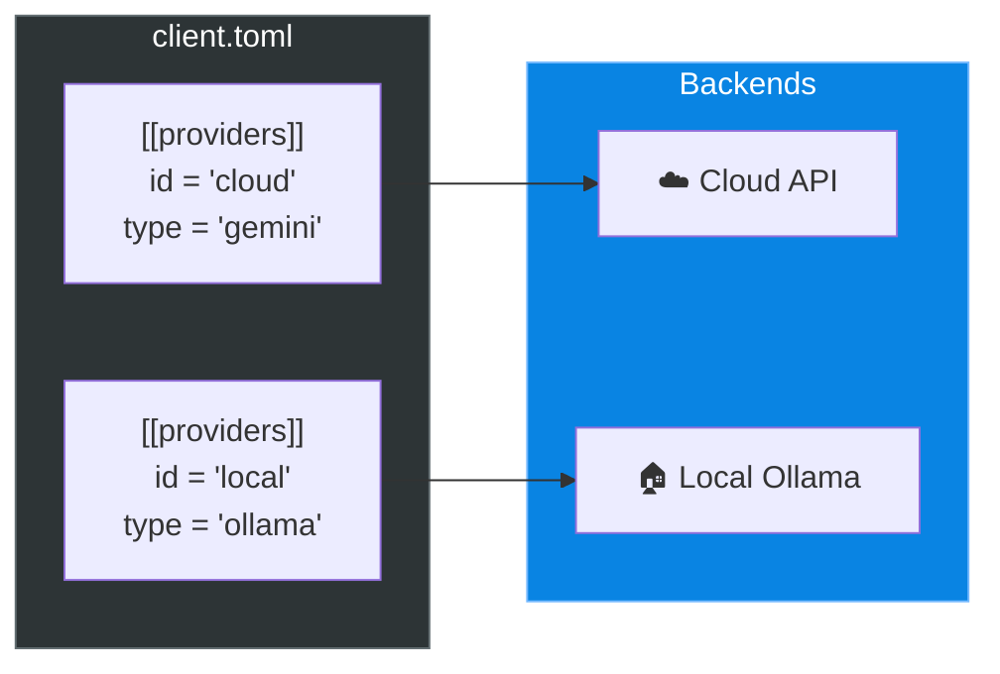
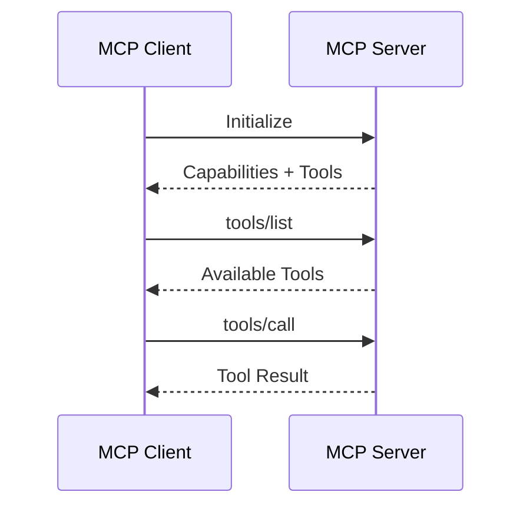
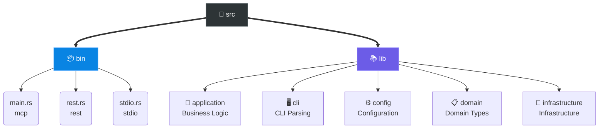

<div align="center">

# 🚀 MCP Client

**A flexible Model Context Protocol client for connecting LLMs with tools**

[](https://www.rust-lang.org/)
[](LICENSE)
[](http://makeapullrequest.com)

[Features](#-features) •
[Quick Start](#-quick-start) •
[Configuration](#%EF%B8%8F-configuration) •
[API](#-api-reference) •
[Development](#-development)

</div>

---

## ✨ Features

| Feature | Description |
|:--------|:------------|
| 🤖 **Multi-Provider** | Gemini, Ollama, OpenAI, and more |
| 🔧 **MCP Tools** | Connect any MCP-compatible tool server |
| 💬 **Interactive Chat** | STDIO mode with session management |
| 🌐 **REST API** | HTTP API with Swagger UI |
| ⚡ **Dual Mode** | Run STDIO + REST simultaneously |
| 🔄 **Hot Reload** | Reload config without restart |

---

## 🏗️ Architecture



---

## 🚀 Quick Start

### Prerequisites

| Requirement | Version | Note |
|:------------|:--------|:-----|
| Rust | 1.75+ | Edition 2024 |
| Ollama | Latest | Optional, for local models |
| API Key | - | For cloud providers |

### Installation

```bash
# Clone repository
git clone https://github.com/your-username/antikhitera-mcp-client.git
cd antikhitera-mcp-client

# Setup configuration
cp -r config.example config
# Edit config/client.toml and config/.env

# Build
cargo build --release
```

### Run Modes



---

## ⚙️ Configuration

### Directory Structure

```text
config/
├── client.toml    # Main configuration
└── .env           # API keys (gitignored)
```

### Provider Configuration



### Full Configuration Example

See [config.example/client.toml](https://github.com/tsfarizi/antikhitera-mcp-client/blob/697899d85562d19467d22d59d0771322639201ea/config.example/client.toml) for the complete configuration reference with detailed comments.

---

## 🌐 API Reference

### REST Endpoints

| Method | Endpoint | Description |
|:------:|:---------|:------------|
| `POST` | `/chat` | 💬 Send chat message |
| `GET` | `/config` | ⚙️ Get configuration |
| `PUT` | `/config` | ✏️ Update configuration |
| `POST` | `/reload` | 🔄 Reload from file |
| `GET` | `/tools` | 🔧 List tools |
| `POST` | `/tools/{name}` | ▶️ Invoke tool |

> 📚 **Swagger UI**: `http://127.0.0.1:8080/swagger-ui/`

### STDIO Commands

| Command | Description |
|:--------|:------------|
| `/help` | 📖 Show commands |
| `/config` | ⚙️ Display configuration from `config/client.toml` |
| `/reload` | 🔄 Reload current configuration |
| `/reset` | 🗑️ Clear history |
| `/exit` | 🚪 Exit app |

---

## 🔌 Adding MCP Servers



### Steps

1️⃣ **Add server to config**

```toml
[[servers]]
name = "my-server"
command = "/path/to/server-binary"
```

2️⃣ **Bind tools**

```toml
[[tools]]
name = "tool_name"
server = "my-server"
```

3️⃣ **Restart or reload**

```bash
# In STDIO mode
/reload
```

---

## 🧪 Development

### Project Structure (Interactive)



### 🛠️ Developer Commands

#### Build & Run

| Command | Description |
|:--------|:------------|
| `cargo build` | 🔨 Build in debug mode |
| `cargo build --release` | 🚀 Build for production |
| `cargo run --bin mcp` | 🎮 Run interactive mode selector |
| `cargo run --bin stdio` | 💬 Run directly in STDIO mode |
| `cargo run --bin rest` | 🌐 Run directly in REST mode |
| `cargo run --bin mcp -- -m all` | ⚡ Run both modes simultaneously |

#### Testing

| Command | Description |
|:--------|:------------|
| `cargo test` | 🧪 Run all tests |
| `cargo test --test config_loading_tests` | 📄 Run specific integration test |
| `cargo test --doc` | 📚 Run documentation tests |
| `cargo test -- --nocapture` | 🗣️ Run tests showing output |

#### Maintenance

| Command | Description |
|:--------|:------------|
| `cargo fmt` | 🎨 Format code |
| `cargo clippy` | 🔍 Lint code |
| `cargo doc --open` | 📖 Generate and open docs |

---

## 📄 License

MIT License - See [LICENSE](LICENSE) for details.

---

<p align="center">
  Made with ❤️ using Rust
</p>
