<div align="center">

# 🚀 MCP Client

**A flexible Model Context Protocol client with modern TUI interface**

[](https://www.rust-lang.org/)
[](LICENSE)
[](http://makeapullrequest.com)

[Features](#-features) •
[Quick Start](#-quick-start) •
[TUI Interface](#-tui-interface) •
[Configuration](#%EF%B8%8F-configuration) •
[API](#-api-reference) •
[Development](#-development)

</div>

---

## ✨ Features

| Feature | Description |
|:--------|:------------|
| 🖥️ **Modern TUI** | Full Ratatui-based interface with responsive layout |
| 🤖 **Multi-Provider** | Gemini, Ollama, OpenAI, Anthropic, and more |
| 🔧 **MCP Tools** | Connect any MCP-compatible tool server |
| 💬 **Interactive Chat** | Real-time chat with Agent/Chat mode toggle |
| 🌐 **REST API** | HTTP API with Swagger UI |
| ⚡ **Dual Mode** | Run STDIO + REST simultaneously |
| 🔄 **Hot Reload** | Reload config without restart |
| 📝 **Setup Wizard** | TUI-based configuration management |

---

## 🏗️ Architecture

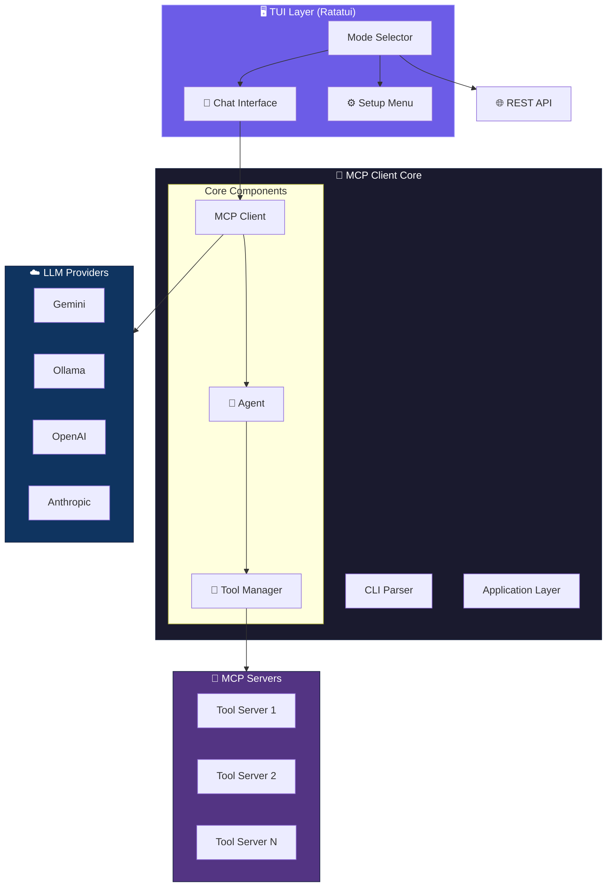

---

## 🚀 Quick Start

### Prerequisites

| Requirement | Version | Note |
|:------------|:--------|:-----|
| Rust | 1.75+ | Edition 2024 |
| Ollama | Latest | Optional, for local models |
| API Key | - | For cloud providers |

### Installation

```bash
# Clone repository
git clone https://github.com/your-username/antikhitera-mcp-client.git
cd antikhitera-mcp-client

# Build
cargo build --release

# Run (shows TUI mode selector)
cargo run
```

---

## 🖥️ TUI Interface

### Mode Selection

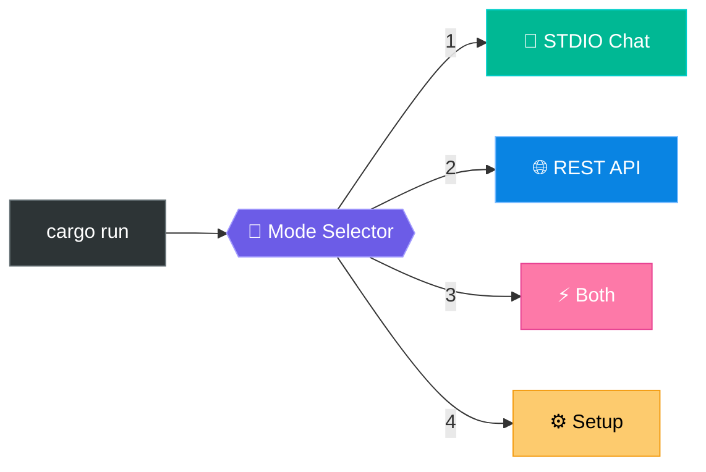

### Chat Interface Layout

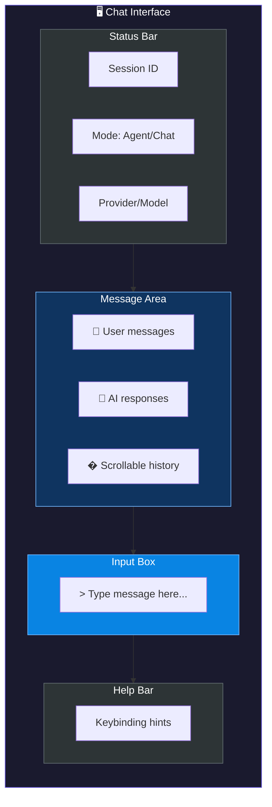

#### Layout Components

| Component | Description |
|:----------|:------------|
| **Status Bar** | Session ID, Agent/Chat mode toggle, Provider & Model info |
| **Message Area** | Scrollable chat history with user and AI messages |
| **Input Box** | Text input with cursor, shows "Command" when typing `/` |
| **Help Bar** | Context-sensitive keybinding hints |


### Chat Keybindings

| Key | Action |
|:----|:-------|
| `Enter` | Send message |
| `q` | Exit (when input empty) |
| `Ctrl+C` | Clear input |
| `PageUp/Down` | Scroll messages |
| `/help` | Show commands |
| `/agent on\|off` | Toggle agent mode |
| `/reset` | Reset session |
| `/logs` | Show last logs |
| `/steps` | Show tool steps |

### Setup Menu

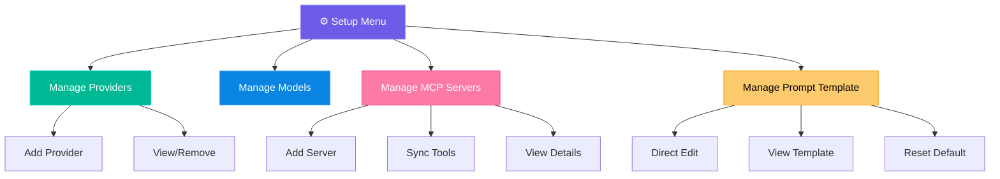

---

## ⚙️ Configuration

### Directory Structure

```
config/
├── client.toml    # Infrastructure: providers, servers, REST settings
├── model.toml     # Model settings: provider, model, prompt, tools
└── .env           # API keys (gitignored)
```

### Split Configuration Design

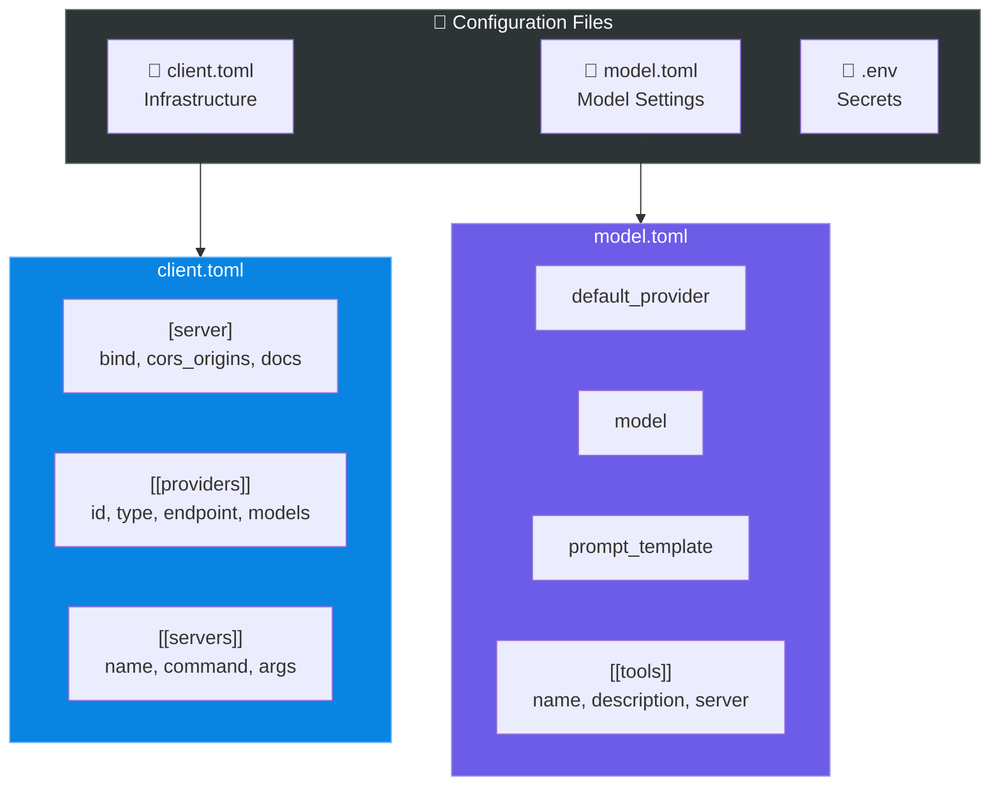

### client.toml - Infrastructure

```toml
# REST Server Settings
[server]
bind = "127.0.0.1:8080"          # Server bind address
cors_origins = [
    "http://localhost:5173",
]

[[server.docs]]
url = "http://localhost:8080"
description = "Local development"

# LLM Providers
[[providers]]
id = "gemini"
type = "gemini"
endpoint = "https://generativelanguage.googleapis.com"
api_key = "GEMINI_API_KEY"         # Environment variable name
models = [
    { name = "gemini-2.0-flash", display_name = "Gemini 2.0 Flash" }
]

# MCP Servers
[[servers]]
name = "time"
command = "/path/to/mcp-server-time"
default_timezone = "Asia/Jakarta"
```

### model.toml - Model Settings

```toml
# Default provider and model
default_provider = "gemini"
model = "gemini-2.0-flash"

# System prompt template
prompt_template = """
You are a helpful AI assistant.

{{custom_instruction}}

{{language_guidance}}

{{tool_guidance}}
"""

# Tools (synced from MCP servers)
[[tools]]
name = "get_current_time"
description = "Get current time"
server = "time"
```

### Configuration Flow

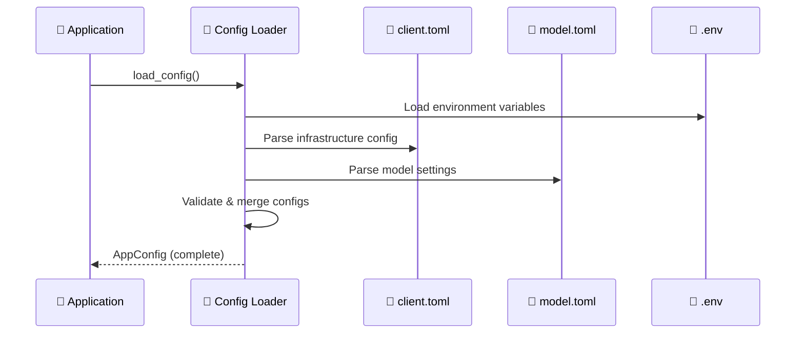

### Full Configuration Reference

See example files:
- [config.example/client.toml](config.example/client.toml) - Infrastructure template
- [config.example/model.toml](config.example/model.toml) - Model settings template

---

## 🚀 Execution Modes

### Mode Overview

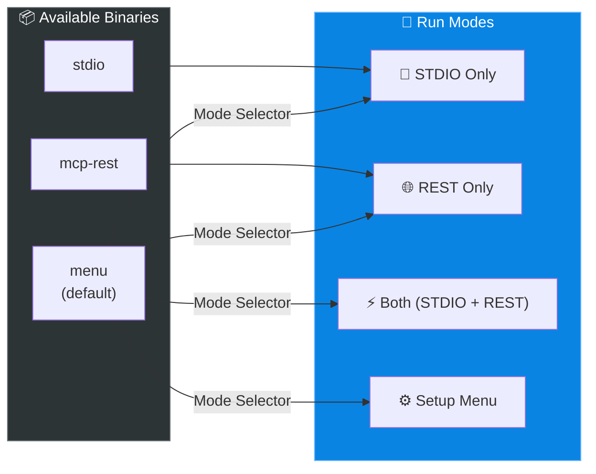

### Execution Flow

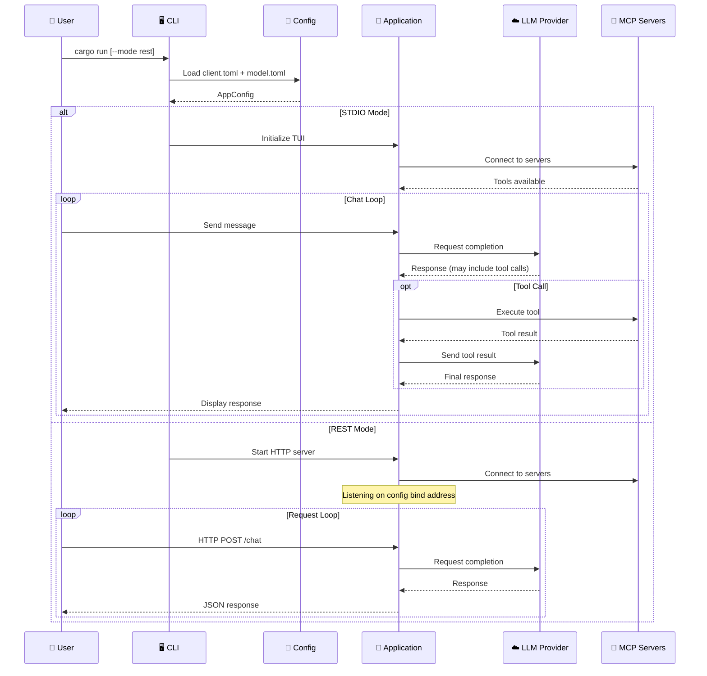

### Running Different Modes

```bash
# Default: TUI Mode Selector
cargo run

# Direct STDIO mode
cargo run --bin stdio

# Direct REST mode (uses config bind address)
cargo run --bin mcp-rest

# REST with CLI override
cargo run --bin mcp-rest -- --addr 0.0.0.0:3000

# Using mode flag
cargo run -- --mode rest
cargo run -- --mode stdio
cargo run -- --mode all
```

### Production Deployment

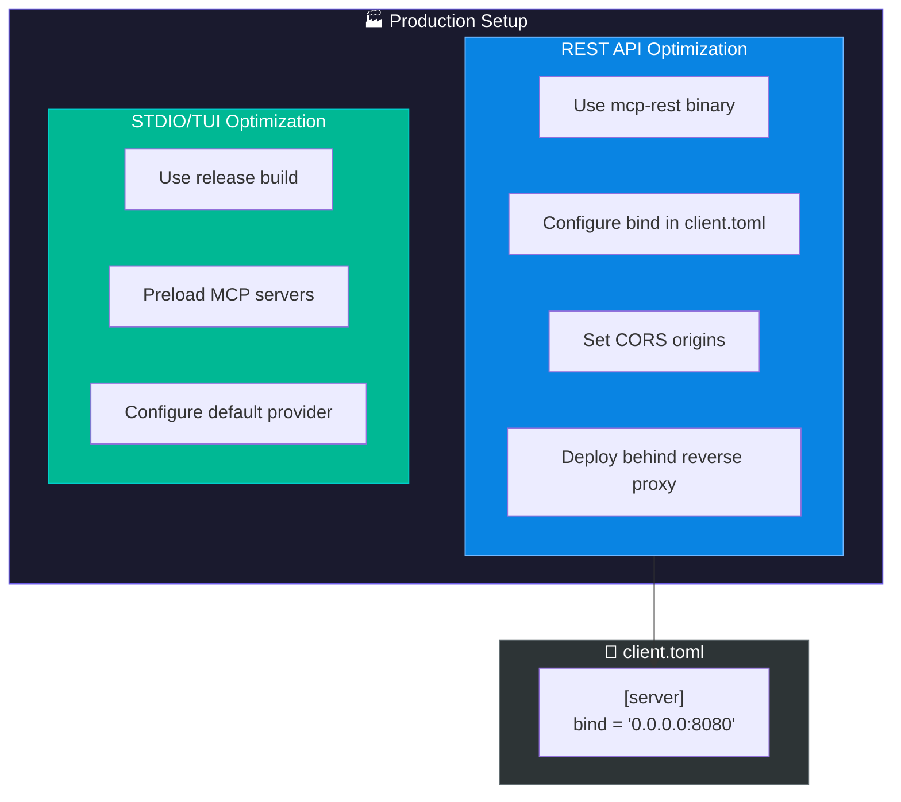

### REST API Optimization

| Aspect | Configuration | Description |
|:-------|:--------------|:------------|
| **Bind Address** | `[server].bind` | Configure in `client.toml` |
| **CORS** | `[server].cors_origins` | Whitelist allowed origins |
| **Binary** | `mcp-rest` | Optimized REST-only binary |
| **Logging** | `RUST_LOG=info` | Control log verbosity |

```bash
# Production REST deployment
RUST_LOG=info ./target/release/mcp-rest
```

### STDIO/TUI Optimization

| Aspect | Configuration | Description |
|:-------|:--------------|:------------|
| **Default Provider** | `model.toml` | Set preferred LLM |
| **Prompt Template** | `model.toml` | Customize system prompt |
| **Tools** | `model.toml` | Pre-configure available tools |
| **Binary** | `stdio` | Optimized STDIO-only binary |

```bash
# Production STDIO deployment
./target/release/stdio
```

---

## 🌐 API Reference

### REST Endpoints

| Method | Endpoint | Description |
|:------:|:---------|:------------|
| `POST` | `/chat` | 💬 Send chat message |
| `GET` | `/config` | ⚙️ Get configuration |
| `PUT` | `/config` | ✏️ Update configuration |
| `POST` | `/reload` | 🔄 Reload from file |
| `GET` | `/tools` | 🔧 List tools |
| `POST` | `/tools/{name}` | ▶️ Invoke tool |

> 📚 **Swagger UI**: `http://127.0.0.1:8080/swagger-ui/`

### STDIO/TUI Commands

| Command | Description |
|:--------|:------------|
| `/help` | 📖 Show commands |
| `/agent [on\|off]` | 🤖 Toggle agent mode |
| `/reset` | 🗑️ Clear session |
| `/logs` | 📋 Show interaction logs |
| `/steps` | 🔧 Show tool steps |
| `/exit` | 🚪 Exit app |

---

## 🔌 Adding MCP Servers

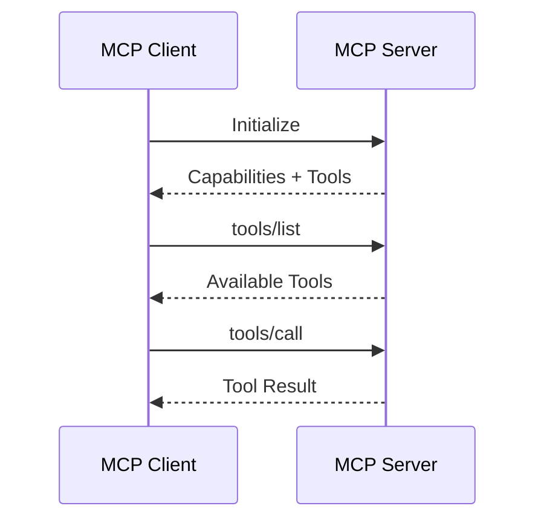

### Steps

1️⃣ **Add server via Setup Menu or config**

```toml
[[servers]]
name = "my-server"
command = "/path/to/server-binary"
```

2️⃣ **Sync tools in Setup → Manage MCP Servers → Sync All**

3️⃣ **Tools auto-bind to the configured server**

---

## 🔍 Server Auto-Discovery

The discovery module provides automatic loading of MCP servers from a designated folder.

### Architecture

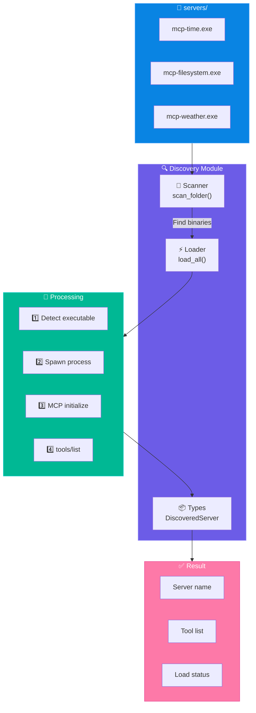

### Discovery Flow

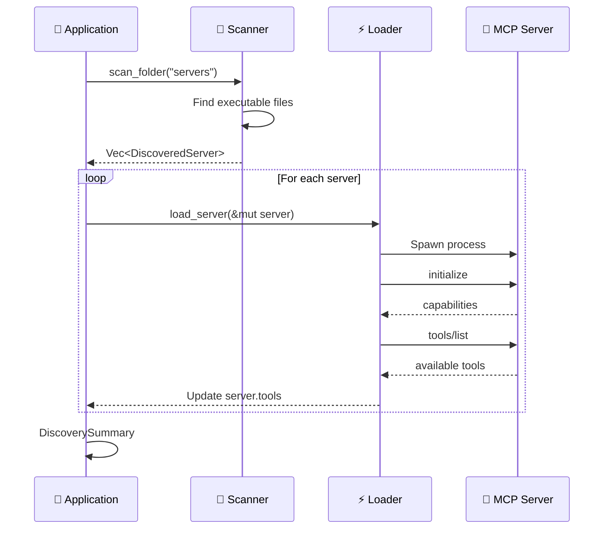

### Usage

```rust
use antikhitera_mcp_client::application::discovery;

// Option 1: Scan and load in one step
let (servers, summary) = discovery::scan_and_load("servers").await?;

println!("✓ Loaded {} servers with {} total tools", 
    summary.loaded, 
    summary.total_tools
);

// Option 2: Manual two-step process
let mut servers = discovery::scan_folder("servers")?;
let summary = discovery::load_all(&mut servers).await;

// Iterate through results
for server in &servers {
    match &server.load_status {
        LoadStatus::Success => {
            println!("✓ {} - {} tools", server.name, server.tool_count());
            for (tool_name, desc) in &server.tools {
                println!("  • {}: {}", tool_name, desc);
            }
        }
        LoadStatus::Failed(e) => println!("✗ {} - {}", server.name, e),
        LoadStatus::NoTools => println!("⚠ {} - no tools", server.name),
        _ => {}
    }
}
```

### Module Structure

| File | Description |
|:-----|:------------|
| `discovery/mod.rs` | Module exports + documentation |
| `discovery/types.rs` | `DiscoveredServer`, `LoadStatus`, `DiscoverySummary` |
| `discovery/scanner.rs` | `scan_folder()` - Platform-specific executable detection |
| `discovery/loader.rs` | `load_all()`, `scan_and_load()` - MCP initialization |

### Platform-Specific Detection

| Platform | Detected Extensions |
|:---------|:-------------------|
| **Windows** | `.exe`, `.cmd`, `.bat` |
| **Unix/Linux** | Files with execute permission bit |

---

## 🧪 Development

### Project Structure

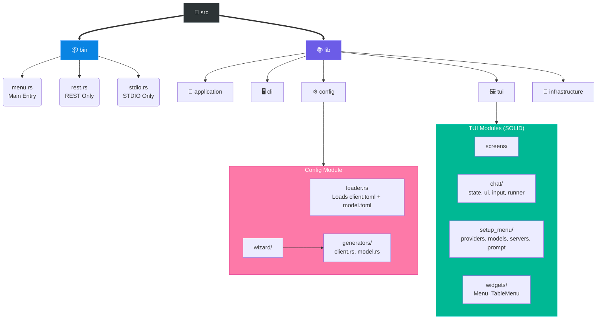

### Chat Module Architecture (SOLID)

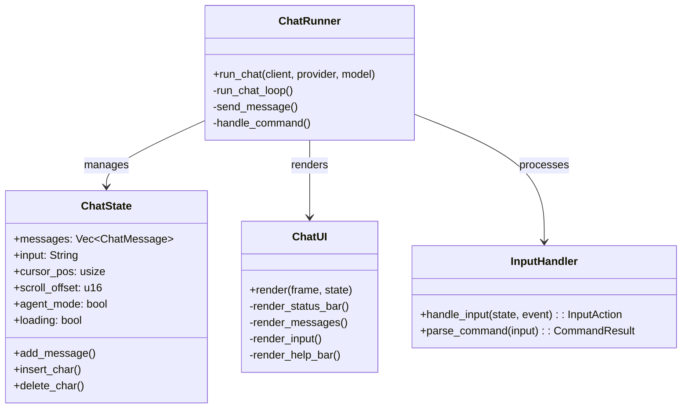

### 🛠️ Developer Commands

#### Build & Run

| Command | Description |
|:--------|:------------|
| `cargo build` | 🔨 Build in debug mode |
| `cargo build --release` | 🚀 Build for production |
| `cargo run` | 🎮 Run TUI mode selector |
| `cargo run --bin stdio` | 💬 Run directly in STDIO mode |
| `cargo run --bin rest` | 🌐 Run directly in REST mode |

#### Testing

| Command | Description |
|:--------|:------------|
| `cargo test` | 🧪 Run all tests |
| `cargo test --test config_loading_tests` | 📄 Run specific integration test |
| `cargo clippy` | 🔍 Lint code |
| `cargo fmt` | 🎨 Format code |

---

## 📄 License

MIT License - See [LICENSE](LICENSE) for details.

---

<p align="center">
  Made with ❤️ using Rust + Ratatui
</p>
