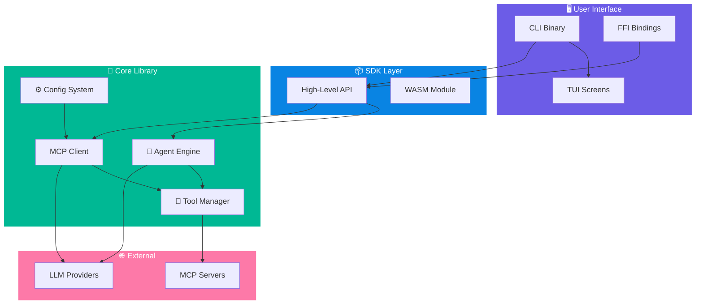
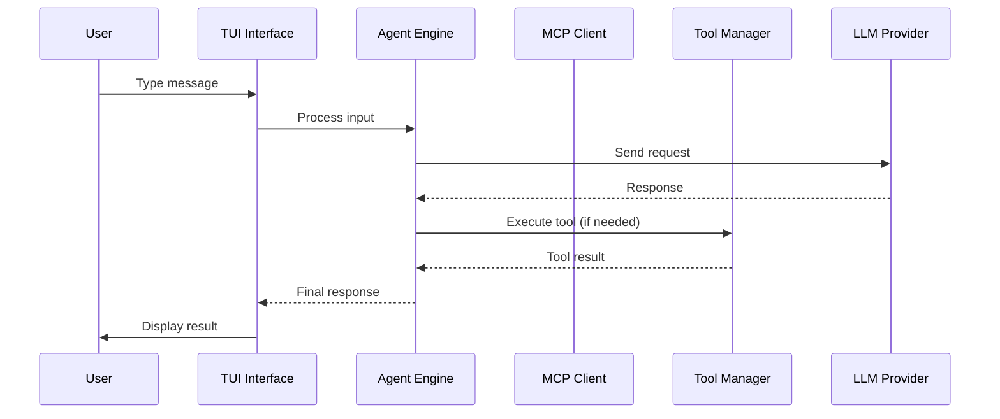

<div align="center">

# 🚀 Antikythera MCP Framework

**A flexible Model Context Protocol client with modern TUI interface**

[](https://www.rust-lang.org/)
[](LICENSE)
[](http://makeapullrequest.com)

[Overview](#-overview) •
[Quick Start](#-quick-start) •
[Documentation](#-documentation) •
[Features](#-features) •
[Architecture](#-architecture)

</div>

---

## 📖 Overview

Antikythera is a **feature-rich MCP (Model Context Protocol) client** built with Rust, providing:

- 🖥️ **Modern TUI** - Interactive terminal interface with Ratatui
- 🤖 **Multi-Provider** - Support for Gemini, Ollama, OpenAI, Anthropic
- 🔧 **MCP Tools** - Tool execution via MCP servers
- 🌐 **FFI/WASM** - C bindings and WebAssembly support
- ⚡ **Fast Config** - Postcard binary caching for instant loads
- 🎯 **Multi-Agent** - Sandboxed agent orchestration (optional)

### Project Structure

```
antikythera-mcp-framework/
├── antikythera-core/      # Core library (MCP protocol, agent, tools)
├── antikythera-sdk/       # WASM/FFI bindings
├── antikythera-cli/       # CLI binary with TUI
└── config/                # Configuration files
```

---

## 🚀 Quick Start

### 1. Install Prerequisites

| Requirement | Version | Note |
|:------------|:--------|:-----|
| **Rust** | 1.75+ | Edition 2024 |
| **Ollama** | Latest | Optional (for local models) |
| **API Keys** | - | For cloud providers (Gemini, OpenAI, etc.) |

### 2. Build from Source

```bash
# Clone repository
git clone https://github.com/antikythera/mcp-framework.git
cd mcp-framework

# Build release binary
cargo build --release

# Run the CLI
./target/release/antikythera
# Windows: target\release\antikythera.exe
```

### 3. First Run

```
┌─────────────────────────────────────────┐
│  🚀 Antikythera MCP v0.8.0             │
│  📦 https://github.com/antikythera/... │
├─────────────────────────────────────────┤
│  ↑↓ Navigate  Enter Select  q Quit     │
├─────────────────────────────────────────┤
│  ▶ CLI   - Debug & Native mode         │
│    WASM  - WebAssembly build target    │
└─────────────────────────────────────────┘
```

**Navigation:**
- `↑↓` - Move selection
- `Enter` - Select mode
- `q` - Quit program

---

## 📚 Documentation

### Main Documentation

| Document | Description |
|:---------|:------------|
| **[📖 CLI Guide](CLI_DOCUMENTATION.md)** | Complete CLI usage, commands, TUI interface, keyboard shortcuts |
| **[🔌 FFI Reference](FFI_DOCUMENTATION.md)** | C/C++ API reference, usage examples (C, C++, Python, Node.js) |
| **[🛠️ Build Guide](BUILD.md)** | Build instructions, feature flags, WASM compilation |
| **[🃏 Postcard Cache](POSTCARD_CACHE.md)** | Binary configuration cache, performance benefits |
| **[📋 Phase 2 Plan](PHASE2_IMPLEMENTATION.md)** | Multi-agent architecture, sandboxing, memory abstraction |

### Quick Reference

```bash
# Run CLI
cargo run --bin antikythera

# Build with all features
cargo build --release --features full

# Build WASM SDK
cargo build -p antikythera-sdk \
  --target wasm32-unknown-unknown \
  --release

# Build FFI library
cargo build -p antikythera-sdk --release --features ffi
```

---

## ✨ Features

### Core Features

| Feature | Description | Status |
|:--------|:------------|:------:|
| 🖥️ **TUI Interface** | Full Ratatui-based interactive terminal | ✅ Stable |
| 🤖 **Multi-Provider** | Gemini, Ollama, OpenAI, Anthropic support | ✅ Stable |
| 🔧 **MCP Tools** | Tool execution via MCP servers | ✅ Stable |
| 💬 **Agent Mode** | Autonomous tool-using agent | ✅ Stable |
| ⚙️ **Setup Wizard** | Interactive configuration | ✅ Stable |
| 🃏 **Postcard Cache** | Binary config caching (10x faster) | ✅ Stable |
| 🌐 **FFI Bindings** | C/C++ API for integration | ✅ Stable |
| 🧩 **WASM Support** | WebAssembly SDK for web apps | 🧪 Beta |
| 🎭 **Multi-Agent** | Sandboxed agent orchestration | 🧪 Beta |

### Keyboard Shortcuts

| Key | Action |
|:----|:-------|
| `Enter` | Send message |
| `q` | Exit (when input empty) |
| `Ctrl+Q` | Force quit |
| `Ctrl+C` | Clear input / Cancel |
| `/help` | Show commands |
| `/agent on\|off` | Toggle agent mode |
| `/setup` | Open configuration wizard |

**Full list:** [CLI Documentation →](CLI_DOCUMENTATION.md#keyboard-shortcuts)

---

## 🏗️ Architecture

### High-Level Overview


```mermaid
graph TB
    subgraph UI["🖥️ User Interface"]
        CLI[CLI Binary]
        TUI[TUI Screens]
        FFI[FFI Bindings]
    end

    subgraph SDK["📦 SDK Layer"]
        HIGH[High-Level API]
        WASM[WASM Module]
    end

    subgraph Core["🔧 Core Library"]
        AGENT[🤖 Agent Engine]
        CLIENT[MCP Client]
        TOOLS[🔧 Tool Manager]
        CONFIG[⚙️ Config System]
    end

    subgraph External["🌐 External"]
        LLM[LLM Providers]
        MCP[MCP Servers]
    end

    CLI --> TUI
    CLI --> HIGH
    FFI --> HIGH
    
    HIGH --> AGENT
    HIGH --> CLIENT
    
    AGENT --> TOOLS
    CLIENT --> TOOLS
    CONFIG --> CLIENT
    
    TOOLS --> MCP
    CLIENT --> LLM
    AGENT --> LLM

    style UI fill:#6c5ce7,stroke:#fff,color:#fff
    style SDK fill:#0984e3,stroke:#fff,color:#fff
    style Core fill:#00b894,stroke:#fff,color:#fff
    style External fill:#fd79a8,stroke:#fff,color:#fff
```

### Data Flow


```mermaid
sequenceDiagram
    participant User
    participant TUI as TUI Interface
    participant Agent as Agent Engine
    participant MCP as MCP Client
    participant Tools as Tool Manager
    participant LLM as LLM Provider

    User->>TUI: Type message
    TUI->>Agent: Process input
    Agent->>LLM: Send request
    LLM-->>Agent: Response
    Agent->>Tools: Execute tool (if needed)
    Tools-->>Agent: Tool result
    Agent-->>TUI: Final response
    TUI->>User: Display result
```

---

## ⚙️ Configuration

### Configuration Files

```
config/
├── client.toml    # Providers, servers, REST settings
├── model.toml     # Default model, prompts, tools
├── .env           # API keys (gitignored)
└── .cache/        # Postcard binary cache (auto-generated)
    ├── client.postcard
    └── model.postcard
```

### Quick Configuration

**1. Run Setup Wizard:**
```bash
antikythera
# Select "Setup" from mode selector
```

**2. Manual Configuration:**

`config/client.toml`:
```toml
[[providers]]
id = "ollama"
type = "ollama"
endpoint = "http://127.0.0.1:11434"
models = [{ name = "llama3", display_name = "Llama 3" }]

[[servers]]
name = "filesystem"
command = "/path/to/mcp-filesystem-server"
```

`config/model.toml`:
```toml
default_provider = "ollama"
model = "llama3"

[prompts]
tool_guidance = "You have access to the following tools..."
```

**Detailed guide:** [CLI Documentation → Configuration](CLI_DOCUMENTATION.md#configuration)

---

## 🔌 FFI Integration

### C Example

```c
#include <stdio.h>
#include "antikythera.h"

int main() {
    antikythera_init();
    
    const char* config = R"({
        "providers": [{"id": "ollama", "type": "ollama"}],
        "default_provider": "ollama",
        "model": "llama3"
    })";
    
    int64_t client = antikythera_client_create(config);
    char* response = antikythera_chat(client, "Hello!");
    
    printf("Response: %s\n", response);
    
    antikythera_string_free(response);
    antikythera_client_destroy(client);
    return 0;
}
```

**Complete examples:** [FFI Documentation → Examples](FFI_DOCUMENTATION.md#usage-examples)

---

## 🧩 WASM Integration

### JavaScript Example

```javascript
import init, { WasmClient } from './pkg/antikythera_sdk.js';

await init();
const client = new WasmClient(config_json);
const response = await client.chat("Hello!");
console.log(response);
```

**Build instructions:** [BUILD.md → WASM Mode](BUILD.md#wasm-mode-webassembly)

---

## 🛠️ Development

### Build Commands

```bash
# Development build
cargo build

# Release build (optimized)
cargo build --release

# With all features
cargo build --release --features full

# Run tests
cargo test --workspace

# Format code
cargo fmt

# Lint
cargo clippy
```

### Feature Flags

| Feature | Description | Default |
|:--------|:------------|:-------:|
| `native-transport` | Stdio/OS process management | ✅ Yes |
| `gcp` | Google Cloud integrations | ❌ No |
| `wasm-runtime` | WASM sandboxed execution | ❌ No |
| `cache` | Postcard config caching | ❌ No |
| `wizard` | Interactive setup wizard | ❌ No |
| `multi-agent` | Multi-agent orchestration | ❌ No |
| `full` | All features enabled | ❌ No |

**Complete guide:** [BUILD.md → Feature Flags](BUILD.md#feature-flags)

---

## 📊 Performance

### Postcard Cache Benefits

| Metric | TOML | Postcard | Improvement |
|:-------|:----:|:--------:|:-----------:|
| **Load Time** | ~50ms | ~5ms | **10x faster** |
| **File Size** | ~5KB | ~2.5KB | **50% smaller** |
| **Memory** | ~20KB | ~10KB | **50% less** |

**Details:** [POSTCARD_CACHE.md](POSTCARD_CACHE.md)

---

## 🤝 Contributing

Contributions are welcome! Please read our [Contributing Guide](CONTRIBUTING.md) first.

### Development Setup

```bash
# Clone repository
git clone https://github.com/antikythera/mcp-framework.git
cd mcp-framework

# Run in development mode
cargo run

# Run tests
cargo test --workspace

# Format and lint
cargo fmt && cargo clippy
```

---

## 📝 License

Antikythera MCP Framework is licensed under the [MIT License](LICENSE).

---

## 🔗 Links

- **GitHub:** [https://github.com/antikythera/mcp-framework](https://github.com/antikythera/mcp-framework)
- **Documentation:** [CLI Guide](CLI_DOCUMENTATION.md) | [FFI Reference](FFI_DOCUMENTATION.md) | [Build Guide](BUILD.md)
- **Issues:** [https://github.com/antikythera/mcp-framework/issues](https://github.com/antikythera/mcp-framework/issues)

---

<div align="center">

**Made with ❤️ using Rust**

[Report Bug](https://github.com/antikythera/mcp-framework/issues) · [Request Feature](https://github.com/antikythera/mcp-framework/issues)

</div>
