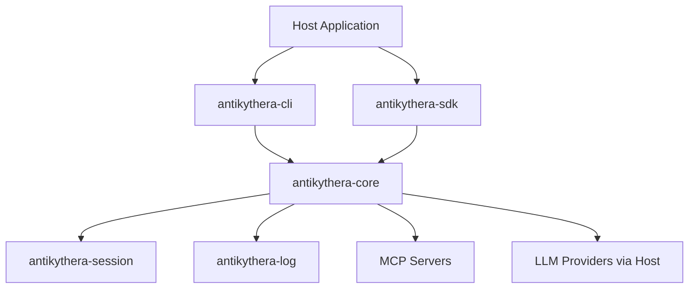

# Antikythera MCP Framework v1.0.10

Antikythera MCP Framework is a Rust workspace for building MCP-capable agent runtimes, host-integrated orchestration flows, and portable WASM agent components.

## System Overview


```mermaid
flowchart TD
    Host[Host Application] --> CLI[antikythera-cli]
    Host --> SDK[antikythera-sdk]
    CLI --> Core[antikythera-core]
    SDK --> Core
    Core --> Session[antikythera-session]
    Core --> Log[antikythera-log]
    Core --> MCP[MCP Servers]
    Core --> LLM[LLM Providers via Host]
```

## What Is Included

- Stable workspace crates for CLI, SDK, core runtime, session, and logging.
- Multi-agent orchestration with guardrails, resilience, and observability hooks.
- Streaming support for token/event output and buffered delivery policies.
- WASM component integration path for host-controlled execution.
- Consolidated documentation under `documentation/`.

## Workspace Layout

- `antikythera-core`: protocol/runtime, orchestration, transport, resilience, streaming.
- `antikythera-sdk`: high-level API, component-facing integration layer.
- `antikythera-cli`: interactive and scripted entry binaries.
- `antikythera-session`: structured session state and export helpers.
- `antikythera-log`: structured logging and subscriber support.
- `scripts`: build-scripts crate for WIT generation and WASM component tooling.
- `tests`: integration and module-level validation suites.

## Build and Validate

```bash
cargo build --workspace
cargo test --workspace
cargo fmt --all -- --check
cargo clippy --workspace --lib --bins -- -D warnings -D deprecated
```

## Documentation Index

- [Architecture](documentation/ARCHITECTURE.md)
- [Build](documentation/BUILD.md)
- [Cache](documentation/CACHE.md)
- [CLI](documentation/CLI.md)
- [Component](documentation/COMPONENT.md)
- [Config](documentation/CONFIG.md)
- [Context Management](documentation/CONTEXT_MANAGEMENT.md)
- [Deprecation Policy](documentation/DEPRECATION_POLICY.md)
- [Guardrails](documentation/GUARDRAILS.md)
- [Hooks](documentation/HOOKS.md)
- [Import Export](documentation/IMPORT_EXPORT.md)
- [JSON Schema](documentation/JSON_SCHEMA.md)
- [Logging](documentation/LOGGING.md)
- [MCP Contracts](documentation/MCP_CONTRACTS.md)
- [Migration](documentation/MIGRATION.md)
- [Observability](documentation/OBSERVABILITY.md)
- [Product Scope](documentation/PRODUCT_SCOPE.md)
- [Resilience](documentation/RESILIENCE.md)
- [Security](documentation/SECURITY.md)
- [Servers and Agents](documentation/SERVERS_AND_AGENTS.md)
- [Streaming](documentation/STREAMING.md)
- [Testing](documentation/TESTING.md)
- [WASM Agent](documentation/WASM_AGENT.md)
- [Workspace](documentation/WORKSPACE.md)

## Version

- Workspace release: `1.0.10`
- Documentation baseline: `1.0.10`
