<div align="center">

# 🚀 MCP Client

**A flexible Model Context Protocol client for connecting LLMs with tools**

[](https://www.rust-lang.org/)
[](LICENSE)
[](http://makeapullrequest.com)

[Features](#-features) •
[Quick Start](#-quick-start) •
[Configuration](#%EF%B8%8F-configuration) •
[API](#-api-reference) •
[Development](#-development)

</div>

---

## ✨ Features

| Feature | Description |
|:--------|:------------|
| 🤖 **Multi-Provider** | Gemini, Ollama, OpenAI, and more |
| 🔧 **MCP Tools** | Connect any MCP-compatible tool server |
| 💬 **Interactive Chat** | STDIO mode with session management |
| 🌐 **REST API** | HTTP API with Swagger UI |
| ⚡ **Dual Mode** | Run STDIO + REST simultaneously |
| 🔄 **Hot Reload** | Reload config without restart |

---

## 🏗️ Architecture

```mermaid
graph TB
    subgraph Client["🖥️ MCP Client"]
        CLI["CLI Parser"]
        APP["Application Layer"]
        
        subgraph Modes["Run Modes"]
            STDIO["💬 STDIO"]
            REST["🌐 REST API"]
        end
        
        subgraph Core["Core Components"]
            AGENT["🤖 Agent"]
            MCPC["MCP Client"]
            TOOL["🔧 Tool Manager"]
        end
    end
    
    subgraph Providers["☁️ LLM Providers"]
        GEMINI["Gemini"]
        OLLAMA["Ollama"]
        OTHER["Other..."]
    end
    
    subgraph Servers["🔌 MCP Servers"]
        SRV1["Tool Server 1"]
        SRV2["Tool Server 2"]
        SRVN["Tool Server N"]
    end
    
    CLI --> APP
    APP --> STDIO
    APP --> REST
    STDIO --> MCPC
    REST --> MCPC
    MCPC --> AGENT
    AGENT --> TOOL
    MCPC --> Providers
    TOOL --> Servers
    
    style Client fill:#1a1a2e,stroke:#16213e,color:#fff
    style Providers fill:#0f3460,stroke:#16213e,color:#fff
    style Servers fill:#533483,stroke:#16213e,color:#fff
```



---

## 🚀 Quick Start

### Prerequisites

| Requirement | Version | Note |
|:------------|:--------|:-----|
| Rust | 1.75+ | Edition 2024 |
| Ollama | Latest | Optional, for local models |
| API Key | - | For cloud providers |

### Installation

```bash
# Clone repository
git clone https://github.com/your-username/antikhitera-mcp-client.git
cd antikhitera-mcp-client

# Setup configuration
cp -r config.example config
# Edit config/client.toml and config/.env

# Build
cargo build --release
```

### Run Modes

```mermaid
flowchart LR
    A["cargo run --bin mcp"] --> B{Select Mode}
    B -->|1| C["💬 STDIO"]
    B -->|2| D["🌐 REST"]
    B -->|3| E["⚡ Both"]
    
    F["cargo run --bin stdio"] --> C
    G["cargo run --bin rest"] --> D
    
    style A fill:#2d3436,stroke:#636e72,color:#fff
    style C fill:#00b894,stroke:#00cec9,color:#fff
    style D fill:#0984e3,stroke:#74b9ff,color:#fff
    style E fill:#6c5ce7,stroke:#a29bfe,color:#fff
```



---

## ⚙️ Configuration

### Directory Structure

```
config/
├── client.toml    # Main configuration
└── .env           # API keys (gitignored)
```

### Provider Configuration

```mermaid
graph LR
    subgraph Config["client.toml"]
        P1["[[providers]]<br/>id = 'cloud'<br/>type = 'gemini'"]
        P2["[[providers]]<br/>id = 'local'<br/>type = 'ollama'"]
    end
    
    subgraph Backends["Backends"]
        B1["☁️ Cloud API"]
        B2["🏠 Local Ollama"]
    end
    
    P1 --> B1
    P2 --> B2
    
    style Config fill:#2d3436,stroke:#636e72,color:#fff
    style Backends fill:#0984e3,stroke:#74b9ff,color:#fff
```



<details>
<summary><b>📄 Full Configuration Example</b></summary>

```toml
# Basic Settings
default_provider = "cloud"
model = "default-model"

prompt_template = """
You are a helpful AI assistant.
{{custom_instruction}}
{{language_guidance}}
{{tool_guidance}}
"""

# Cloud Provider
[[providers]]
id = "cloud"
type = "gemini"
endpoint = "https://api.example.com"
api_key = "API_KEY_ENV_VAR"
models = [
    { name = "model-fast", display_name = "Fast Model" },
    { name = "model-pro", display_name = "Pro Model" },
]

# Local Provider
[[providers]]
id = "local"
type = "ollama"
endpoint = "http://127.0.0.1:11434"
models = [
    { name = "llama3", display_name = "Llama 3" },
]

# MCP Server
[[servers]]
name = "my-tools"
command = "/path/to/server"

# Tool Binding
[[tools]]
name = "my_tool"
server = "my-tools"
```

</details>

---

## 🌐 API Reference

### REST Endpoints

| Method | Endpoint | Description |
|:------:|:---------|:------------|
| `POST` | `/chat` | 💬 Send chat message |
| `GET` | `/config` | ⚙️ Get configuration |
| `PUT` | `/config` | ✏️ Update configuration |
| `POST` | `/reload` | 🔄 Reload from file |
| `GET` | `/tools` | 🔧 List tools |
| `POST` | `/tools/{name}` | ▶️ Invoke tool |

> 📚 **Swagger UI**: `http://127.0.0.1:8080/swagger-ui/`

### STDIO Commands

| Command | Description |
|:--------|:------------|
| `/help` | 📖 Show commands |
| `/config` | ⚙️ Display config |
| `/reload` | 🔄 Reload config |
| `/reset` | 🗑️ Clear history |
| `/exit` | 🚪 Exit app |

---

## 🔌 Adding MCP Servers


### Steps

1️⃣ **Add server to config**

```toml
[[servers]]
name = "my-server"
command = "/path/to/server-binary"
```

2️⃣ **Bind tools**

```toml
[[tools]]
name = "tool_name"
server = "my-server"
```

3️⃣ **Restart or reload**

```bash
# In STDIO mode
/reload
```

---

## 🧪 Development

### Project Structure

```mermaid
graph TD
    SRC[📂 src] ==> BIN[📦 bin]
    SRC ==> LIB[📚 lib]
    
    BIN --> MAIN(main.rs<br/>mcp)
    BIN --> REST(rest.rs<br/>rest)
    BIN --> STD(stdio.rs<br/>stdio)
    
    LIB --> APP[🎯 application<br/>Business Logic]
    LIB --> CLI[🖥️ cli<br/>CLI Parsing]
    LIB --> CFG[⚙️ config<br/>Configuration]
    LIB --> DOM[📋 domain<br/>Domain Types]
    LIB --> INF[🔧 infrastructure<br/>Infrastructure]
    
    style SRC fill:#2d3436,stroke:#636e72,color:#fff
    style BIN fill:#0984e3,stroke:#74b9ff,color:#fff
    style LIB fill:#6c5ce7,stroke:#a29bfe,color:#fff
```



### Commands

| Command | Description |
|:--------|:------------|
| `cargo build` | Build debug |
| `cargo build --release` | Build release |
| `cargo test` | Run all tests |
| `cargo test --test config_loading_tests` | Specific test |

---

## 📄 License

MIT License - See [LICENSE](LICENSE) for details.

---

<p align="center">
  Made with ❤️ using Rust
</p>
