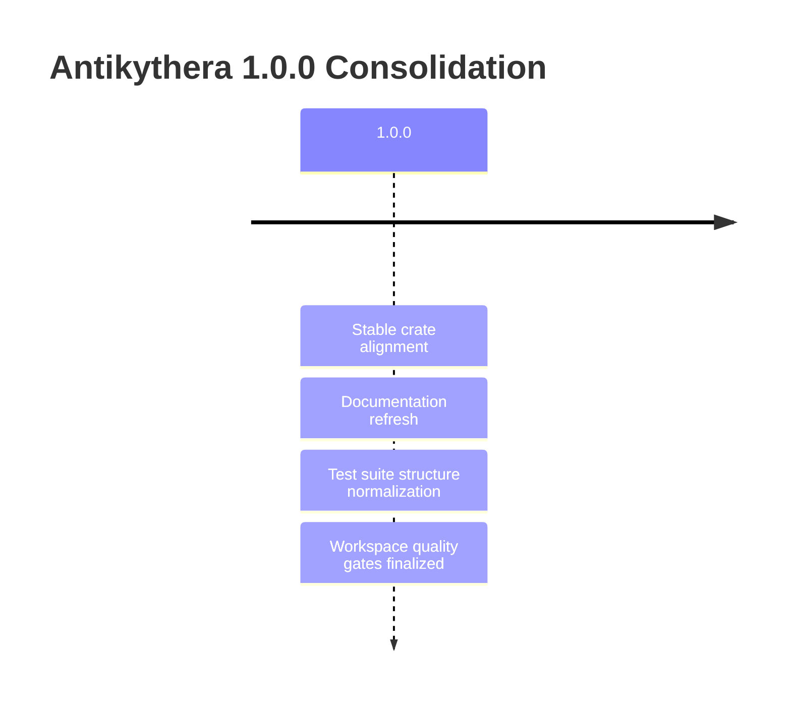

# Revision Notes v1.0.0

This file records the consolidated release state for version 1.0.0.

## Release Snapshot

## 1.0.0 Scope

- Workspace crate versions aligned to `1.0.0`.
- Public documentation updated to match current code layout and active features.
- Test suite organization standardized with part-based structures for large files.
- Build, lint, and validation commands documented as release gates.

## Quality Gates

- `cargo build --workspace`
- `cargo test --workspace`
- `cargo fmt --all -- --check`
- `cargo clippy --workspace --lib --bins -- -D warnings -D deprecated`

## Current Release Policy

- Documentation tracks current implemented behavior only.
- Forward-looking placeholders are not maintained in release docs.
- Version references in docs and manifests must match the active workspace version.
