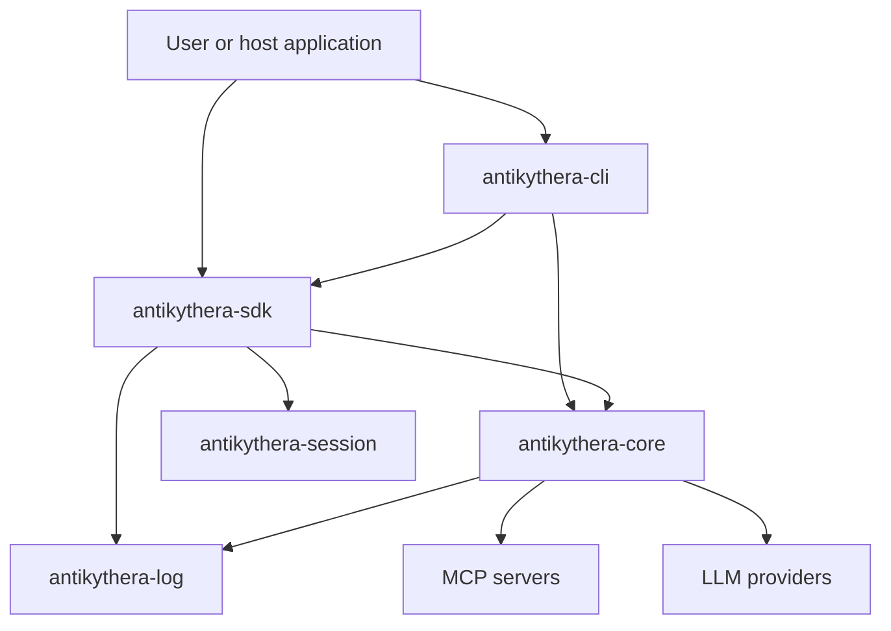
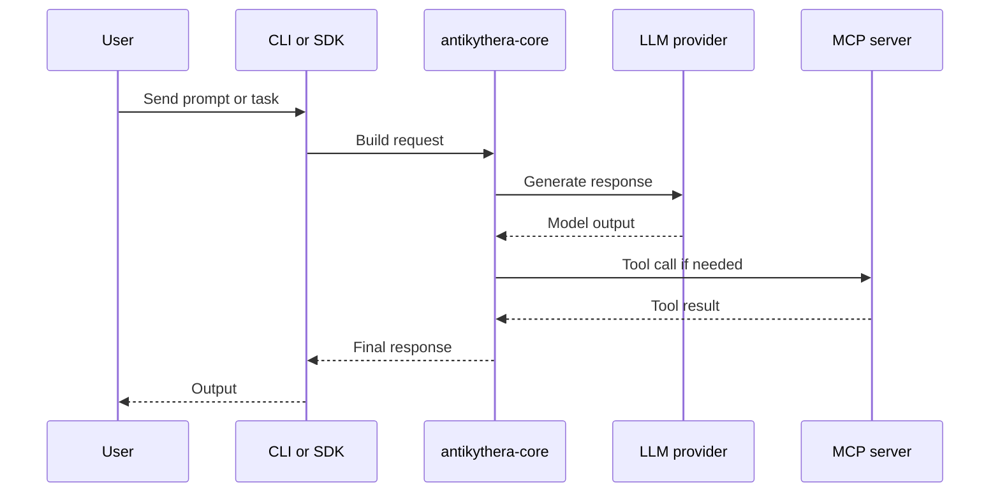

# Architecture

This document gives a current high-level view of how the main crates interact.

## System view

## Request flow

## CLI-specific note

The CLI crate is architected around separate domain, infrastructure, presentation, and config areas, but the shipped `antikythera` binary is still partial at runtime. The architecture is broader than the currently exposed user experience.

## Current implications

- `antikythera-core` is the main place to understand real runtime behavior.
- `antikythera-sdk` is the best view of the exported integration surface.
- `antikythera-cli` documents intent and structure, but the main binary still exposes placeholder runtime modes.
