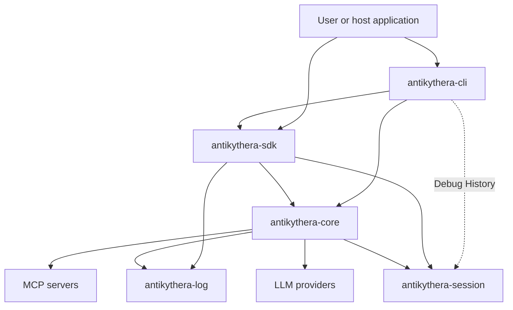
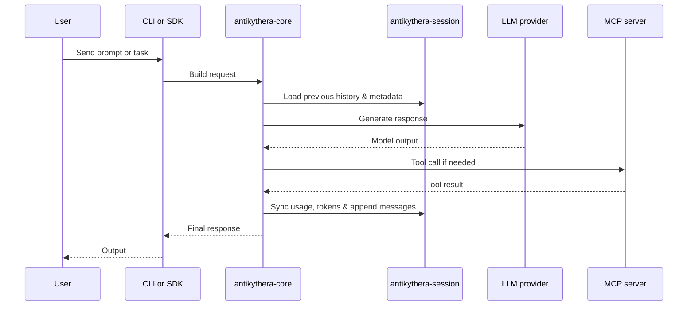

# Architecture

This document gives a current high-level view of how the main crates interact.

## System view

## Core Principles

- **Single Source of Truth for Session:** `antikythera-session` owns the conversational data model (`Message`, `MessageRole`, `MessagePart`) and provides the thread-safe `SessionManager`. Both `CORE` (for actual context injection) and `CLI` (for debug persistence) utilize this unified model.
- **Stateless Tooling:** `CORE` orchestrates LLM dispatch, agent loops, and MCP tools, delegating long-term conversational memory to `SESSION`.
- **FFI & Portability:** `SDK` exposes `SESSION` and `LOG` components over safe FFI boundaries, allowing host languages (e.g. Node.js, Python) to import/export chat histories easily using the `Postcard` binary format.

## Request flow

## Crate reading order

- `antikythera-session` defines the data models and handles state retention/snapshots.
- `antikythera-core` is the main place to understand runtime behavior, orchestration, and context pruning.
- `antikythera-sdk` is the best view of the exported integration surface (FFI boundaries).
- `antikythera-cli` is the user-facing binary layer over core.
