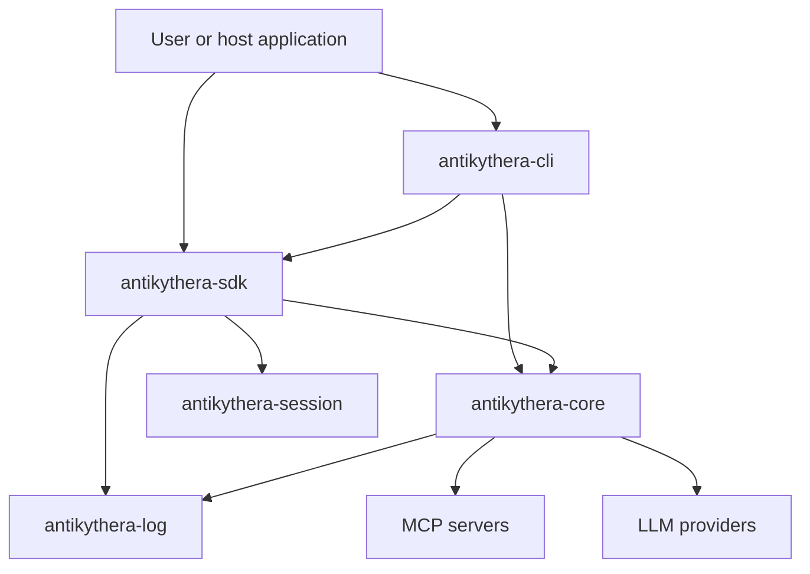
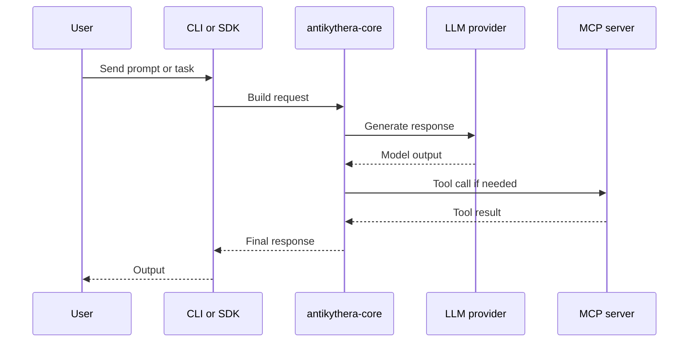

# Architecture

This document gives a current high-level view of how the main crates interact.

## System view

## Request flow

## Crate reading order

- `antikythera-core` is the main place to understand runtime behavior.
- `antikythera-sdk` is the best view of the exported integration surface.
- `antikythera-cli` is the user-facing binary layer over core.
