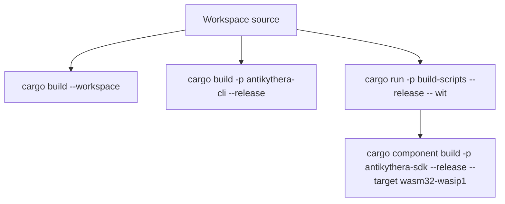
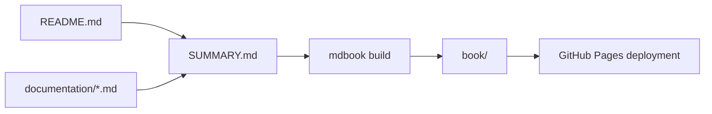
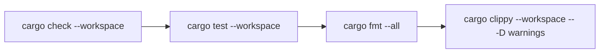

# BUILD

This guide covers the commands that match the current workspace layout and tooling.

## Build map



## What you can build

| Target | Status | Notes |
|:-------|:------:|:------|
| Workspace crates | ✅ | `cargo build --workspace` |
| `antikythera` native binary | ✅ | stdio, setup, and multi-agent modes |
| `antikythera-config` native binary | ✅ | Provider and server config management |
| `antikythera-sdk` component build | ✅ | Single WASM output via `cargo-component` + `wasm32-wasip1` |

## Prerequisites

- Rust 1.75+
- `cargo-component` for component builds
- Optional: `wasm-tools` for inspecting the generated component
- Optional: `task` for the helpers in `Taskfile.yml`

## Native builds

### Build everything

```bash
cargo build --workspace
```

### Build release artifacts

```bash
cargo build --workspace --release
```

### Build only the CLI crate

```bash
cargo build -p antikythera-cli --release
```

### Native binaries

| Binary | Command |
|:-------|:--------|
| `antikythera` | `cargo run -p antikythera-cli --bin antikythera` |
| `antikythera-config` | `cargo run -p antikythera-cli --bin antikythera-config -- --help` |

## WASM component build

### Generate WIT

```bash
cargo run -p build-scripts --release -- wit
```

This generates:

```text
wit/antikythera.wit
```

### Build the WASM component

```bash
cargo component build -p antikythera-sdk --release --target wasm32-wasip1 \
  --no-default-features --features component
```

The helper binary in `scripts/build-component.rs` also supports:

```bash
cargo run -p build-scripts --release -- component
cargo run -p build-scripts --release -- all
```

Expected component output is produced under:

```text
target/wasm32-wasip1/release/
```

Canonical artifact name for CI/release packaging:

```text
dist/antikythera-sdk.wasm
```

## CLI harness against WASM

Use the CLI to execute the generated WASM via host runtime bridge (`WasmAgentRunner`):

```bash
cargo run -p antikythera-cli --bin antikythera -- \
    --mode wasm-harness \
    --wasm target/wasm32-wasip1/release/antikythera_sdk.wasm \
    --task "Smoke test"
```

Optional deterministic host callback payload:

```bash
cargo run -p antikythera-cli --bin antikythera -- \
    --mode wasm-harness \
    --wasm target/wasm32-wasip1/release/antikythera_sdk.wasm \
    --wasm-llm-response '{"content":"ok","model":"stub"}'
```

## Docs site build

The repository also includes an `mdBook` configuration that turns `README.md` plus the `documentation/` folder into a static documentation site.



### Local commands

```bash
# Build static site
mdbook build

# Preview locally
mdbook serve --open
```

## Tests and quality checks

### Verification flow



### Workspace-wide

```bash
cargo test --workspace
cargo fmt --all
cargo clippy --workspace -- -D warnings
```

### Common targeted checks

```bash
# SDK library tests
cargo test -p antikythera-sdk --lib

# Check all crates without producing binaries
cargo check --workspace
```

## Taskfile helpers

The repository includes `Taskfile.yml` for common flows.

| Task | Purpose |
|:-----|:--------|
| `task build` | Build the WASM component |
| `task build-cli` | Build the native CLI binary |
| `task build-all` | Build both native CLI and WASM outputs |
| `task wit` | Generate WIT |
| `task run` | Run the CLI crate |
| `task test` | Run workspace tests |
| `task check` | Run `cargo check --workspace` |
| `task lint` | Run Clippy |
| `task format` | Run rustfmt |
| `task inspect` | Inspect the built component with `wasm-tools` if installed |
| `task size` | Show binary sizes |

## GitHub workflows

| Workflow | Purpose |
|:---------|:--------|
| `.github/workflows/wasm.yml` | Builds the WASM component and generated WIT on pushes, pull requests, and manual runs |
| `.github/workflows/release.yml` | Builds release-grade artifacts on version tags and publishes to GitHub Releases |

## Feature flags overview

### `antikythera-core`

| Feature | Purpose |
|:--------|:--------|
| `native-transport` | OS process and stdio transport support |
| `gcp` | Google Cloud-related integrations |
| `wasm-runtime` | Sandboxed WASM execution support |
| `cache` | Postcard-based configuration cache |
| `wizard` | Interactive setup and wizard-related dependencies |
| `multi-agent` | Multi-agent orchestration support |
| `full` | Enables the full capability set |

### `antikythera-sdk`

| Feature | Purpose |
|:--------|:--------|
| `wasm` | WASM bindings via WIT (server-side, wasm32-wasip1) |
| `component` | WASM Component Model support |
| `wasm-config` | WASM configuration binary format support |
| `single-agent` | Single-agent support |
| `multi-agent` | Multi-agent support |
| `cloud` | Cloud-related integrations |
| `wasm-sandbox` | WASM sandbox support |
| `full` | Broad feature bundle for the SDK/core stack |

## Notes

- The component build (`wasm32-wasip1`) is the WASM deployment target. Use it when embedding agent logic in a host application via wasmtime.
- For browser or C FFI targets, implement those in the host application itself — the framework does not provide those bindings.
