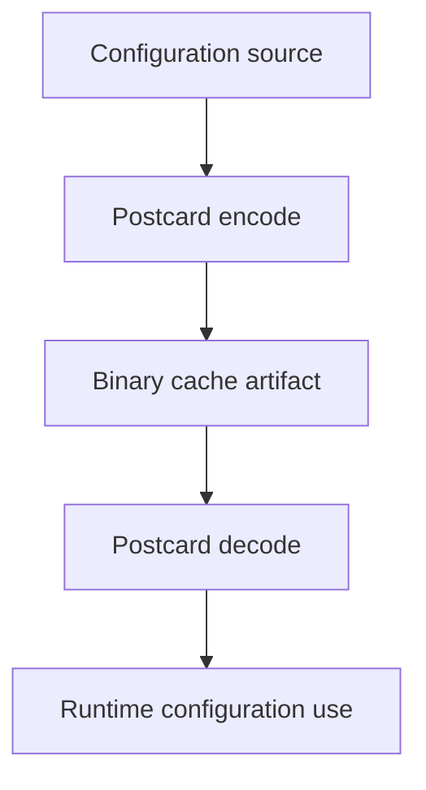

# Cache (v1.0.0)

This document describes the active binary cache model for configuration data.

## Cache Lifecycle

## Current Behavior

- Binary configuration artifacts reduce parse overhead on repeated loads.
- Cache decoding is tied to active schema compatibility checks.
- Runtime uses cache artifacts only when integrity checks pass.

## Operational Guidance

- Rebuild cache after schema-affecting updates.
- Keep import/export procedures aligned with cache format expectations.
