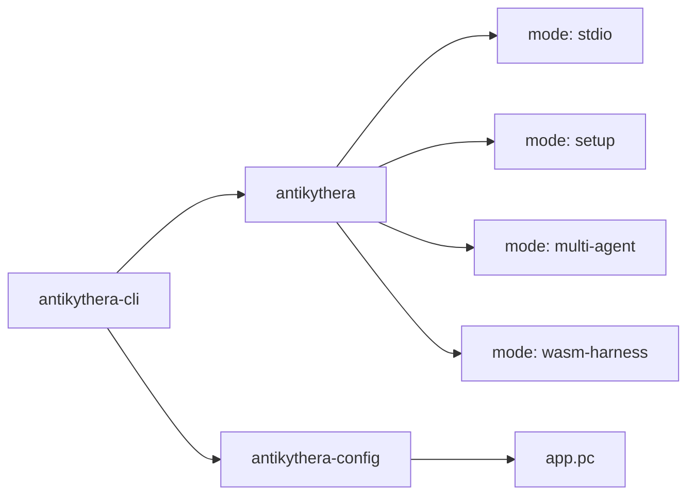
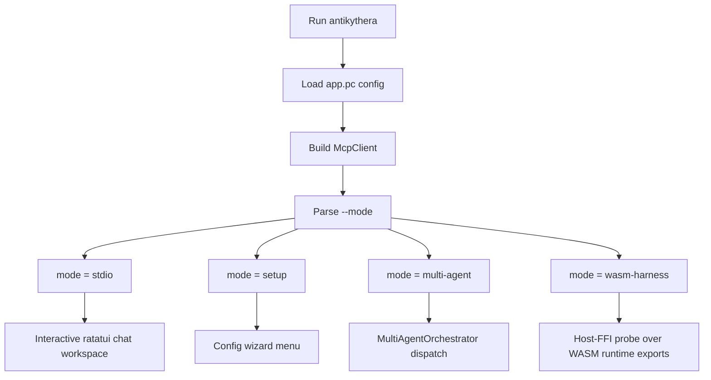
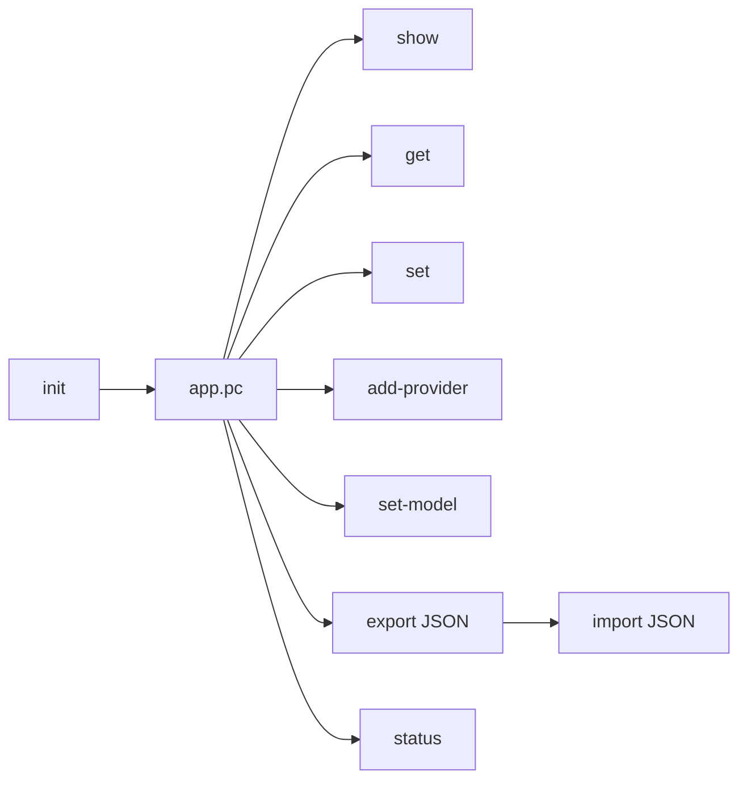

# CLI

This guide documents the CLI binaries exposed by `antikythera-cli`.

## Binary map



## Overview

The CLI crate exposes two binaries:

| Binary | Purpose |
|:-------|:--------|
| `antikythera` | Main runtime entry point: interactive chat, setup wizard, and multi-agent orchestration |
| `antikythera-config` | Lightweight config manager for provider and server configuration |

Runtime provider and model selection are owned by the CLI layer. `antikythera-core` stays model-agnostic and only executes against the runtime client configuration that the CLI has already materialized.

## `antikythera`

### Runtime modes

The main binary accepts a `--mode` flag:

| Mode | Default | Description |
|:-----|:-------:|:------------|
| `stdio` | ✅ | Interactive TUI chat session |
| `setup` | | Configuration wizard for providers and servers |
| `multi-agent` | | Multi-agent orchestrator harness |
| `wasm-harness` | | Execute host-FFI WASM probe (runtime/session/telemetry/slo/tool-registry validation) |

### Execution flow



  ### Interactive TUI UX

  The `stdio` mode now launches a ratatui-based workspace with:

  1. A conversation panel that keeps the latest chat and tool trace visible.
  2. A context sidebar showing provider, model, session, and configured backends.
  3. A prompt box with slash-command recommendations as soon as the input starts with `/`.
  4. Inline commands such as `/help`, `/providers`, `/use <provider> [model]`, `/model <name>`, `/config`, `/tools`, `/agent`, `/reset`, and `/exit`.

  Use `Tab` to autocomplete the first command suggestion, `Enter` to submit, and `Esc` to quit.

### Run it

```bash
# Default mode: stdio (interactive chat)
cargo run -p antikythera-cli --bin antikythera

# Explicit mode selection
cargo run -p antikythera-cli --bin antikythera -- --mode stdio
cargo run -p antikythera-cli --bin antikythera -- --mode stdio --provider gemini --model gemini-2.0-flash
cargo run -p antikythera-cli --bin antikythera -- --mode stdio --provider openai --model gpt-4o-mini
cargo run -p antikythera-cli --bin antikythera -- --mode stdio --provider ollama --model llama3.2 --provider-endpoint http://127.0.0.1:11434
cargo run -p antikythera-cli --bin antikythera -- --mode setup
cargo run -p antikythera-cli --bin antikythera -- --mode multi-agent --agents agents.json --task "Write a summary"
cargo run -p antikythera-cli --bin antikythera -- --mode wasm-harness --wasm target/wasm32-wasip1/release/antikythera_sdk.wasm --task "Smoke test"

# Task shortcuts
task run-tui
task run
task run-wasm
task setup-config PROVIDER_ID=openai PROVIDER_TYPE=openai PROVIDER_ENDPOINT=https://api.openai.com PROVIDER_API_KEY=OPENAI_API_KEY MODEL_NAME=gpt-4o-mini
```

`task run` now bootstraps `app.pc` automatically when needed and opens the interactive TUI directly. Change provider/model from inside the TUI with commands such as `/use gemini gemini-2.0-flash` or `/model gpt-4o-mini` instead of passing runtime shell arguments.

### Common flags

| Flag | Description |
|:-----|:------------|
| `--mode <mode>` | Runtime mode (default: `stdio`) |
| `--config <path>` | Path to `app.pc` config file |
| `--system <prompt>` | Override system prompt |
| `--provider <id>` | Override active provider without editing config |
| `--model <name>` | Override active model without editing config |
| `--provider-endpoint <url>` | Override endpoint for the selected provider |
| `--ollama-url <url>` | Override Ollama endpoint (default: `http://127.0.0.1:11434`) |
| `--wasm <path>` | Path to wasm module used by `wasm-harness` |
| `--wasm-llm-response <json>` | Host callback response stub for `wasm-harness` |

### Multi-agent flags

| Flag | Description |
|:-----|:------------|
| `--agents <path>` | JSON file with agent profile definitions |
| `--task <prompt>` | Task to dispatch (reads stdin when omitted) |
| `--target-agent <id>` | Route to a specific agent using `DirectRouter` |
| `--execution-mode <mode>` | `auto` (default), `sequential`, `concurrent`, or `parallel:N` |

Agent profile JSON format:
```json
[
  {
    "id": "writer",
    "name": "Writer Agent",
    "role": "writer",
    "system_prompt": "You write clear and concise content.",
    "max_steps": 8
  }
]
```

## `antikythera-config`

### What it does

`antikythera-config` manages the Postcard-based config file shared across all framework surfaces.

| Item | Value |
|:-----|:------|
| Default config file | `app.pc` |
| Supported provider types | `gemini`, `openai`, `ollama` |
| Config format | Postcard on disk, JSON for import/export and display |

### Config workflow



### Run it

```bash
cargo run -p antikythera-cli --bin antikythera-config -- --help
```

### Available subcommands

| Command | Purpose |
|:--------|:--------|
| `init` | Create default configuration |
| `show` | Print full config as JSON |
| `get <field>` | Print a single field |
| `set <field> <value>` | Update a single field |
| `add-provider <id> <type> <endpoint> [api_key]` | Add a provider |
| `remove-provider <id>` | Remove a provider |
| `set-model <provider> <model>` | Set default provider/model |
| `set-bind <address>` | Set `server.bind` |
| `export [output]` | Export config as JSON |
| `import <input>` | Import config from JSON |
| `reset` | Reset to defaults |
| `status` | Show whether config exists and summarize it |

### Supported fields for `get` and `set`

| Field | Meaning |
|:------|:--------|
| `default_provider` | Default provider ID |
| `model` | Default model name |
| `server.bind` | Bind address in the CLI config |

`get providers` is also supported and returns the provider list as JSON.

### Example workflow

```bash
# Create default file
cargo run -p antikythera-cli --bin antikythera-config -- init

# Add an OpenAI provider
cargo run -p antikythera-cli --bin antikythera-config -- add-provider openai openai https://api.openai.com OPENAI_API_KEY

# Set the default model
cargo run -p antikythera-cli --bin antikythera-config -- set-model openai gpt-4o-mini

# Check current status
cargo run -p antikythera-cli --bin antikythera-config -- status
```

### Provider limitations

`antikythera-config init` now seeds provider templates for `gemini`, `openai`, and `ollama`, including their common default endpoints and model presets. `add-provider` also normalizes aliases such as `google-ai` -> `gemini` and `localai` -> `ollama`.

## API consistency rules

To keep CLI discoverability and public contracts stable:

| Concern | Convention |
|:--------|:-----------|
| Root error type | `CliError` and `CliResult<T>` for public APIs |
| Config loaders | `load_app_config` / `save_app_config` |
| Factory/builders | `build_*` for constructors and adapters |
| Backward compatibility | old names retained as deprecated aliases only |

### Deprecated alias map

Current aliases are maintained only for compatibility and are documented in the deprecation policy.

| Deprecated symbol | Replacement |
|:------------------|:------------|
| `load_config` | `load_app_config` |
| `save_config` | `save_app_config` |
| `load_cli_config` | `load_app_config` |
| `create_llm_provider` | `build_llm_provider` |
| `create_provider_config` | `build_active_provider_config` |

## Related documents

- [`CONFIG.md`](CONFIG.md) for the config format and serialization model
- [`BUILD.md`](BUILD.md) for build commands and component workflows
- [`PRODUCT_SCOPE.md`](PRODUCT_SCOPE.md) for deployment targets and feature flags
- [`DEPRECATION_POLICY.md`](DEPRECATION_POLICY.md) for deprecation lifecycle and CI enforcement
