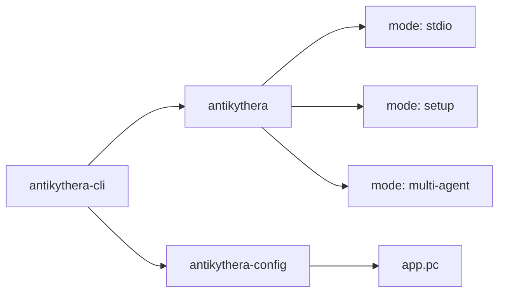
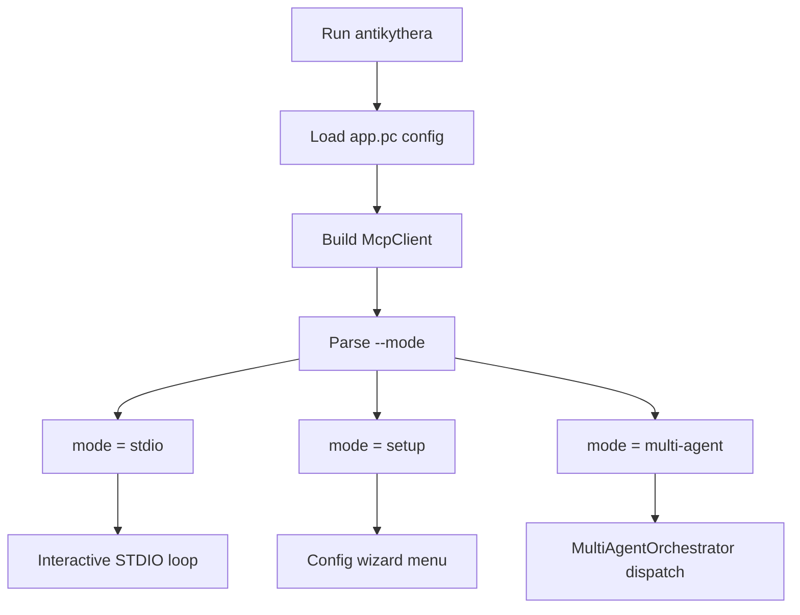
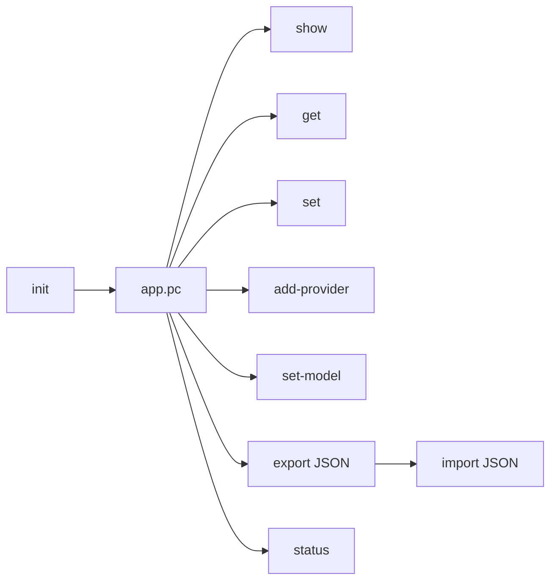

# CLI

This guide documents the CLI binaries exposed by `antikythera-cli`.

## Binary map



## Overview

The CLI crate exposes two binaries:

| Binary | Purpose |
|:-------|:--------|
| `antikythera` | Main runtime entry point: interactive chat, setup wizard, and multi-agent orchestration |
| `antikythera-config` | Lightweight config manager for provider and server configuration |

## `antikythera`

### Runtime modes

The main binary accepts a `--mode` flag:

| Mode | Default | Description |
|:-----|:-------:|:------------|
| `stdio` | ✅ | Interactive TUI chat session |
| `setup` | | Configuration wizard for providers and servers |
| `multi-agent` | | Multi-agent orchestrator harness |

### Execution flow



### Run it

```bash
# Default mode: stdio (interactive chat)
cargo run -p antikythera-cli --bin antikythera

# Explicit mode selection
cargo run -p antikythera-cli --bin antikythera -- --mode stdio
cargo run -p antikythera-cli --bin antikythera -- --mode setup
cargo run -p antikythera-cli --bin antikythera -- --mode multi-agent --agents agents.json --task "Write a summary"
```

### Common flags

| Flag | Description |
|:-----|:------------|
| `--mode <mode>` | Runtime mode (default: `stdio`) |
| `--config <path>` | Path to `app.pc` config file |
| `--system <prompt>` | Override system prompt |
| `--ollama-url <url>` | Override Ollama endpoint (default: `http://127.0.0.1:11434`) |

### Multi-agent flags

| Flag | Description |
|:-----|:------------|
| `--agents <path>` | JSON file with agent profile definitions |
| `--task <prompt>` | Task to dispatch (reads stdin when omitted) |
| `--target-agent <id>` | Route to a specific agent using `DirectRouter` |
| `--execution-mode <mode>` | `auto` (default), `sequential`, `concurrent`, or `parallel:N` |

Agent profile JSON format:
```json
[
  {
    "id": "writer",
    "name": "Writer Agent",
    "role": "writer",
    "system_prompt": "You write clear and concise content.",
    "max_steps": 8
  }
]
```

## `antikythera-config`

### What it does

`antikythera-config` manages the Postcard-based config file shared across all framework surfaces.

| Item | Value |
|:-----|:------|
| Default config file | `app.pc` |
| Supported provider types | `gemini`, `ollama` |
| Config format | Postcard on disk, JSON for import/export and display |

### Config workflow



### Run it

```bash
cargo run -p antikythera-cli --bin antikythera-config -- --help
```

### Available subcommands

| Command | Purpose |
|:--------|:--------|
| `init` | Create default configuration |
| `show` | Print full config as JSON |
| `get <field>` | Print a single field |
| `set <field> <value>` | Update a single field |
| `add-provider <id> <type> <endpoint> [api_key]` | Add a provider |
| `remove-provider <id>` | Remove a provider |
| `set-model <provider> <model>` | Set default provider/model |
| `set-bind <address>` | Set `server.bind` |
| `export [output]` | Export config as JSON |
| `import <input>` | Import config from JSON |
| `reset` | Reset to defaults |
| `status` | Show whether config exists and summarize it |

### Supported fields for `get` and `set`

| Field | Meaning |
|:------|:--------|
| `default_provider` | Default provider ID |
| `model` | Default model name |
| `server.bind` | Bind address in the CLI config |

`get providers` is also supported and returns the provider list as JSON.

### Example workflow

```bash
# Create default file
cargo run -p antikythera-cli --bin antikythera-config -- init

# Add an Ollama provider
cargo run -p antikythera-cli --bin antikythera-config -- add-provider ollama ollama http://127.0.0.1:11434

# Set the default model
cargo run -p antikythera-cli --bin antikythera-config -- set-model ollama llama3

# Check current status
cargo run -p antikythera-cli --bin antikythera-config -- status
```

### Provider limitations

Provider types supported: `gemini` and `ollama`.

## Related documents

- [`CONFIG.md`](CONFIG.md) for the config format and serialization model
- [`BUILD.md`](BUILD.md) for build commands and component workflows
- [`PRODUCT_SCOPE.md`](PRODUCT_SCOPE.md) for deployment targets and feature flags
