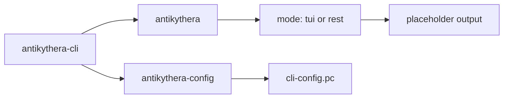
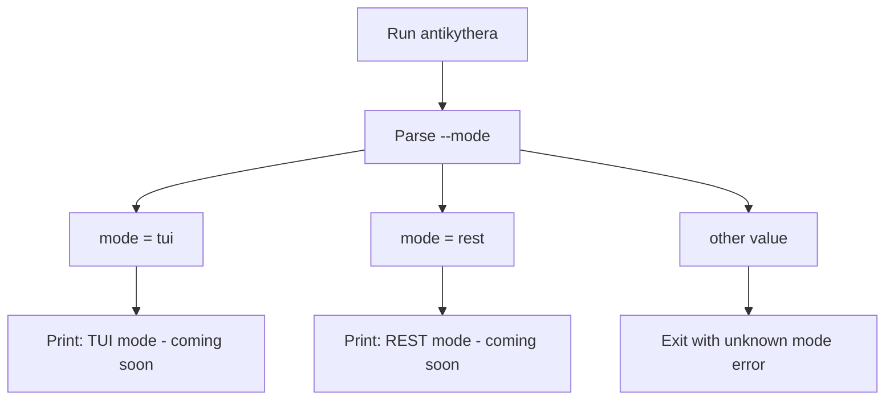
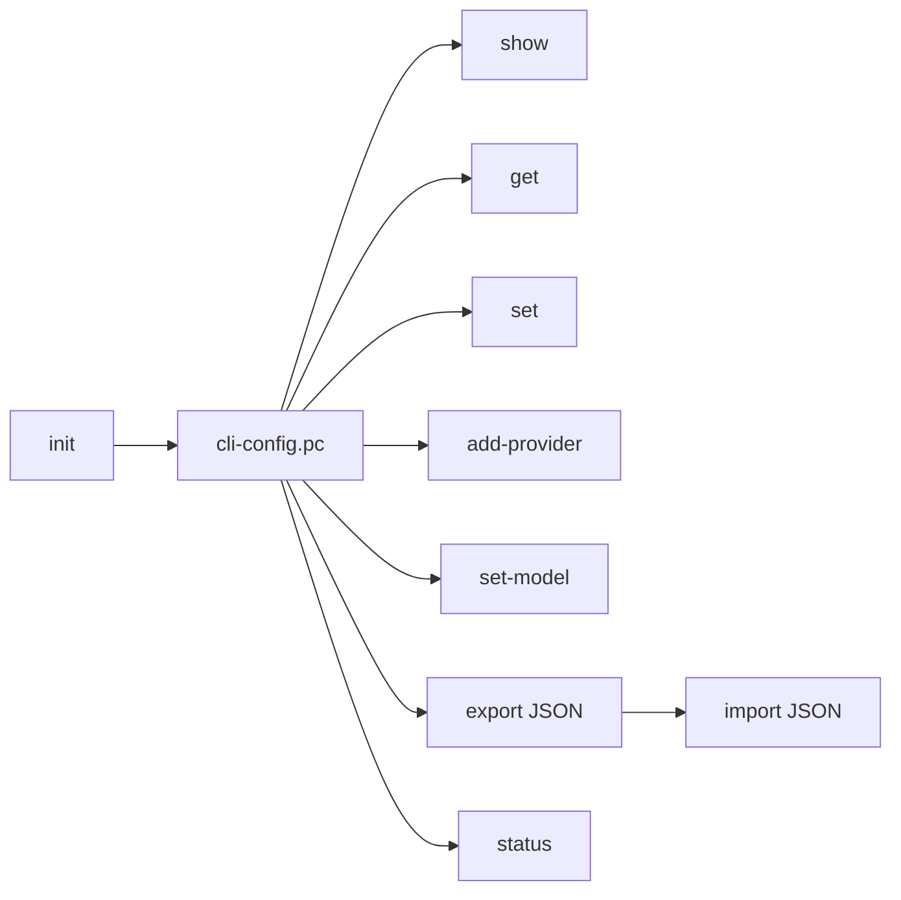

# CLI

This guide documents the CLI surface that actually exists in the current repository.

## Binary map



## Overview

The CLI crate currently exposes two binaries:

| Binary | Purpose | Current maturity |
|:-------|:--------|:-----------------|
| `antikythera` | Main entry point for native runtime modes | Partial: parses mode, then prints placeholder output |
| `antikythera-config` | Lightweight config manager for CLI testing/setup | Usable |

If you want the most practical command-line flow today, use `antikythera-config`.

## `antikythera`

### What it does today

The main binary accepts a `--mode` flag with two supported values:

- `tui` (default)
- `rest`

Both modes are present in the code, but both currently return placeholder text:

- `TUI mode - coming soon`
- `REST mode - coming soon`

### Execution flow



### Run it

```bash
# Default mode: tui
cargo run -p antikythera-cli --bin antikythera

# Explicit mode selection
cargo run -p antikythera-cli --bin antikythera -- --mode tui
cargo run -p antikythera-cli --bin antikythera -- --mode rest
```

### Invalid mode behavior

Any other mode exits with an error message:

```text
Unknown mode: <value>. Use 'tui' or 'rest'.
```

## `antikythera-config`

### What it does

`antikythera-config` manages a lightweight Postcard-based config file used by the CLI crate.

| Item | Value |
|:-----|:------|
| Default config file | `cli-config.pc` |
| Supported provider types | `gemini`, `ollama` |
| Config format | Postcard on disk, JSON for import/export and display |

### Config workflow



### Run it

```bash
cargo run -p antikythera-cli --bin antikythera-config -- --help
```

### Available subcommands

| Command | Purpose |
|:--------|:--------|
| `init` | Create default configuration |
| `show` | Print full config as JSON |
| `get <field>` | Print a single field |
| `set <field> <value>` | Update a single field |
| `add-provider <id> <type> <endpoint> [api_key]` | Add a provider |
| `remove-provider <id>` | Remove a provider |
| `set-model <provider> <model>` | Set default provider/model |
| `set-bind <address>` | Set `server.bind` |
| `export [output]` | Export config as JSON |
| `import <input>` | Import config from JSON |
| `reset` | Reset to defaults |
| `status` | Show whether config exists and summarize it |

### Supported fields for `get` and `set`

| Field | Meaning |
|:------|:--------|
| `default_provider` | Default provider ID |
| `model` | Default model name |
| `server.bind` | Bind address in the CLI config |

`get providers` is also supported and returns the provider list as JSON.

### Example workflow

```bash
# Create default file
cargo run -p antikythera-cli --bin antikythera-config -- init

# Add an Ollama provider
cargo run -p antikythera-cli --bin antikythera-config -- add-provider ollama ollama http://127.0.0.1:11434

# Set the default model
cargo run -p antikythera-cli --bin antikythera-config -- set-model ollama llama3

# Check current status
cargo run -p antikythera-cli --bin antikythera-config -- status
```

### Provider limitations

The current config CLI explicitly rejects provider types other than `gemini` and `ollama`.

## Relationship to the rest of the repository

- `antikythera-core` and `antikythera-sdk` are currently more feature-complete than the main `antikythera` binary.
- The CLI config format documented here is specific to `antikythera-cli` and is separate from the richer config structures used elsewhere in the workspace.
- For build commands and component workflows, see [`BUILD.md`](BUILD.md).
