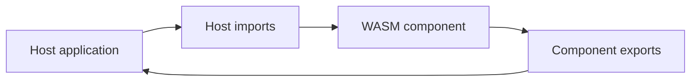
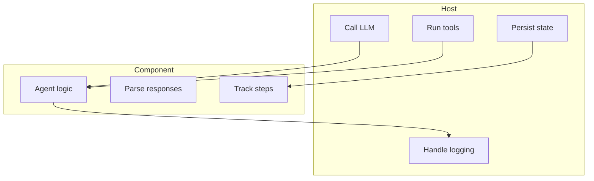

# Component

This document explains the WASM component model used by the project documentation.

## Overview

The component model keeps agent logic inside the component and pushes environment-specific I/O into the host.

## Component view

## Responsibility model

## Host-driven message flow

The component does not call model APIs directly. The intended flow is:

1. Host sends the initial user prompt into the framework or component.
2. Framework/WASM assigns `session_id`, builds the full message list, and preserves history/context.
3. Host receives the prepared message payload and performs the actual LLM API call.
4. Host may return either plain text or a fully shaped assistant message.
5. Framework/WASM commits that response back into session history so later turns stay connected to the same context.

This means the first incoming turn may be plain text only. Once a session exists, later turns should be sent with the matching `session_id` and any host-level metadata needed to keep the conversation aligned with the WASM state.

## Why this design is useful

| Benefit | Explanation |
|:--------|:------------|
| Portability | The same component can run in different hosts |
| Separation of concerns | Runtime integration stays outside the component |
| Better host control | Providers, tools, and storage remain host-managed |

## Related documents

- [`WASM_AGENT.md`](WASM_AGENT.md)
- [`BUILD.md`](BUILD.md)
