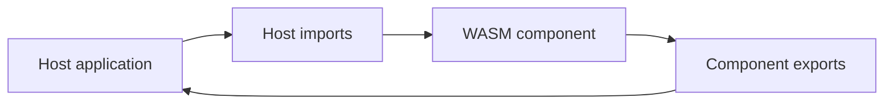
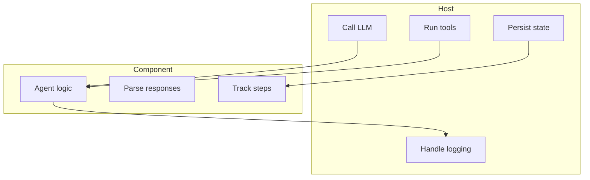

# Component

This document explains the WASM component model used by the project documentation.

## Overview

The component model keeps agent logic inside the component and pushes environment-specific I/O into the host.

## Component view

## Responsibility model

## Why this design is useful

| Benefit | Explanation |
|:--------|:------------|
| Portability | The same component can run in different hosts |
| Separation of concerns | Runtime integration stays outside the component |
| Better host control | Providers, tools, and storage remain host-managed |

## Related documents

- [`WASM_AGENT.md`](WASM_AGENT.md)
- [`BUILD.md`](BUILD.md)
