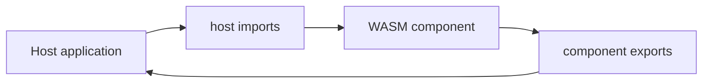

# Component

Dokumentasi lengkap untuk WASM Component dengan **host imports** untuk delegasi I/O.

## Overview



Arsitektur ini memisahkan **agent intelligence** (di WASM) dari **I/O operations** (di host):

```
┌──────────────────────────────────────────────┐
│  Host (TypeScript/Python/Go/etc)            │
│  ┌────────────────────────────────────────┐ │
│  │  Implement host-imports:               │ │
│  │  ├─ call-llm() → OpenAI/Anthropic API │ │
│  │  ├─ emit-tool-call() → MCP Servers   │ │
│  │  ├─ log-message() → Console/File     │ │
│  │  ├─ save-state() → Database/Redis    │ │
│  │  └─ load-state() → Database/Redis    │ │
│  └────────────────────────────────────────┘ │
│           ↑              ↓                  │
│     WASM Imports    WASM Exports            │
└───────────┼──────────────┼──────────────────┘
            │              │
┌───────────▼──────────────┼──────────────────┐
│  WASM Component          │                  │
│  ┌─────────────────────┐ │                  │
│  │  Agent FSM Runner   │ │                  │
│  │  ├─ Parse LLM resp  │ │                  │
│  │  ├─ Detect actions  │ │                  │
│  │  ├─ Build prompts   │ │                  │
│  │  └─ Manage state    │ │                  │
│  └─────────────────────┘ │                  │
│                          │                  │
│  Exports:                │                  │
│  ├─ prompt-manager       │                  │
│  ├─ mcp-client           │                  │
│  └─ ffi-server           │                  │
└──────────────────────────┴──────────────────┘
```

## Host Imports Interface

WASM memanggil host melalui **imports** yang didefinisikan di WIT:

```wit
interface host-imports {
    /// Call LLM API
    call-llm(request: llm-request) -> result<llm-response, string>;

    /// Execute tool call
    emit-tool-call(event: tool-call-event) -> result<tool-execution-result, string>;

    /// Logging
    log-message(event: log-event);

    /// State persistence
    save-state(context-id: string, state-json: string) -> result<_, string>;
    load-state(context-id: string) -> result<option<string>, string>;
}
```

## Data Types

### LLM Request/Response

```wit
record llm-request {
    prompt: string,
    system-prompt: string,
    temperature: option<f32>,
    max-tokens: option<u32>,
    response-format: option<string>,
}

record llm-response {
    content: string,
    model: string,
    tokens-used: option<u32>,
    finish-reason: option<string>,
}
```

### Tool Call Event

```wit
record tool-call-event {
    tool-name: string,
    arguments-json: string,
    session-id: option<string>,
    step-id: u32,
}

record tool-execution-result {
    tool-name: string,
    success: bool,
    output-json: string,
    error-message: option<string>,
    step-id: u32,
}
```

### Logging

```wit
record log-event {
    level: string,
    message: string,
    timestamp: option<string>,
}
```

## Implementasi di Host (TypeScript)

### 1. Load WASM Component

```typescript
import { readFile } from 'fs/promises';
import { instantiate } from '@bytecodealliance/jco';

// Load WASM binary
const wasmBytes = await readFile('antikythera.wasm');

// Instantiate dengan host imports
const instance = await instantiate(wasmBytes, {
  'antikythera:mcp-framework/host-imports': {
    'call-llm': async (request) => {
      // Call actual LLM API
      const response = await openai.chat.completions.create({
        model: 'gpt-4',
        messages: [
          { role: 'system', content: request.systemPrompt },
          { role: 'user', content: request.prompt }
        ],
        temperature: request.temperature ?? 0.7,
        max_tokens: request.maxTokens ?? 4096,
        response_format: request.responseFormat
          ? { type: request.responseFormat }
          : undefined
      });

      return {
        content: response.choices[0].message.content,
        model: response.model,
        tokensUsed: response.usage?.total_tokens,
        finishReason: response.choices[0].finish_reason
      };
    },

    'emit-tool-call': async (event) => {
      // Execute MCP tool
      const args = JSON.parse(event.argumentsJson);
      const result = await mcptools.execute(event.toolName, args);

      return {
        toolName: event.toolName,
        success: result.success,
        outputJson: JSON.stringify(result.output),
        errorMessage: result.error,
        stepId: event.stepId
      };
    },

    'log-message': (event) => {
      const timestamp = event.timestamp || new Date().toISOString();
      console.log(`[${timestamp}] [${event.level}] ${event.message}`);
    },

    'save-state': async (contextId, stateJson) => {
      await redis.set(`agent:${contextId}`, stateJson);
      return undefined;
    },

    'load-state': async (contextId) => {
      const state = await redis.get(`agent:${contextId}`);
      return state || undefined;
    }
  }
});
```

### 2. Run Agent

```typescript
// Get exported functions from WASM
const { exports } = instance;

// Initialize
const config = JSON.stringify({
  providers: [{ id: 'openai', type: 'openai', baseUrl: 'https://api.openai.com/v1' }],
  defaultProvider: 'openai',
  model: 'gpt-4'
});

// Run agent
const result = await exports.runAgent({
  prompt: "What's the weather in NYC?",
  options: { maxSteps: 10, verbose: true }
});

console.log('Agent result:', result.response);
```

## Alur Eksekusi

```
User: "What's the weather in NYC?"
  ↓
WASM: Parse prompt, build system prompt
  ↓
WASM: Call host.callLlm(request)
  ↓
Host: Call OpenAI API
  ↓
OpenAI: {"action":"call_tool","tool":"get_weather","args":{"city":"NYC"}}
  ↓
Host: Return to WASM
  ↓
WASM: Parse response, detect tool call
  ↓
WASM: Call host.emitToolCall(event)
  ↓
Host: Execute MCP tool "get_weather"
  ↓
MCP Server: Return {"temp":72,"unit":"F"}
  ↓
Host: Return result to WASM
  ↓
WASM: Build tool result prompt
  ↓
WASM: Call host.callLlm() again with tool result
  ↓
OpenAI: {"action":"final","response":"It's 72°F in NYC"}
  ↓
WASM: Parse final response
  ↓
WASM: Return to caller
```

## Implementasi di Python

```python
from wasmtime import Store, Component, Linker
import openai
import redis

# Setup WASM runtime
store = Store()
linker = Linker(store.engine)

# Define host imports
linker.define("antikythera:mcp-framework/host-imports", "call-llm",
    lambda req: call_llm_impl(req))
linker.define("antikythera:mcp-framework/host-imports", "emit-tool-call",
    lambda event: emit_tool_call_impl(event))
linker.define("antikythera:mcp-framework/host-imports", "log-message",
    lambda event: log_impl(event))

# Load and instantiate
component = Component.from_file("antikythera.wasm")
instance = linker.instantiate(store, component)

# Run agent
result = instance.exports["run-agent"](
    store,
    "What's the weather?",
    json.dumps({"maxSteps": 10})
)

print(result.response)
```

## World Definition

```wit
world antikythera-mcp {
    /// Import dari host (I/O)
    import host-imports;

    /// Export ke host (agent functionality)
    export prompt-manager;
    export mcp-client;
    export ffi-server;
}
```

## Benefits

✅ **Separation of Concerns**
- WASM: Agent logic, parsing, state management
- Host: I/O, APIs, tool execution

✅ **Portability**
- Same WASM works with TypeScript, Python, Go, etc.
- Host implements I/O sesuai environment

✅ **Security**
- WASM sandboxed (tidak bisa akses network langsung)
- Host kontrol akses ke resources

✅ **Flexibility**
- Ganti LLM provider tanpa recompile WASM
- Ganti tool implementations tanpa change agent logic

✅ **Stateless Execution**
- Save/load state via host imports
- Compatible dengan serverless/ephemeral environments

## Build Commands

```bash
# Generate WIT (jika ada changes)
cargo run -p build-scripts --release -- wit

# Build WASM component
cargo component build --release --target wasm32-wasip1

# Output
ls wit/antikythera.wit
ls target/wasm32-wasip1/release/antikythera.wasm
```

## Next Steps

1. Setup host runtime (TypeScript/Python/Go)
2. Implement host-imports interface
3. Load WASM component
4. Call agent functions
5. Handle tool calls via MCP servers
