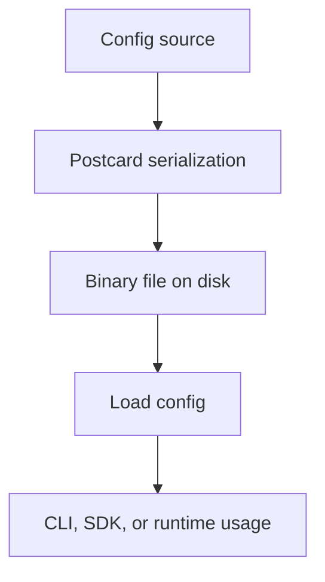

# Config

This document describes the Postcard-based configuration flow used by the current documentation set and related SDK surfaces.

## Overview

The repository documents two configuration stories:

1. The lightweight CLI config flow built around `cli-config.pc`
2. Broader SDK and core configuration helpers that use serialized configuration data

## Configuration model

## Why Postcard

| Property | Benefit |
|:---------|:--------|
| Binary format | Smaller and faster than text-heavy config storage |
| Typed serialization | Matches Rust data structures directly |
| Easy export/import | Works well for backup and transfer flows |

## Main points

- Configuration is treated as structured data first, not hand-edited prose.
- Export and inspection can still be done through JSON-based helper commands or APIs.
- Secrets should remain outside the binary file when a dedicated secret mechanism is available.

## Related documents

- [`CLI.md`](CLI.md) for the current CLI config workflow
- [`IMPORT_EXPORT.md`](IMPORT_EXPORT.md) for backup and restore flows
- [`CACHE.md`](CACHE.md) for cache-specific notes
