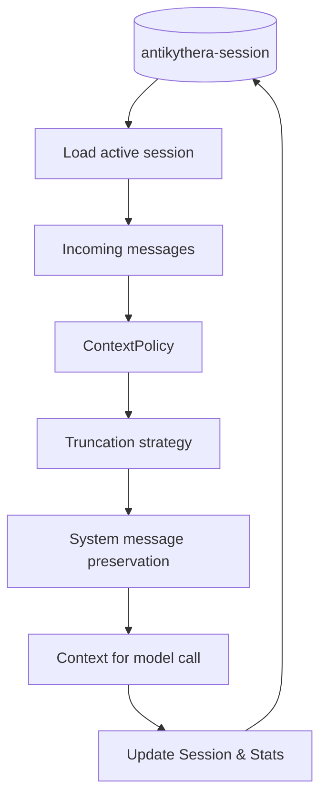

# Context Management

This document describes the active context management and session lifecycle behavior in the runtime.

## Storage and Source of Truth

All conversational state, message history, metadata, and token tracking are strictly managed by `antikythera-session`. 

- The `McpClient` in `antikythera-core` utilizes an LRU-based adapter (`SessionStore`) to access the `SessionManager`.
- This unifies session structures across the CLI, the Core runtime, and the external SDK FFI boundaries.

## Runtime Flow

## Current Capabilities

- **Unified Data Model**: Multi-part messages (`Text`, `Image`, `File`), ensuring robust LLM input structures align with the persisted history format.
- **Runtime Policies**: Policy configuration through context management APIs (e.g., token-budget aware pruning and max history messages).
- **Stat Tracking**: Auto-syncs token consumption and tool usage into the active session instance.
- **Snapshot Export/Import**: Fast, binary (`Postcard`) based FFI session state serialization, easily hydrated during warm starts.

## Operational Notes

- Configure resilience policy (e.g., `ContextWindowPolicy`) before high-volume conversational loops.
- Avoid building custom history maps in higher-level SDK integrations. Rely on `antikythera_session::SessionManager` functions.
- Host-side persistence and restoration should securely leverage `mcp_session_export` and `mcp_session_import` bindings.
