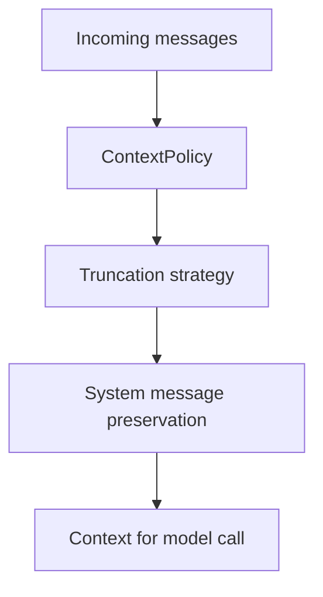

# Context Management (v1.0.0)

This document describes the active context management behavior in the runtime.

## Runtime Flow

## Current Capabilities

- Runtime policy configuration through context management APIs.
- Message-count and token-budget aware pruning.
- Strategy support for retaining recent context while preserving critical system prompts.
- Deterministic output for repeatable host integration tests.

## Operational Notes

- Configure policy before high-volume conversational loops.
- Validate behavior with context management and session tests in `tests/`.
- Keep host-side persistence and restoration aligned with session snapshots.
