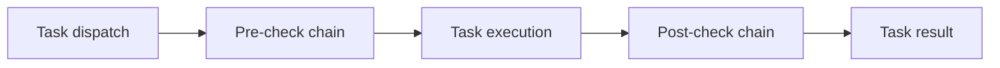

# Multi-Agent Guardrails (v1.0.0)

This document describes the active guardrail chain used by multi-agent orchestration.

## Guardrail Evaluation Order

## Active Guardrails

- Timeout validation guardrail.
- Budget and step-limit guardrail.
- Rate-limit guardrail.
- Cancellation guardrail.
- Custom guardrail trait integration.

## Runtime Notes

- Guardrails are composable and ordered.
- First rejection short-circuits remaining checks.
- Metadata carries rejection source and stage.
