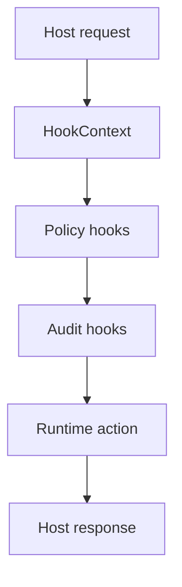

# Host Integration Hooks (v1.0.0)

This document describes host hook integration points in the runtime.

## Hook Pipeline

## Active Surfaces

- Caller and correlation context propagation.
- Optional policy decisions before sensitive actions.
- Structured hook records for auditing and diagnostics.
- Integration with observability exports.

## Usage Guidance

- Keep hook logic deterministic and side-effect bounded.
- Validate policy outcomes with hook tests in `tests/hooks`.
