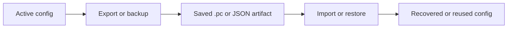

# Import Export

This document covers the backup and restore workflow for serialized configuration files.

## Purpose

Import and export support makes it easier to:

- back up a working configuration
- move configuration between environments
- restore a known-good configuration after rebuilds or failures

## Workflow

## Typical use cases

| Use case | Result |
|:---------|:-------|
| Backup before infrastructure changes | Roll back to a known-good config |
| Promote config between environments | Reuse the same config shape in staging or production |
| Recover after file loss | Restore from a saved artifact |

## Guidance

- Keep backups versioned and named clearly.
- Treat exported artifacts as sensitive if they contain provider or environment details.
- Validate imported configuration before using it in production automation.

## Related documents

- [`CONFIG.md`](CONFIG.md)
- [`CLI.md`](CLI.md)
