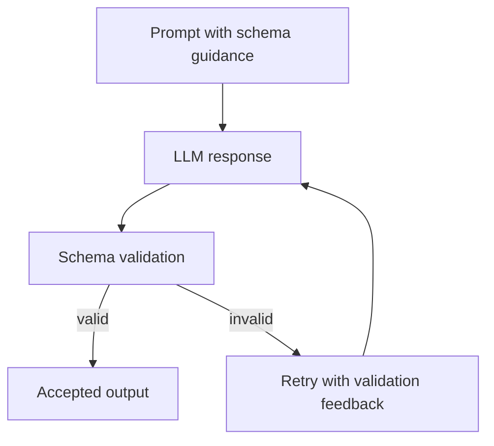

# JSON Schema

This document explains the JSON schema validation layer exposed by the SDK documentation set.

## Goal

The JSON schema flow helps enforce structured model responses when plain free-form text is not enough.

## Validation loop

## What it is useful for

| Scenario | Why schema validation helps |
|:---------|:----------------------------|
| Data extraction | Ensures expected keys and types are present |
| Tool-oriented responses | Reduces fragile string parsing |
| Structured reports | Keeps output machine-readable |

## Core ideas

- A schema defines the required shape of the response.
- Validation checks the model output against that shape.
- Retry guidance can feed validation errors back into the next model attempt.

## Related documents

- [`WASM_AGENT.md`](WASM_AGENT.md)
- [`COMPONENT.md`](COMPONENT.md)
