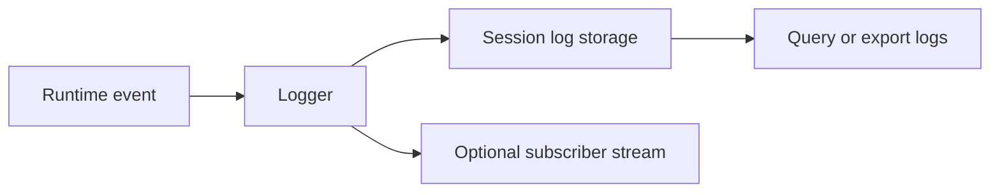

# Logging

This document describes the logging model used across the framework crates.

## Overview

Logging is designed around structured events, session awareness, and optional subscription-style consumption.

## Flow

## Characteristics

| Capability | Purpose |
|:-----------|:--------|
| Structured entries | Keep logs machine-readable |
| Session grouping | Trace activity by session or context |
| Subscriber support | Stream events in real time when needed |
| Export support | Persist logs for later inspection |

## Guidance

- Use structured metadata whenever possible.
- Keep session identifiers stable enough to trace one workflow end to end.
- Export logs when debugging long-running or multi-step flows.

## Related documents

- [`WORKSPACE.md`](WORKSPACE.md)
- [`SERVERS_AND_AGENTS.md`](SERVERS_AND_AGENTS.md)
