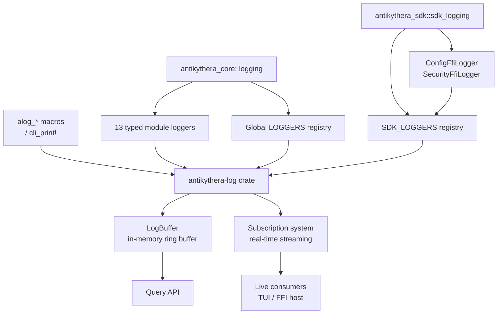

# Logging

This document describes the structured logging system used across the framework crates.

## Two-Tier Architecture

The framework separates logging into a **base crate** and **typed module loggers** layered on top:



| Tier | Crate | Purpose |
|:-----|:------|:--------|
| `antikythera-log` | `antikythera-log` | `Logger`, `LogEntry`, `LogBuffer`, `LogFilter`, `LogSubscriber`, convenience macros. Foundation for all log emission, storage, and retrieval. |
| Typed module loggers | `antikythera-core::logging` | 13 domain-specific loggers that wrap `Logger` with automatic `source` tagging. |
| SDK loggers | `antikythera-sdk::sdk_logging` | 2 FFI-facing loggers with their own global registry. |

---

## antikythera-log Crate

### Logger

`Logger` holds an in-memory circular buffer (`LogBuffer`, default capacity 10k entries) keyed by session ID. It supports four log levels (`Debug`, `Info`, `Warn`, `Error`) and three emission patterns:

| Method | Description |
|:-------|:------------|
| `debug` / `info` / `warn` / `error` | Plain message emission |
| `log_with_source(source, msg)` | Tags entry with a source module string |
| `log_with_context(msg, ctx)` | Attaches a JSON context payload (e.g. tool args, FFI params) |

Each `LogEntry` records:

| Field | Type | Description |
|:------|:-----|:------------|
| `level` | `LogLevel` | Debug / Info / Warn / Error |
| `message` | `String` | Human-readable text |
| `timestamp` | `String` | ISO 8601 (UTC) |
| `session_id` | `Option<String>` | Session grouping key |
| `source` | `Option<String>` | Module origin label |
| `context` | `Option<String>` | JSON-encoded structured payload |
| `sequence` | `u64` | Global monotonic sequence number |

### Convenience Macros

Macros are the **only sanctioned** logging emission points. All framework crates must use these (never `println!` or `tracing` macros):

| Macro | Purpose |
|:------|:--------|
| `alog_debug!` / `alog_info!` / `alog_warn!` / `alog_error!` | Log at level with `format!`-style args |
| `alog_debug_src!` / `alog_info_src!` / `alog_warn_src!` / `alog_error_src!` | Log with explicit source tag |
| `alog_debug_ctx!` / `alog_info_ctx!` / `alog_warn_ctx!` / `alog_error_ctx!` | Log with context payload |
| `cli_print!` / `cli_eprint!` | Sanctioned CLI output (never for runtime logs) |

Enable the `lint` feature on `antikythera-log` to enforce this at compile time — it shadows `println!`, `eprintln!`, `dbg!`, and `tracing` macros with compile-error stubs.

```rust
use antikythera_log::{Logger, alog_info, alog_info_ctx};
use antikythera_core::{TransportLogger, AgentLogger};

let logger = Logger::new("my-session");
alog_info!(logger, "Server started on port {}", 8080);

// Module loggers auto-tag with source
let transport = TransportLogger::new("my-session");
transport.connect("weather-mcp");

let agent = AgentLogger::new("my-session");
agent.tool_call("read_file", &serde_json::json!({"path": "/etc/hosts"}));
```

### Subscription

With the `subscriber` feature enabled, callers can subscribe to a real-time channel:

```rust
let logger = Logger::new("my-session");
let subscriber = logger.subscribe();

// Spawn a task:
// while let Ok(entry) = subscriber.recv() {
//     // handle live log entry
// }

logger.info("This is sent to all subscribers immediately");
```

---

## Typed Module Loggers (antikythera-core)

Each subsystem has a dedicated logger type that inherits `debug`/`info`/`warn`/`error` from the core trait and adds domain-specific methods where appropriate. All use the `define_module_logger!` macro for consistency.

| Logger | Source Tag | Domain | Extra Methods |
|:-------|:-----------|:-------|:--------------|
| `AgentLogger` | `agent` | FSM runner, agent runner, parser, context management | `tool_call`, `tool_result`, `agent_step`, `agent_complete` |
| `TransportLogger` | `transport` | HTTP, SSE, RPC, process management | `connect`, `disconnect`, `tool_request`, `tool_response` |
| `ProviderLogger` | `provider` | Model provider API calls | `api_call`, `api_response`, `api_error` |
| `DiscoveryLogger` | `discovery` | Server discovery, scanning, loading | — |
| `StdioLogger` | `stdio` | STDIO command processing | — |
| `ChatLogger` | `chat` | Chat service operations | — |
| `WasmLogger` | `wasm` | WASM runtime | — |
| `ResilienceLogger` | `resilience` | Retry, circuit breaker, backoff | — |
| `SessionLogger` | `session` | Session store operations | — |
| `ConfigLogger` | `config` | Configuration handling | — |
| `OrchestratorLogger` | `orchestrator` | Multi-agent orchestration | — |
| `StreamingLogger` | `streaming` | LLM streaming events | — |
| `SecurityLogger` | `security` | Rate limiting, secrets, validation | `rate_limit_check`, `rate_limit_exceeded`, `secret_stored`, `secret_retrieved`, `secret_rotated`, `secret_deleted`, `secret_error`, `cleanup_task` |

Usage pattern:

```rust
use antikythera_core::{SecurityLogger, ResilienceLogger};

let sec = SecurityLogger::new("session-001");
sec.rate_limit_check("user-x", true);
sec.secret_rotated("api-key-main");

let res = ResilienceLogger::new("session-001");
res.warn("Circuit breaker opened for provider gpt-4o-mini");
```

---

## Global LOGGERS Registry

`antikythera-core` maintains a `HashMap<String, Arc<Logger>>` behind `LazyLock<Mutex<...>>` — one `Logger` instance per session ID. All 13 module loggers resolve their underlying `Logger` through this shared registry via `get_logger(session_id)`.

| Function | Purpose |
|:---------|:--------|
| `get_logger(session_id)` | Get or create a Logger for a session |
| `clear_all_loggers()` | Drop all logger instances |
| `logger_count()` | Return number of active sessions |

---

## Session Bridge

The `ACTIVE_SESSION` static bridges log producers to the correct session bucket without requiring callers to carry a session handle:

| Function | Purpose |
|:---------|:--------|
| `set_active_session(id)` | Set the session key all module loggers write to |
| `get_active_session()` | Read the current active session key |

Default session is `"tui"`. The CLI calls `set_active_session` when a chat session starts or a background task outcome arrives, ensuring logs always land in the expected bucket.

---

## Log Query API

All query functions operate on the global `LOGGERS` registry:

| Function | Signature | Purpose |
|:---------|:----------|:--------|
| `query_logs` | `(session_id, &LogFilter) -> LogBatch` | Filtered query with pagination |
| `get_latest_logs` | `(session_id, count) -> Vec<LogEntry>` | Last N entries |
| `get_logs_json` | `(session_id, &LogFilter) -> Result<String>` | JSON-serialized batch |
| `subscribe_logs` | `(session_id) -> Option<LogSubscriber>` | Real-time channel subscriber |
| `clear_logs` | `(session_id)` | Clear all entries for a session |

`LogFilter` supports:

| Field | Effect |
|:------|:-------|
| `min_level` | Inclusive severity floor |
| `session_id` | Exact session match |
| `source` | Exact source tag match |
| `limit` | Max results to return |
| `offset` | Pagination cursor |

```rust
use antikythera_core::logging::query_logs;
use antikythera_log::LogFilter;

let filter = LogFilter::new()
    .min_level(LogLevel::Warn)
    .source("transport")
    .limit(20);

let batch = query_logs("tui", &filter);
println!("Found {} entries (more: {})", batch.entries.len(), batch.has_more);
```

---

## SDK Logging (antikythera-sdk)

The SDK maintains its own `SDK_LOGGERS` registry, parallel to the core `LOGGERS`. This separation keeps FFI-related log entries isolated from core runtime entries.

| Function | Purpose |
|:---------|:--------|
| `get_sdk_logger(session_id)` | Get or create an SDK Logger |
| `clear_sdk_loggers()` | Remove all SDK loggers |
| `query_sdk_logs` | Filtered query (SDK-side) |
| `get_latest_sdk_logs` | Last N entries (SDK-side) |
| `get_sdk_logs_json` | JSON export (SDK-side) |
| `subscribe_sdk_logs` | Real-time subscriber (SDK-side) |
| `clear_sdk_session_logs` | Clear one session |

### SDK Module Loggers

| Logger | Source | Purpose | Key Methods |
|:-------|:-------|:--------|:------------|
| `ConfigFfiLogger` | — (uses context) | Tracks FFI config operations | `ffi_call`, `ffi_result`, `ffi_error`, `config_loaded`, `config_saved`, `provider_added`, `provider_removed`, `prompt_updated`, `agent_config_changed` |
| `SecurityFfiLogger` | — (uses context) | Tracks FFI security operations | `ffi_call`, `ffi_result`, `ffi_error`, `validation_passed`, `validation_failed`, `rate_limit_checked`, `rate_limit_exceeded`, `secret_stored`, `secret_retrieved`, `secret_rotated`, `secret_deleted` |

Both SDK loggers encode structured data via `context` field rather than `source` tags, which distinguishes SDK log entries in the TUI display.

---

## TUI Log Display Integration

The CLI TUI reads from **both** registries on every frame tick (`event_loop.rs:297`) and merges them into a single chronological view:

```rust
let mut core_logs = get_latest_logs("tui", 50);      // core LOGGERS registry
let mut sdk_logs = get_latest_sdk_logs("tui", 20);    // SDK_LOGGERS registry

// Tag SDK entries with "sdk:" source prefix for visual differentiation
for entry in &mut sdk_logs {
    if let Some(ref mut src) = entry.source {
        *src = format!("sdk:{src}");
    } else {
        entry.source = Some("sdk:ffi".to_string());
    }
}

core_logs.extend(sdk_logs);
core_logs.sort_by_key(|e| e.sequence);  // chronological merge
```

Log lines display as `HH:MM:SS [LEVEL][source] message | context` in reverse-chronological order.

All `tracing::` events from the runtime are also captured by `AntikytheraTuiLayer` and written to the `"tui"` session bucket, so `tracing` macros (in third-party crates) appear alongside native `alog_*` entries.

---

## FFI Log Export

The SDK exposes four C-ABI functions in `antikythera-sdk/src/session/ffi/session_logs.rs`:

| FFI Function | Purpose |
|:-------------|:--------|
| `mcp_session_get_logs(session_id)` | Returns JSON array of merged core + SDK `LogEntry` objects (sorted by sequence) |
| `mcp_session_export_logs(session_id)` | Binary export via Postcard hex-encoding; returns JSON with `session_id`, `export_data` (hex), `log_count`, `size` |
| `mcp_session_import_logs(export_data)` | Deserializes a Postcard-encoded `SessionLogExport`; returns confirmation JSON |
| `mcp_session_batch_export_logs()` | Exports all session logs as a `BatchLogExport`; returns JSON with `session_count`, `total_log_count`, `export_data` (hex), `size` |
| `mcp_session_batch_import_logs(export_data)` | Imports a `BatchLogExport` from Postcard; returns confirmation JSON |

All export functions merge logs from both the core `LOGGERS` and SDK `SDK_LOGGERS` registries.

---

## Related documents

- [`ARCHITECTURE.md`](ARCHITECTURE.md)
- [`OBSERVABILITY.md`](OBSERVABILITY.md)
- [`RESILIENCE.md`](RESILIENCE.md)
- [`SERVERS_AND_AGENTS.md`](SERVERS_AND_AGENTS.md)
