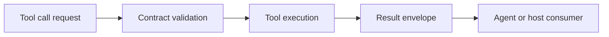

# MCP Contracts (v1.0.0)

This document defines the active tool-calling contract surfaces.

## Contract Data Path

## Current Contract Guarantees

- Deterministic request and result envelope structures.
- Stable error-kind mapping for retry and policy decisions.
- Serialization-safe payload shapes for logging and transport.
- Compatibility checks through contract tests in `tests/contract`.

## Validation Guidance

- Keep contract fixtures synchronized with WIT and runtime signatures.
- Treat contract test failures as release blockers.
