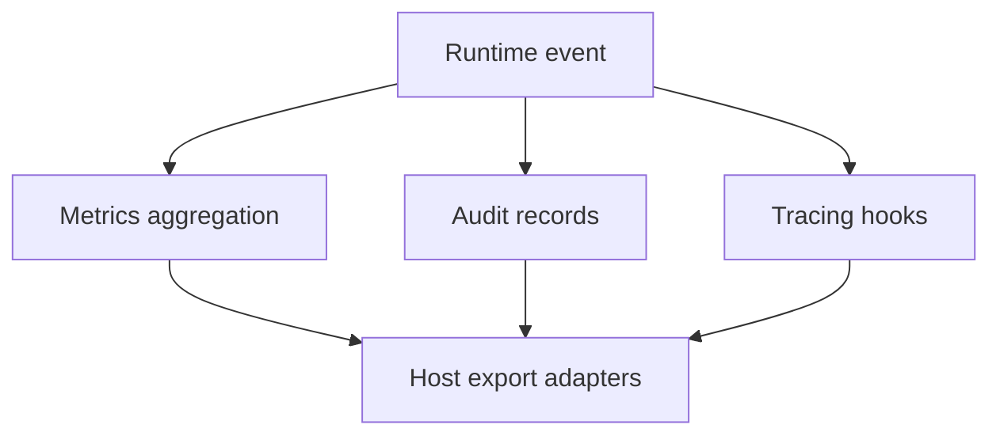

# Observability (v1.0.0)

This document describes the active observability model used by runtime and host integrations.

## Signal Pipeline

## Current Signals

- Latency summaries and operational counters.
- Structured audit trail records for policy and tool decisions.
- Correlation-ID aware event propagation.
- Host-facing export points for external telemetry systems.

## Validation

- Use `tests/observability/observability_tests.rs` for behavior checks.
- Keep metric naming stable across minor updates.
