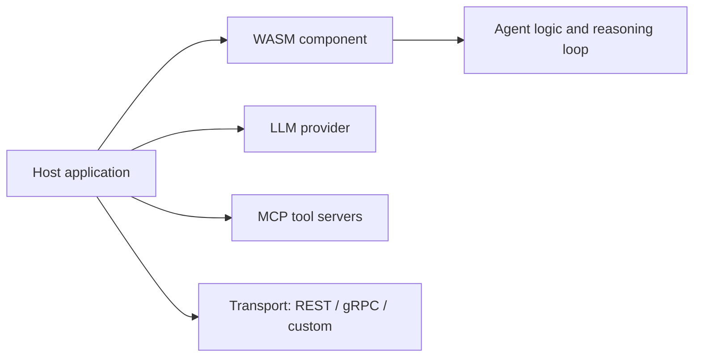

# Product Scope

This document defines what the Antikythera MCP Framework is, what deployment targets it supports, and what surfaces its public API exposes.

## What it is

Antikythera is a **Rust-based MCP client framework** designed to:

- prepare and process LLM message flows while leaving the actual model API call to the embedding host
- connect to MCP tool servers over STDIO and HTTP transports
- run agent and tool-calling flows with structured step management
- expose agent logic as a portable **server-side WASM component** (wasm32-wasip1)
- provide a native CLI for interactive and automated use

## Deployment targets

| Target | Build command | Output |
|:-------|:-------------|:-------|
| **Native CLI** | `cargo build -p antikythera-cli --release` | `antikythera` binary |
| **Server-side WASM component** | `cargo component build -p antikythera-sdk --release --target wasm32-wasip1` | `.wasm` component |

No browser WASM, no C FFI, and no embedded HTTP server are provided by the framework. A host that embeds the WASM component is responsible for its own transport layer (REST, gRPC, WebSocket, or custom).

## Public SDK surface

The `antikythera-sdk` crate provides the stable integration surface:

| Area | Key types |
|:-----|:---------|
| Client and config | `AppConfig`, `McpClient`, `ClientConfig`, `ChatRequest`, `PreparedChatTurn` |
| Agent infrastructure | `Agent`, `AgentOptions`, `AgentOutcome`, `ToolDescriptor` |
| Host model delegation | `DynamicModelProvider`, `ModelProvider`, `HostModelClient`, `HostModelTransport` |
| Multi-agent | `MultiAgentOrchestrator`, `AgentProfile`, `AgentTask` |
| Routing strategies | `DirectRouter`, `RoundRobinRouter`, `FirstAvailableRouter`, `RoleRouter` |
| Logging | `ConfigLogger`, `AgentLogger`, `TransportLogger` |
| Session | Session history types, import/export |

## CLI modes

The `antikythera` binary accepts a `--mode` flag:

| Mode | Description |
|:-----|:------------|
| `stdio` (default) | Interactive TUI chat session |
| `setup` | Configuration wizard for providers and servers |
| `multi-agent` | Orchestrator harness for multi-agent task dispatch |

## Architecture philosophy

The framework is designed around one principle: **the host owns the interface layer**.

The WASM component handles agent reasoning, session continuity, history shaping, and response parsing. The host handles every external integration: LLM calls, tool execution, persistence, and protocol exposure. This keeps the component portable across runtimes and avoids embedding infrastructure concerns inside the framework.

## Feature flags

| Flag | Purpose | Status |
|:-----|:--------|:-------|
| `multi-agent` | Multi-agent orchestration runtime | Stable |
| `component` | Server-side WASM component bindings | Active development |
| `wasm-runtime` | Wasmtime host for running WASM agents | Active development |
| `wizard` | Configuration wizard in CLI | Stable |
| `cache` | Response caching layer | Stable |
| `http-providers` | Deprecated compatibility flag; no active direct model client path | Deprecated |
| `native-transport` | STDIO and HTTP MCP transport | Stable |

## Related documents

- [`ARCHITECTURE.md`](ARCHITECTURE.md) — crate relationships and request flow
- [`BUILD.md`](BUILD.md) — build commands for each target
- [`CLI.md`](CLI.md) — CLI usage reference
- [`COMPONENT.md`](COMPONENT.md) — WASM component model details
- [`WASM_AGENT.md`](WASM_AGENT.md) — agent logic inside the component
