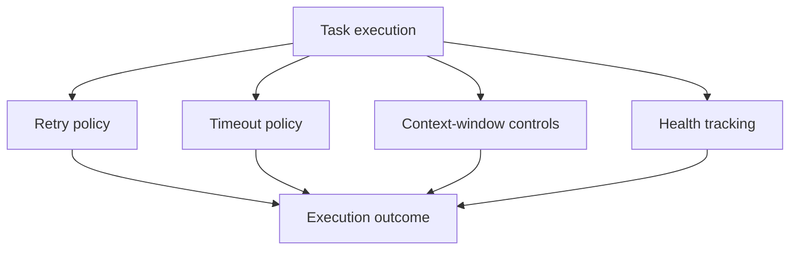

# Runtime Resilience (v1.0.0)

This document describes active resilience controls in runtime execution.

## Resilience Control Loop

## Current Modules

- Retry/backoff behavior with explicit conditions.
- Timeout enforcement for bounded execution.
- Context-window handling to control prompt growth.
- Health-tracker surfaces for runtime state reporting.

## Validation

- Covered by resilience tests under `tests/resilience/`.
- Integrates with guardrails and observability for production flows.
