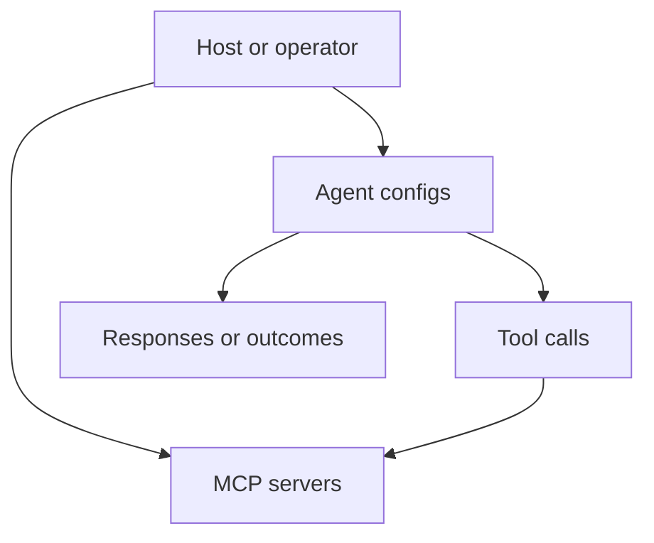

# Servers and Agents

This document summarizes the server and agent management surface exposed by the project documentation.

## Overview

The framework separates:

- server definitions and tool connectivity
- agent definitions and execution behavior

## High-level model

## What this area covers

| Topic | Description |
|:------|:------------|
| Server config | Define how tools are reached |
| Agent config | Define agent role, limits, and behavior |
| Validation | Check whether configuration is usable |
| Execution flow | Connect agents to tool-capable servers |

## Related documents

- [`CLI.md`](CLI.md)
- [`WASM_AGENT.md`](WASM_AGENT.md)
- [`COMPONENT.md`](COMPONENT.md)
