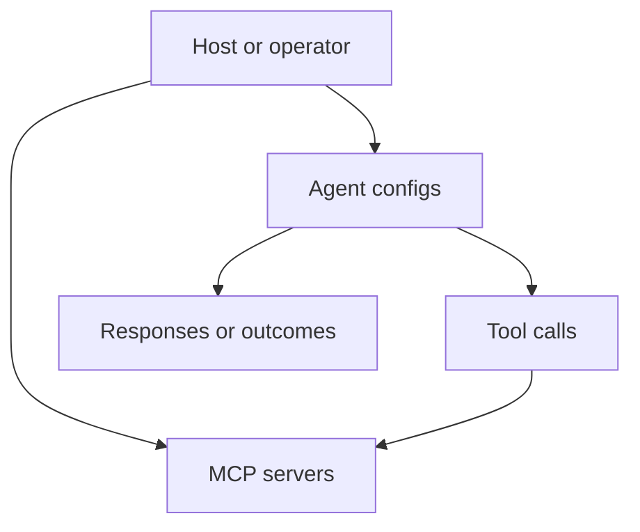

# Servers and Agents

This document summarizes the server and agent management surface exposed by the project documentation.

## Overview

The framework separates:

- server definitions and tool connectivity
- agent definitions and execution behavior

## High-level model



## What this area covers

| Topic | Description |
|:------|:------------|
| Server config | Define how tools are reached |
| Agent config | Define agent role, limits, and behavior |
| Validation | Check whether configuration is usable |
| Execution flow | Connect agents to tool-capable servers |

## Runtime hardening controls (host-facing)

For multi-agent orchestration, host code can now manipulate and monitor
hardening state at runtime via SDK helpers in `antikythera-sdk::agents`.

| API | Purpose |
|:----|:--------|
| `configure_hardening(options_json)` | Apply max concurrency/task/step limits, default retry condition, and optional guardrail JSON config |
| `cancel_orchestrator()` | Trigger cooperative cancellation for active orchestration |
| `get_monitor_snapshot()` | Return live monitor snapshot JSON (budget + cancellation state) |
| `task_result_detail(task_result_json)` | Decode task metadata and error/routing detail without manual field mapping |

`options_json` now also accepts an optional `guardrails` object. Example:

```json
{
    "max_concurrent_tasks": 4,
    "default_retry_condition": "on_transient",
    "guardrails": {
        "timeout": {
            "max_timeout_ms": 2000,
            "require_explicit_timeout": true
        },
        "budget": {
            "max_task_steps": 8,
            "require_explicit_budget": true
        },
        "rate_limit": {
            "max_tasks": 10,
            "window_ms": 60000
        },
        "cancellation": true
    }
}
```

The decoded `task_result_detail(...)` payload now includes optional
`guardrail_name` and `guardrail_stage` fields when a guardrail rejected a task.

## Host integration hooks

Core now also exposes host hook middleware in `antikythera_core::application::hooks`
for auth, correlation, policy, and telemetry integration. See [`HOOKS.md`](HOOKS.md).

The WIT `multi-agent-runner` contract mirrors these operations through
`configure-hardening`, `cancel-orchestrator`, `get-monitor-snapshot`, and
`task-result-detail`.

## Native streaming pipeline

Native CLI provider clients now emit streaming events while parsing provider
chunked responses:

1. provider stream payload is parsed chunk-by-chunk,
2. each chunk emits a stream event in the LLM pipeline,
3. terminal sink prints chunks live to stderr so stdout remains protocol-safe.

This keeps interactive visibility in CLI mode while preserving structured
stdout output (for JSON or automation consumers).

## Related documents

- [`CLI.md`](CLI.md)
- [`WASM_AGENT.md`](WASM_AGENT.md)
- [`COMPONENT.md`](COMPONENT.md)
