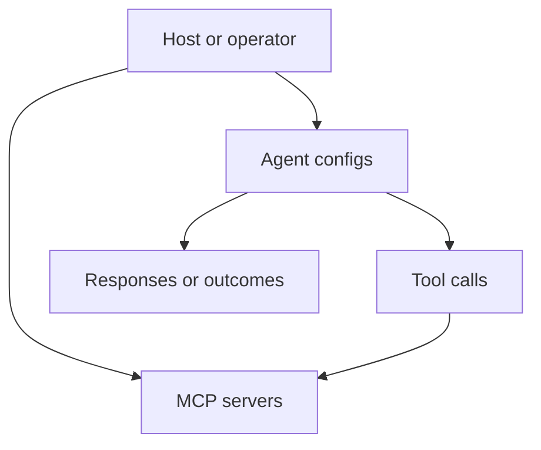

# Servers and Agents

This document summarizes the server and agent management surface exposed by the project documentation.

## Overview

The framework separates:

- server definitions and tool connectivity
- agent definitions and execution behavior

## High-level model

## What this area covers

| Topic | Description |
|:------|:------------|
| Server config | Define how tools are reached |
| Transport plugins | Resolve built-in HTTP and STDIO connections through factory-style registration |
| Agent config | Define agent role, limits, and behavior |
| Native tool calling | Pass tool schemas to OpenAI-compatible and Gemini providers, with JSON fallback kept for unsupported models |
| Multi-agent orchestration | Route, schedule, and pipeline work across registered agent profiles |
| Validation | Check whether configuration is usable |
| Execution flow | Connect agents to tool-capable servers |

## Runtime notes

- `ServerManager` now resolves transports through an internal factory registry instead of hardcoding connection logic directly in the manager.
- `Agent` and `FsmAgent` both pass native tool definitions to providers when schemas are available, then fall back to JSON action parsing when the provider returns plain text.
- `MultiAgentOrchestrator` is an active feature surface, covered by integration tests for both single dispatch and sequential pipelines.

## Related documents

- [`CLI.md`](CLI.md)
- [`RESILIENCE.md`](RESILIENCE.md)
- [`WASM_AGENT.md`](WASM_AGENT.md)
- [`COMPONENT.md`](COMPONENT.md)
