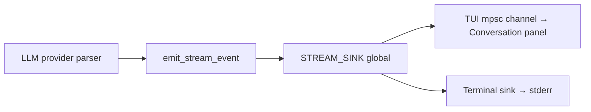

# Streaming (v1.0.0)

This document covers the currently implemented streaming behavior.

## Streaming Architecture

Token streaming is built around a process-global event sink in
`antikythera-cli::infrastructure::llm::streaming`.

## StreamEvent

Provider parsers emit one of three variants:

| Variant | Payload | Description |
|:--------|:--------|:------------|
| `Started` | `provider_id`, `session_id` | Signals that the stream has begun |
| `Chunk` | `provider_id`, `session_id`, `content` | One content fragment from the model |
| `Completed` | `provider_id`, `session_id` | Signals that the stream is done |

## Sink modes

| Sink | Installed by | Behaviour |
|:-----|:------------|:----------|
| TUI sink | `set_stream_event_sink` in `submit_input` | Forwards `Chunk.content` over an `mpsc::unbounded_channel`; TUI drains it each frame for live preview |
| Terminal sink | `install_terminal_stream_sink` via `--stream` flag | Writes chunks directly to stderr; `Started` prints a header, `Completed` prints a newline |

## Runtime Guarantees

- Only one sink is active at a time; `set_stream_event_sink` replaces any previous sink.
- `clear_stream_event_sink` drops the sender, cleanly ending the mpsc channel after each response.
- `Started` and `Completed` events are forwarded to `tracing::info!` for the log panel under the `cli:streaming` source label.
- `Chunk` events are not traced — they are too frequent and their content is visible in the chat panel.

## Related documents

- [`CLI.md`](CLI.md)
- [`SERVERS_AND_AGENTS.md`](SERVERS_AND_AGENTS.md)
