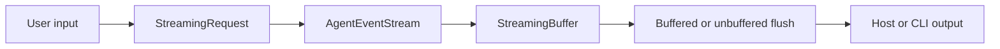

# Streaming (v1.0.0)

This document covers the currently implemented streaming behavior.

## Streaming Pipeline

## Current Capabilities

- Token and event streaming through unified request options.
- Tool-result and summary event support.
- Buffered and unbuffered emission policies.
- Client input chunk accumulation helpers.

## Runtime Guarantees

- Backward-compatible request defaults.
- Bounded buffering controls via explicit limits.
- Deterministic event draining order.
