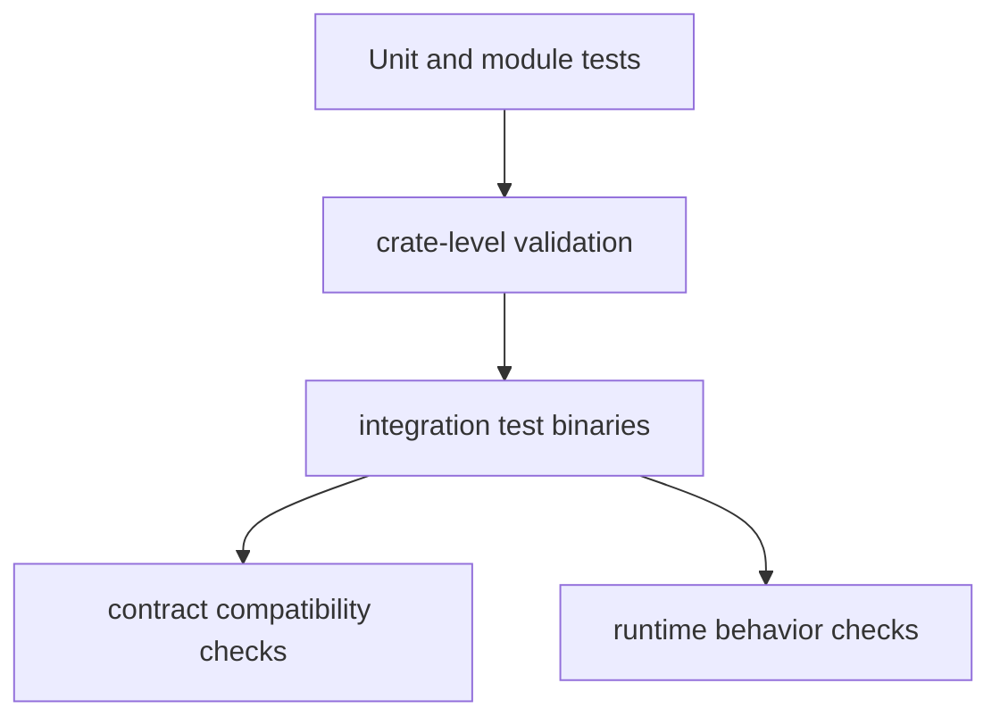

# Testing (v1.0.0)

This document describes the active test strategy for the workspace.

## Test Topology



## Current Structure

- Workspace-wide checks: build, test, fmt, and clippy gates.
- `tests/` contains integration suites and module-specific binaries.
- Large suites use part-based organization for readability and maintenance.
- Contract fixtures are used for compatibility detection.

## Standard Commands

```bash
cargo test --workspace
cargo test -p antikythera-tests --no-run
cargo fmt --all -- --check
cargo clippy --workspace --lib --bins -- -D warnings -D deprecated
```
