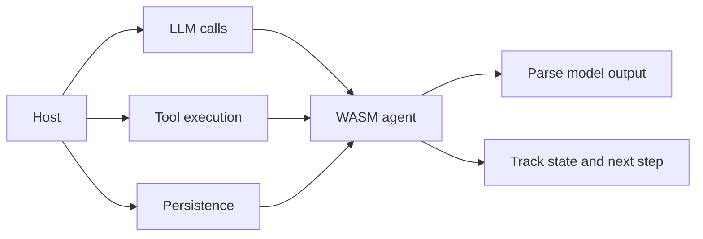

# WASM Agent

This document describes the WASM-side agent model at a high level.

## Overview

The WASM agent focuses on agent logic and response processing, while the host side handles external I/O.

## Responsibility split

## Why this split matters

| WASM side | Host side |
|:----------|:----------|
| Agent reasoning loop | External API calls |
| Response parsing | Tool execution |
| Step management | Persistence and environment integration |

## Benefits

- Keeps the WASM side smaller and more portable
- Lets the host choose provider and infrastructure strategy
- Avoids embedding every I/O concern into the component itself

## Message and session flow

The intended host/WASM exchange is:

1. The first host request may contain only plain user text.
2. The framework creates or continues a `session_id` and assembles the internal message history.
3. The framework emits a prepared message list for the host to send to the LLM.
4. The host calls the provider API and may return either:
    - plain text, or
    - a structured assistant message already shaped to match framework expectations.
5. The framework records that assistant turn into history so the next prepared request remains tied to the same WASM-side context.

This allows the host to own provider-specific payload shaping while the framework owns conversation continuity, step tracking, and response interpretation.

## Session archive and restore flow

The runner now supports automatic in-memory pressure handling and idle timeout archival.

### Triggers

- Capacity pressure: session count exceeds `max_in_memory_sessions`
- Inactive timeout: `sweep_idle_sessions(...)` finds sessions older than `session_timeout_secs`

### What the runner emits

When a session leaves RAM, the event stream includes:

- `session_archived`
    - includes `reason` (`capacity_pressure` or `idle_timeout`)
    - includes `state_json` snapshot to persist in host storage

If a request arrives for an archived session, the runner emits:

- `session_restore_requested`
- `session_restore_progress` (initial stage)

Host can push progress updates at any time using:

- `report_session_restore_progress(session_id, progress_json)`

After host loads state from durable storage, it restores RAM state via:

- `hydrate_session(session_id, state_json)`

Which emits:

- `session_restored`

This flow allows hosts to stream loading feedback to user interfaces when restore latency is non-trivial.

## Related documents

- [`COMPONENT.md`](COMPONENT.md)
- [`JSON_SCHEMA.md`](JSON_SCHEMA.md)
