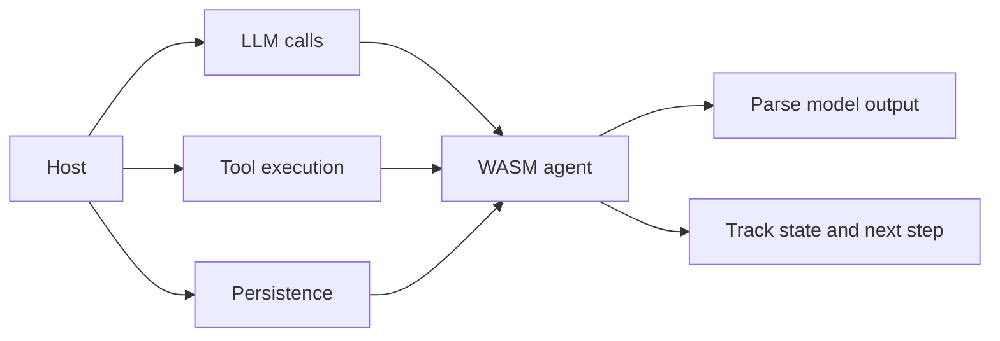

# WASM Agent

This document describes the WASM-side agent model at a high level.

## Overview

The WASM agent focuses on agent logic and response processing, while the host side handles external I/O.

## Responsibility split

## Why this split matters

| WASM side | Host side |
|:----------|:----------|
| Agent reasoning loop | External API calls |
| Response parsing | Tool execution |
| Step management | Persistence and environment integration |

## Benefits

- Keeps the WASM side smaller and more portable
- Lets the host choose provider and infrastructure strategy
- Avoids embedding every I/O concern into the component itself

## Related documents

- [`COMPONENT.md`](COMPONENT.md)
- [`JSON_SCHEMA.md`](JSON_SCHEMA.md)
