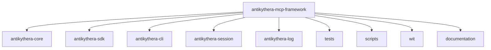
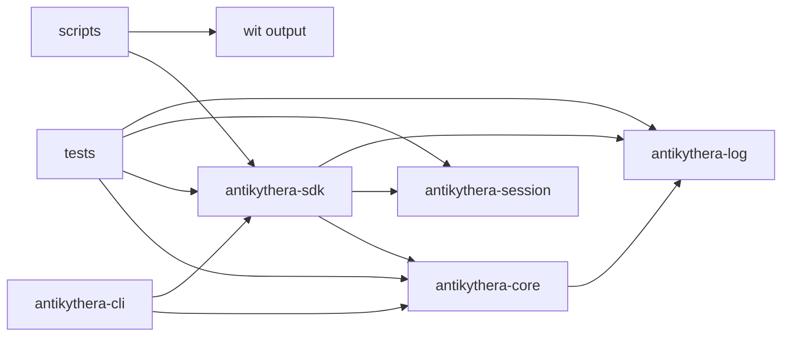

# Workspace

This document explains how the repository is organized and how each crate relates to the others.

## Repository map

## Crate responsibilities

| Path | Role |
|:-----|:-----|
| `antikythera-core/` | Core MCP runtime, agent logic, config loading, providers, and transports |
| `antikythera-sdk/` | Public API layer for Rust and server-side WASM component bindings, config/session/agent helper modules |
| `antikythera-cli/` | Native binaries for the current CLI surface |
| `antikythera-session/` | Session storage, history, and export/import |
| `antikythera-log/` | Structured logging and subscriptions |
| `tests/` | Workspace integration tests and scenario coverage |
| `scripts/` | WIT generation and component build helpers |
| `wit/` | Generated WIT output |
| `documentation/` | Focused guides and references |

## Workspace dependency shape

## Practical reading order

1. Start with `antikythera-core` to understand the runtime behavior.
2. Move to `antikythera-sdk` to see the public API and bindings layer.
3. Check `antikythera-cli` for the current command-line surface.
4. Use `tests/` to see how the repository is exercised end-to-end.
